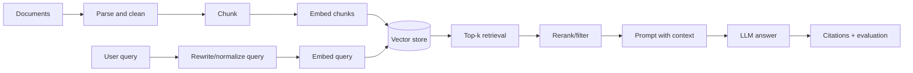
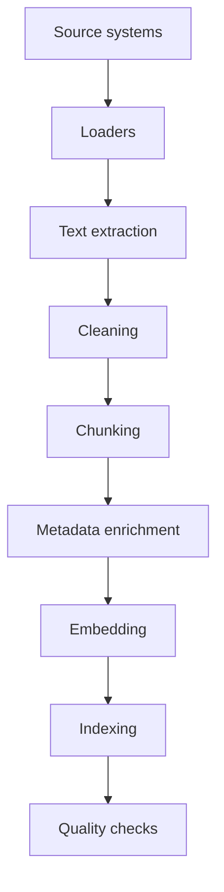
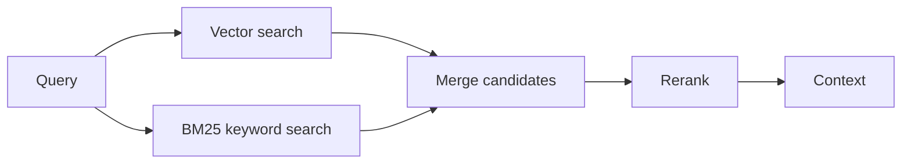
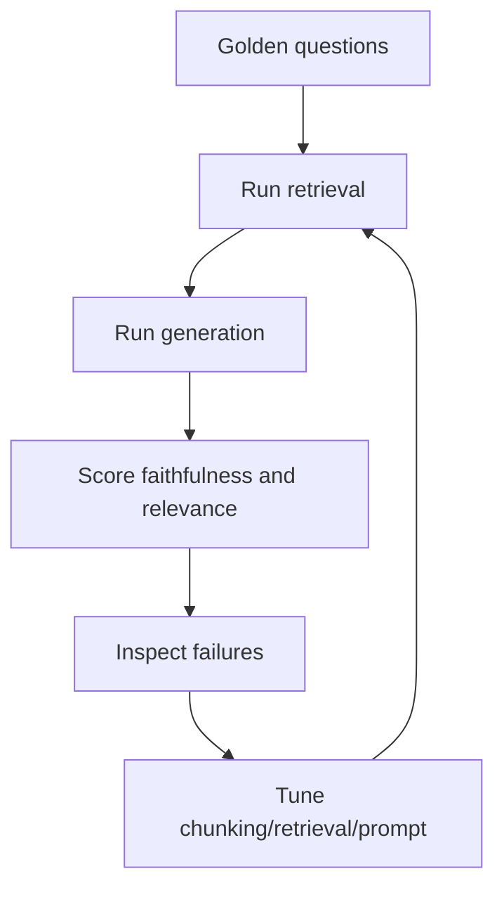

# Retrieval-Augmented Generation (RAG) End to End

## Interview-ready summary

RAG is an application pattern where we retrieve relevant external knowledge and provide it to an LLM at answer time. It is the default architecture for enterprise Q&A because it supports private data, fresh updates, citations, and access control without retraining the model.



---

## 1. RAG solves a grounding problem

LLMs have broad language ability but do not automatically know:

- Private company documents
- New policy changes
- User-specific data
- Source references
- Tenant-scoped permissions

RAG keeps knowledge in systems you control.

### RAG vs traditional search

| Feature | Keyword search | Vector search | RAG |
|---|---|---|---|
| Finds exact words | Excellent | Weak | Uses either |
| Finds semantic matches | Limited | Excellent | Excellent |
| Produces final answer | No | No | Yes |
| Can cite sources | Search result links | Chunk metadata | Yes, if designed |
| Handles follow-up questions | No | No | With chat state/query rewriting |

---

## 2. Ingestion pipeline

The ingestion pipeline turns raw content into searchable chunks.



### Source examples

- PDFs, Word docs, Markdown, HTML
- Confluence, SharePoint, Notion
- Git repositories
- Database rows
- Support tickets
- Product catalogs

### Metadata to preserve

Good RAG depends on metadata as much as embeddings.

```json
{
  "source_id": "policy-2026-07",
  "title": "API Key Rotation Policy",
  "uri": "https://docs.example.com/security/api-keys",
  "section": "Rotation schedule",
  "page": 4,
  "tenant_id": "acme",
  "visibility": "internal",
  "updated_at": "2026-07-01"
}
```

Use metadata for:

- Citations
- Authorization filters
- Freshness filtering
- Debugging retrieval failures
- Evaluation labels

---

## 3. Chunking strategies

Chunking determines what context the retriever can return.

### Common approaches

| Strategy | Description | Best for | Risk |
|---|---|---|---|
| Fixed-size | Split every N tokens/chars | Simple documents | Cuts through meaning |
| Recursive | Split by headings/paragraphs/sentences before fallback | General docs | Needs tuning |
| Semantic | Split where embedding/topic changes | Long prose | More compute |
| Structure-aware | Preserve HTML headings, Markdown sections, code symbols | Technical docs | Parser complexity |
| Parent-child | Retrieve small chunks but return larger parent sections | Dense docs | More storage |

### Chunk size guidance

```text
FAQ/support snippets:       200-500 tokens
Technical docs:             500-1,000 tokens
Legal/policy docs:          800-1,500 tokens
Code chunks:                function/class/module-aware
Overlap:                    10-20% when context crosses boundaries
```

### Example: recursive chunker

```python
from langchain_text_splitters import RecursiveCharacterTextSplitter

splitter = RecursiveCharacterTextSplitter(
    chunk_size=900,
    chunk_overlap=120,
    separators=["\n## ", "\n### ", "\n\n", "\n", ". ", " ", ""],
)

chunks = splitter.create_documents(
    texts=[markdown_text],
    metadatas=[{"source": "handbook.md"}],
)
```

### Chunking anti-patterns

- Splitting PDFs by arbitrary page only.
- Dropping headings, tables, or source URLs.
- Using one global chunk size for code, tables, and prose.
- Ignoring tenant/security metadata.
- Indexing noisy boilerplate headers/footers.

---

## 4. Embeddings

Embedding models convert chunks and queries into vectors.

Selection criteria:

- Language/domain coverage
- Vector dimension and storage cost
- Latency and throughput
- Price
- Quality on your evaluation set
- Provider/data policy

### Embedding example

```python
from mistralai import Mistral

client = Mistral(api_key="...")

embedding_response = client.embeddings.create(
    model="mistral-embed",
    inputs=["How do I rotate API keys?"],
)

vector = embedding_response.data[0].embedding
print(len(vector))
```

---

## 5. Vector stores

Vector stores index embeddings and metadata.

| Store | Type | Best for | Notes |
|---|---|---|---|
| Chroma | Local/dev vector DB | Prototypes, demos | Easy Python integration |
| FAISS | Vector index library | Local high-performance search | Metadata persistence is DIY |
| pgvector | PostgreSQL extension | Teams already on Postgres | Strong transactional + metadata story |
| Qdrant | Vector database | Production vector workloads | Filtering and payload support |
| Weaviate | Vector database | Managed semantic search | Rich schema/features |
| Pinecone | Managed vector DB | SaaS production | Managed scaling |

### pgvector conceptual schema

```sql
CREATE EXTENSION IF NOT EXISTS vector;

CREATE TABLE rag_chunks (
  id UUID PRIMARY KEY,
  tenant_id TEXT NOT NULL,
  source_uri TEXT NOT NULL,
  title TEXT NOT NULL,
  content TEXT NOT NULL,
  embedding VECTOR(1024) NOT NULL,
  updated_at TIMESTAMPTZ NOT NULL DEFAULT now()
);

CREATE INDEX rag_chunks_embedding_idx
ON rag_chunks
USING ivfflat (embedding vector_cosine_ops)
WITH (lists = 100);
```

### Access control in retrieval

Always filter by authorization before generation.

```sql
SELECT title, source_uri, content
FROM rag_chunks
WHERE tenant_id = @tenantId
  AND visibility <= @userVisibility
ORDER BY embedding <=> @queryEmbedding
LIMIT 8;
```

---

## 6. Retrieval

Retrieval converts a user question into relevant chunks.

### Basic vector retrieval

```python
results = vector_store.similarity_search(
    "How do I rotate an API key?",
    k=5,
    filter={"tenant_id": "acme"},
)
```

### Query rewriting

Follow-up questions often need rewriting.

```text
History:
User: How do I create an API key?
Assistant: ...
User: What about rotating it?

Standalone query:
"How do I rotate an API key?"
```

### Multi-query retrieval

Ask the LLM to generate alternative search queries:

```text
Original: "How do I stop employees from using old tokens?"
Generated:
- API key rotation policy
- revoke old API tokens
- disable stale credentials
```

This increases recall but costs more.

---

## 7. Hybrid search

Hybrid search combines:

- **Dense retrieval**: semantic vector search
- **Sparse retrieval**: lexical/keyword BM25 search

Why it matters:

- Product names, error codes, IDs, and exact terms are often better with keyword search.
- Semantic retrieval handles paraphrases.



### Reciprocal Rank Fusion

A simple merge method:

```python
def reciprocal_rank_fusion(result_lists, k=60):
    scores = {}
    for results in result_lists:
        for rank, doc in enumerate(results, start=1):
            doc_id = doc["id"]
            scores[doc_id] = scores.get(doc_id, 0.0) + 1.0 / (k + rank)
    return sorted(scores.items(), key=lambda item: item[1], reverse=True)
```

---

## 8. Reranking

Initial retrieval optimizes for recall. Reranking improves precision by scoring query-document pairs.

Options:

- Cross-encoder reranker
- LLM-based relevance scoring
- Provider rerank API
- Heuristics: freshness, exact title match, section priority

```text
Retrieve top 50 candidates -> rerank -> keep top 5 for prompt
```

### Reranking prompt example

```text
Score the document from 0 to 3 for relevance to the query.
Query: {query}
Document: {chunk}

0 = unrelated
1 = somewhat related
2 = useful
3 = directly answers
Return only the number.
```

Use LLM reranking carefully because it adds latency and cost.

---

## 9. Prompting for grounded answers

```text
You are a documentation assistant.
Answer using only the context below.
If the answer is not in the context, say you do not know.
Include citations in the form [source_id].

Question:
{question}

Context:
[doc-1] API keys must be rotated every 90 days...
[doc-2] To revoke a key, open Settings > Security...
```

### Citation requirements

Good citations require:

- Stable source ID
- Source title/URI
- Chunk text or quote
- Post-generation validation that cited IDs exist

---

## 10. Evaluation

RAG evaluation measures both retrieval and generation.

### Retrieval metrics

| Metric | Meaning |
|---|---|
| Recall@k | Did any relevant chunk appear in top k? |
| Precision@k | How many top-k chunks were relevant? |
| MRR | How high was the first relevant result? |
| NDCG | Ranking quality with graded relevance |

### Generation metrics

| Metric | Meaning |
|---|---|
| Faithfulness | Is the answer supported by retrieved context? |
| Answer relevance | Does it answer the user question? |
| Context precision | Is retrieved context useful rather than noisy? |
| Context recall | Did context contain all needed facts? |
| Citation accuracy | Do citations support the claims? |

### Golden dataset example

```json
{
  "question": "How often must API keys be rotated?",
  "expected_answer": "Every 90 days.",
  "relevant_source_ids": ["security-policy-api-keys"],
  "tenant_id": "acme"
}
```

### Evaluation loop



---

## 11. Complete Python: minimal RAG without a framework

This in-memory example is intentionally simple so the architecture is visible.

```python
import math
from dataclasses import dataclass
from typing import Iterable


@dataclass
class Chunk:
    id: str
    text: str
    source: str
    embedding: list[float]


def cosine_similarity(a: list[float], b: list[float]) -> float:
    dot = sum(x * y for x, y in zip(a, b))
    norm_a = math.sqrt(sum(x * x for x in a))
    norm_b = math.sqrt(sum(y * y for y in b))
    return dot / (norm_a * norm_b)


def retrieve(query_embedding: list[float], chunks: Iterable[Chunk], k: int = 3) -> list[Chunk]:
    scored = [
        (cosine_similarity(query_embedding, chunk.embedding), chunk)
        for chunk in chunks
    ]
    scored.sort(key=lambda item: item[0], reverse=True)
    return [chunk for _, chunk in scored[:k]]


def build_prompt(question: str, chunks: list[Chunk]) -> str:
    context = "\n\n".join(
        f"[{chunk.id}] Source: {chunk.source}\n{chunk.text}"
        for chunk in chunks
    )
    return f"""
You are a grounded assistant.
Use only the context. Cite sources by chunk id.

Question:
{question}

Context:
{context}
""".strip()
```

The real code examples in `examples/01-rag` add embedding providers and hybrid retrieval.

---

## 12. Production checklist

### Ingestion

- [ ] Parse documents with structure preserved.
- [ ] Remove boilerplate and duplicate content.
- [ ] Choose chunking per content type.
- [ ] Store source URI, title, section, page, tenant, ACL metadata.
- [ ] Track document version and re-index changes.

### Retrieval

- [ ] Filter by tenant and permissions.
- [ ] Use hybrid search for exact terms and semantic matches.
- [ ] Rerank candidates when precision matters.
- [ ] Log retrieved chunk IDs and scores.
- [ ] Evaluate recall@k on golden questions.

### Generation

- [ ] Prompt says to use only context.
- [ ] Temperature is low for factual answers.
- [ ] Citations are required.
- [ ] Cited IDs are validated.
- [ ] Missing evidence returns an honest "I do not know."

### Operations

- [ ] Monitor latency and token usage.
- [ ] Track feedback and failure categories.
- [ ] Red-team prompt injection.
- [ ] Run periodic evals after content/model changes.
- [ ] Keep a fallback path for provider outages.

---

## 13. Interview talking points

- RAG is not just vector search; it includes ingestion, retrieval, reranking, prompt construction, generation, citation validation, and evaluation.
- Chunking quality often matters more than the vector database choice.
- Hybrid search is important for IDs, names, logs, and error messages.
- Access control must happen during retrieval, not after the model has seen unauthorized text.
- Faithfulness is measured against retrieved context, while answer correctness may require external ground truth.
- Fine-tuning and RAG are complementary: tune behavior, retrieve knowledge.

