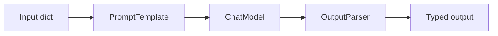

# LangChain: LCEL, Retrieval, Tools, Agents, Memory, and Parsers

## Interview-ready summary

LangChain is a Python/JavaScript framework for composing LLM applications. Modern LangChain emphasizes **LCEL** (LangChain Expression Language): small runnable components composed with `|`, `.invoke()`, `.stream()`, and `.batch()` rather than large legacy monolithic chains.

Use LangChain when you want:

- Prompt templates and model adapters.
- Document loaders and text splitters.
- Retrievers and vector store integrations.
- Tools and agent loops.
- Output parsing and structured results.
- Tracing/evaluation through LangSmith.

---

## 1. Modern LangChain mental model



LCEL composition:

```python
chain = prompt | model | parser
result = chain.invoke({"topic": "RAG"})
```

Important Runnable methods:

| Method | Purpose |
|---|---|
| `.invoke(input)` | Run once synchronously |
| `.ainvoke(input)` | Run once asynchronously |
| `.stream(input)` | Stream chunks |
| `.batch(inputs)` | Run many inputs |
| `.with_retry()` | Retry transient failures |
| `.assign(...)` | Add fields to input dict |
| `.bind(...)` | Bind model/tool parameters |

---

## 2. LCEL chain example

```python
from langchain_core.output_parsers import StrOutputParser
from langchain_core.prompts import ChatPromptTemplate
from langchain_openai import ChatOpenAI

prompt = ChatPromptTemplate.from_messages([
    ("system", "You are a concise technical interviewer."),
    ("human", "Create 3 interview questions about {topic}."),
])

model = ChatOpenAI(model="gpt-4.1-mini", temperature=0.2)
parser = StrOutputParser()

chain = prompt | model | parser

print(chain.invoke({"topic": "ASP.NET Core dependency injection"}))
```

### Why LCEL is preferred over legacy `LLMChain`

Legacy:

```python
# Older style, still seen in tutorials.
from langchain.chains import LLMChain
```

Modern:

```python
chain = prompt | model | parser
```

LCEL is easier to stream, inspect, combine, type, retry, and deploy.

---

## 3. Prompts

### Chat prompt template

```python
from langchain_core.prompts import ChatPromptTemplate

prompt = ChatPromptTemplate.from_messages([
    ("system", "Answer using only the context. Cite sources."),
    ("human", "Question: {question}\n\nContext:\n{context}"),
])
```

### Few-shot prompting

```python
from langchain_core.prompts import FewShotChatMessagePromptTemplate

examples = [
    {"input": "403 from API", "output": "auth_or_permissions"},
    {"input": "charged twice", "output": "billing_dispute"},
]

example_prompt = ChatPromptTemplate.from_messages([
    ("human", "{input}"),
    ("ai", "{output}"),
])

few_shot = FewShotChatMessagePromptTemplate(
    example_prompt=example_prompt,
    examples=examples,
)
```

Prompting best practices:

- Keep system instructions stable and concise.
- Put user/retrieved content in clearly labeled sections.
- Request structured outputs when downstream code depends on the response.
- Do not put secrets in prompts.

---

## 4. Document loaders

Document loaders convert external data into LangChain `Document` objects.

```python
from langchain_community.document_loaders import TextLoader

loader = TextLoader("docs/security-policy.md", encoding="utf-8")
docs = loader.load()

for doc in docs:
    print(doc.page_content[:200])
    print(doc.metadata)
```

Common loaders:

- `TextLoader`
- `PyPDFLoader`
- `DirectoryLoader`
- Web/HTML loaders
- CSV/JSON loaders
- Confluence/SharePoint/community integrations

Production note:

> Loaders are convenience tools. For serious ingestion, preserve document IDs, ACLs, source URLs, update timestamps, and parse errors explicitly.

---

## 5. Text splitters

```python
from langchain_text_splitters import RecursiveCharacterTextSplitter

splitter = RecursiveCharacterTextSplitter(
    chunk_size=800,
    chunk_overlap=120,
)

chunks = splitter.split_documents(docs)
```

### Structure-aware splitting

For Markdown:

```python
from langchain_text_splitters import MarkdownHeaderTextSplitter

headers = [
    ("#", "h1"),
    ("##", "h2"),
    ("###", "h3"),
]

splitter = MarkdownHeaderTextSplitter(headers_to_split_on=headers)
sections = splitter.split_text(markdown_text)
```

Talking point:

> I choose splitters based on content type. Technical docs often need heading-aware chunks; code needs symbol-aware chunks; PDFs need cleaning before splitting.

---

## 6. Vector stores and retrievers

```python
from langchain_chroma import Chroma
from langchain_openai import OpenAIEmbeddings

embeddings = OpenAIEmbeddings(model="text-embedding-3-small")

vectorstore = Chroma.from_documents(
    documents=chunks,
    embedding=embeddings,
    persist_directory="./chroma-db",
)

retriever = vectorstore.as_retriever(
    search_type="similarity",
    search_kwargs={"k": 5},
)

docs = retriever.invoke("How do I rotate API keys?")
```

### Retriever variants

| Retriever | Use case |
|---|---|
| Similarity | Basic semantic search |
| MMR | Increases diversity, reduces duplicate chunks |
| Multi-query | Improves recall with query expansions |
| Contextual compression | Removes irrelevant text from retrieved docs |
| Ensemble | Hybrid sparse + dense retrieval |
| Self-query | Converts natural language into metadata filters |

---

## 7. RAG chain with LCEL

```python
from langchain_core.output_parsers import StrOutputParser
from langchain_core.prompts import ChatPromptTemplate
from langchain_core.runnables import RunnablePassthrough
from langchain_openai import ChatOpenAI


def format_docs(docs):
    return "\n\n".join(
        f"Source: {doc.metadata.get('source', 'unknown')}\n{doc.page_content}"
        for doc in docs
    )


prompt = ChatPromptTemplate.from_template("""
Answer using only the context.
If the answer is missing, say you do not know.

Question: {question}

Context:
{context}
""")

model = ChatOpenAI(model="gpt-4.1-mini", temperature=0)

rag_chain = (
    {
        "context": retriever | format_docs,
        "question": RunnablePassthrough(),
    }
    | prompt
    | model
    | StrOutputParser()
)

answer = rag_chain.invoke("What is the API key rotation policy?")
```

---

## 8. Output parsers and structured output

### Pydantic structured output

```python
from pydantic import BaseModel, Field
from langchain_openai import ChatOpenAI


class SupportTicketClassification(BaseModel):
    intent: str = Field(description="User intent, e.g. billing, auth, bug")
    priority: str = Field(description="low, medium, or high")
    rationale: str


model = ChatOpenAI(model="gpt-4.1-mini", temperature=0)
structured_model = model.with_structured_output(SupportTicketClassification)

result = structured_model.invoke(
    "Customer says they cannot log in and production is down."
)

print(result.intent, result.priority)
```

### Parser choice

| Need | Pattern |
|---|---|
| Plain text | `StrOutputParser` |
| JSON-ish data | Pydantic structured output |
| Tool/function call | Model tool binding |
| Deterministic validation | Validate parsed object in application code |

---

## 9. Tools

Tools are Python functions exposed to the model.

```python
from langchain_core.tools import tool


@tool
def calculate_shipping(weight_kg: float, destination_country: str) -> str:
    """Calculate shipping estimate for a package."""
    base = 8.0 + weight_kg * 1.5
    if destination_country.upper() != "US":
        base += 15.0
    return f"Estimated shipping: ${base:.2f}"
```

Tool design rules:

- Clear names and descriptions.
- Typed parameters.
- Validate inputs inside the function.
- Enforce auth outside the model.
- Avoid broad side-effect tools without confirmations.

---

## 10. Agents and ReAct

An agent is a loop where the model decides whether to answer or call tools.

ReAct pattern:

```text
Reason about the task -> Act by calling a tool -> Observe result -> Repeat -> Answer
```

Modern LangChain often uses LangGraph for durable agents, but LangChain still provides agent helpers.

```python
from langchain.agents import create_react_agent, AgentExecutor
from langchain_core.prompts import PromptTemplate
from langchain_openai import ChatOpenAI

template = """
Answer the following questions as best you can. You have access to:

{tools}

Use this format:
Question: the input question
Thought: what to do
Action: one of [{tool_names}]
Action Input: input to the action
Observation: result
... repeat as needed
Thought: I now know the final answer
Final Answer: final answer

Question: {input}
Thought:{agent_scratchpad}
"""

prompt = PromptTemplate.from_template(template)
model = ChatOpenAI(model="gpt-4.1-mini", temperature=0)
agent = create_react_agent(model, tools, prompt)
executor = AgentExecutor(agent=agent, tools=tools, verbose=True)

result = executor.invoke({"input": "What is shipping for 3 kg to Canada?"})
```

Interview caveat:

> For production agents, I prefer LangGraph when I need checkpoints, human review, state inspection, and controlled routing. Simple LangChain agents are fine for demos and low-risk workflows.

---

## 11. Memory

LangChain memory has evolved. Instead of relying only on legacy memory classes, modern apps usually manage history explicitly.

### Explicit chat history

```python
from langchain_core.messages import HumanMessage, AIMessage

history = [
    HumanMessage(content="How do I create an API key?"),
    AIMessage(content="Open Settings > Security > API Keys."),
]

prompt = ChatPromptTemplate.from_messages([
    ("system", "You are a helpful support assistant."),
    ("placeholder", "{history}"),
    ("human", "{question}"),
])

chain = prompt | model | StrOutputParser()

answer = chain.invoke({
    "history": history,
    "question": "How do I rotate it?",
})
```

### Memory approaches

- Recent message window
- Summaries
- Vector recall of old conversations
- User profile facts in a database
- LangGraph checkpoints for stateful workflows

---

## 12. Observability

Log the following per request:

- Prompt template version
- Model name and parameters
- Input/output token counts
- Retrieved document IDs and scores
- Tool calls and errors
- Latency by stage
- User feedback
- Evaluation labels if available

LangSmith can trace chains and agents, but you can also emit OpenTelemetry spans from your own services.

---

## 13. Common interview questions

### Q: What is LCEL?

LCEL is LangChain's compositional interface for chaining runnables with operators like `|`. It supports invocation, streaming, batching, retries, and easier composition than legacy chain classes.

### Q: How do you build RAG in LangChain?

Load documents, split them, embed chunks, store them in a vector store, expose a retriever, format retrieved docs into a prompt, call a chat model, and parse the output. Add filters, reranking, citations, and evaluation for production.

### Q: When would you not use an agent?

If the workflow is deterministic, use normal code or a fixed chain. Agents add latency, cost, and failure modes. Use agents when the sequence of steps must be selected dynamically.

### Q: What is the difference between tools and retrievers?

A retriever returns documents or context. A tool can execute arbitrary application logic such as API calls, calculations, database lookups, or actions. A retriever can be wrapped as a tool, but it has a narrower purpose.

### Q: How do you get structured output?

Use provider-native structured output when available through `with_structured_output`, Pydantic schemas, or output parsers, then validate the result in application code.

---

## 14. Study exercises

1. Convert a legacy `LLMChain` example to LCEL.
2. Build a RAG chain that returns citations.
3. Add a Pydantic output schema for a support ticket classifier.
4. Create a tool that calls a fake CRM API.
5. Compare a simple agent with an explicit LangGraph workflow.

