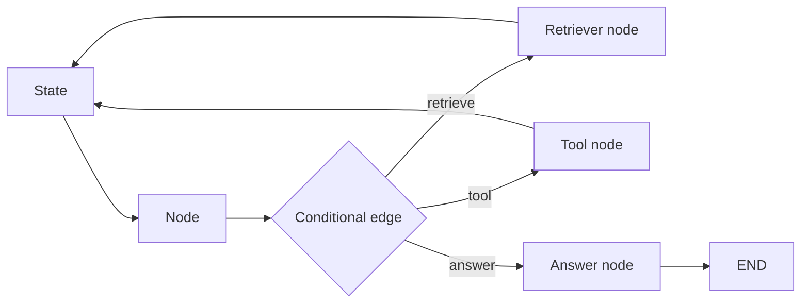
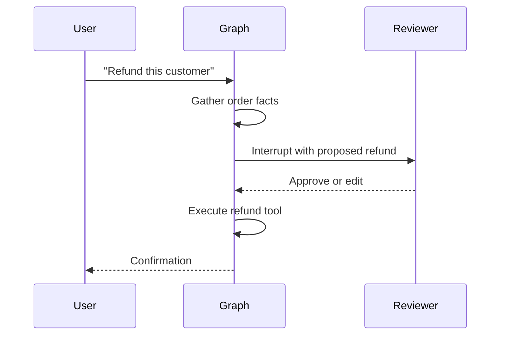
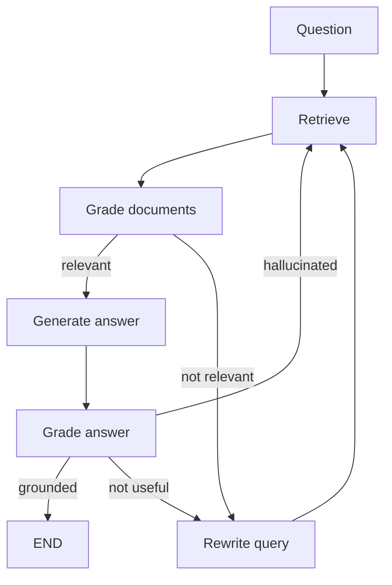
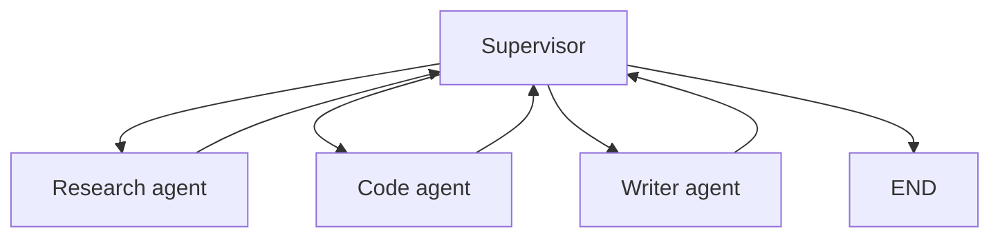

# LangGraph: Stateful Agents, Graph Workflows, and Agentic RAG

## Interview-ready summary

LangGraph is a framework for building stateful, controllable LLM workflows as graphs. It is especially useful when an AI app needs cycles, conditional routing, durable checkpoints, human approval, tool execution, multi-agent collaboration, or recoverable long-running workflows.

LangChain composes chains. LangGraph composes **state machines**.



---

## 1. Core concepts

| Concept | Meaning |
|---|---|
| State | Shared data object passed between nodes |
| Node | Function that reads state and returns state updates |
| Edge | Fixed transition from one node to another |
| Conditional edge | Router function chooses next node |
| Reducer | Defines how concurrent updates merge |
| Checkpointer | Persists graph state between steps/runs |
| Interrupt | Pause execution for human input |
| Compile | Converts graph definition into executable app |

---

## 2. State with `TypedDict` and `Annotated`

LangGraph state is commonly defined as a `TypedDict`.

```python
from typing import Annotated, TypedDict
from langgraph.graph.message import add_messages
from langchain_core.messages import BaseMessage


class ChatState(TypedDict):
    messages: Annotated[list[BaseMessage], add_messages]
    user_id: str
    retrieved_context: list[str]
```

`Annotated[list[BaseMessage], add_messages]` means message updates should be appended rather than overwritten.

### Reducer mental model

```text
Existing state:
messages = [HumanMessage("hello")]

Node returns:
{"messages": [AIMessage("hi")]}

Reducer result:
messages = [HumanMessage("hello"), AIMessage("hi")]
```

---

## 3. Minimal graph

```python
from typing import TypedDict
from langgraph.graph import END, StateGraph


class State(TypedDict):
    topic: str
    outline: str


def write_outline(state: State) -> dict:
    return {"outline": f"1. Intro to {state['topic']}\n2. Key patterns\n3. Interview tips"}


builder = StateGraph(State)
builder.add_node("write_outline", write_outline)
builder.set_entry_point("write_outline")
builder.add_edge("write_outline", END)

graph = builder.compile()
print(graph.invoke({"topic": "RAG", "outline": ""}))
```

---

## 4. Nodes

A node is ordinary Python code.

```python
def retrieve(state: RagState) -> dict:
    docs = retriever.invoke(state["question"])
    return {"documents": docs}
```

Node guidelines:

- Keep each node focused on one responsibility.
- Return only the fields you update.
- Make side effects explicit and observable.
- Validate state assumptions early.
- Use node names that appear clearly in traces.

---

## 5. Edges and conditional routing

```python
def route_after_grading(state: RagState) -> str:
    if state["needs_more_context"]:
        return "rewrite_query"
    if state["has_sufficient_context"]:
        return "generate_answer"
    return "fallback"


builder.add_conditional_edges(
    "grade_documents",
    route_after_grading,
    {
        "rewrite_query": "rewrite_query",
        "generate_answer": "generate_answer",
        "fallback": "fallback",
    },
)
```

Conditional routing is where LangGraph becomes more reliable than a free-form agent loop: you can constrain valid next steps.

---

## 6. Checkpoints and memory

Checkpoints persist graph state. They support:

- Conversation memory
- Resume after failure
- Human-in-the-loop approvals
- Debugging
- Long-running workflows

### In-memory checkpoint example

```python
from langgraph.checkpoint.memory import MemorySaver

checkpointer = MemorySaver()
graph = builder.compile(checkpointer=checkpointer)

config = {"configurable": {"thread_id": "user-123-session-456"}}

graph.invoke(
    {"messages": [("user", "Help me debug this error")]},
    config=config,
)

graph.invoke(
    {"messages": [("user", "What did we try already?")]},
    config=config,
)
```

For production, use a durable checkpointer backed by a database supported by your deployment target.

---

## 7. Human-in-the-loop

Human review is critical for risky actions:

- Sending emails
- Updating CRM records
- Running deployment actions
- Making purchases
- Deleting data

Conceptual flow:



LangGraph supports interrupts so execution can pause until external input resumes it.

---

## 8. Agentic RAG pattern

Classic RAG has a fixed flow:

```text
retrieve -> generate
```

Agentic RAG adds decisions:



Benefits:

- Handles poor initial retrieval.
- Can decide to search again.
- Can reject unsupported answers.
- Separates retrieval quality from generation quality.

Costs:

- More LLM calls.
- More latency.
- More graph complexity.
- Needs loop limits to prevent runaway execution.

---

## 9. Tool-using graph

```python
from langchain_core.messages import ToolMessage


def call_tool(state: AgentState) -> dict:
    last_message = state["messages"][-1]
    tool_call = last_message.tool_calls[0]
    tool_result = tools_by_name[tool_call["name"]].invoke(tool_call["args"])
    return {
        "messages": [
            ToolMessage(
                content=str(tool_result),
                tool_call_id=tool_call["id"],
            )
        ]
    }
```

Typical routing:

```python
def should_continue(state: AgentState) -> str:
    last = state["messages"][-1]
    if getattr(last, "tool_calls", None):
        return "tools"
    return END
```

---

## 10. Multi-agent graphs

Multi-agent systems split responsibilities.

Example research workflow:



Common roles:

- Supervisor/router
- Researcher
- Planner
- Coder
- Reviewer
- Tool executor
- Summarizer

Interview caution:

> Multi-agent systems are useful when roles genuinely reduce complexity. They can also amplify cost, latency, and nondeterminism. I start with a single graph and split agents only when responsibilities are clearly distinct.

---

## 11. Error handling and safety

Production graph checklist:

- Limit loop iterations.
- Track retry counts in state.
- Validate tool arguments.
- Use idempotency keys for side effects.
- Add human approval for irreversible actions.
- Persist checkpoints before risky steps.
- Log state transitions and node latency.
- Define fallback routes.

```python
def route_with_loop_limit(state: RagState) -> str:
    if state["attempts"] >= 3:
        return "fallback"
    if state["needs_retrieval"]:
        return "retrieve"
    return "generate"
```

---

## 12. LangGraph vs LangChain

| Need | LangChain LCEL | LangGraph |
|---|---|---|
| Simple prompt -> model -> parser | Excellent | Overkill |
| Basic RAG chain | Excellent | Useful if conditional |
| Agent loop with tools | Good | Better for control/durability |
| Human approval | Manual | Built in pattern |
| Checkpointed state | Limited | Core feature |
| Cyclic workflows | Awkward | Natural |
| Multi-agent orchestration | Possible | Natural |

---

## 13. Interview questions

### Q: What problem does LangGraph solve?

LangGraph provides a graph/state-machine model for LLM workflows that need state, cycles, conditional routing, persistence, and human-in-the-loop control.

### Q: What is a node?

A node is a function that receives state and returns updates to state. Nodes can call LLMs, retrievers, tools, databases, or deterministic code.

### Q: What is a conditional edge?

A conditional edge runs a router function that inspects current state and returns the name of the next route, such as retrieve, generate, tool, or end.

### Q: Why use checkpoints?

Checkpoints persist state so conversations can continue, failures can resume, humans can approve paused workflows, and production traces can be inspected.

### Q: How do you prevent an agent graph from looping forever?

Track attempts in state, set recursion/step limits, route to fallback after a threshold, and design termination conditions explicitly.

---

## 14. Study exercises

1. Build a graph with `classify -> answer` routes for billing vs technical questions.
2. Add a retrieval node and document relevance grader.
3. Add a query rewrite loop with a max of two retries.
4. Add checkpointed chat memory using `thread_id`.
5. Design a human approval interrupt before calling a "send email" tool.

