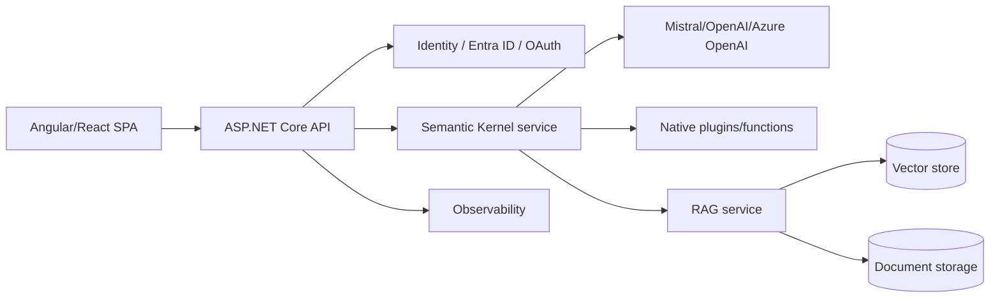
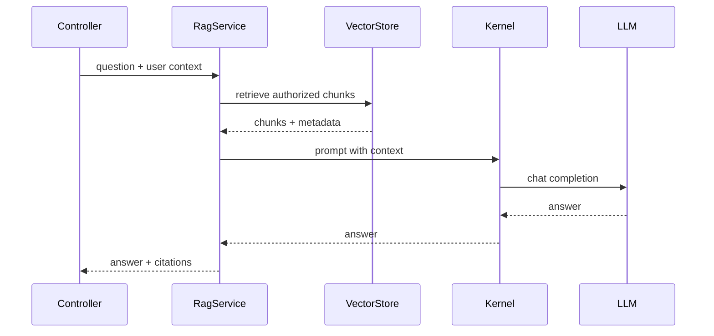
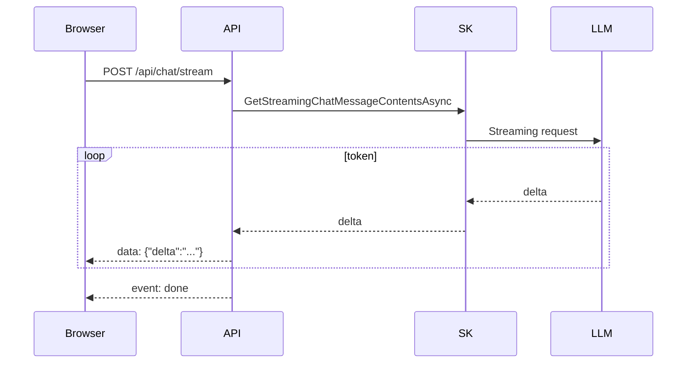

# .NET GenAI with ASP.NET Core and Semantic Kernel

## Interview-ready summary

Semantic Kernel (SK) is Microsoft's orchestration SDK for integrating LLMs into .NET applications. It provides connectors to model providers, prompt functions, native plugins, planners, memory/vector integrations, and streaming APIs. For .NET teams, SK fits naturally into ASP.NET Core dependency injection, configuration, logging, authentication, and enterprise deployment practices.

---

## 1. ASP.NET Core GenAI architecture



### Responsibilities

| Layer | Responsibilities |
|---|---|
| SPA | Chat UI, streaming display, citations, feedback |
| API Controller | Auth, request validation, HTTP/SSE endpoints |
| Application service | Prompt assembly, orchestration, business rules |
| Semantic Kernel | Model connector, plugins, function invocation |
| RAG service | Retrieval, citation metadata, context formatting |
| Data layer | Vector store, source docs, chat history |

---

## 2. Calling LLMs from ASP.NET Core

### NuGet packages

Typical packages vary by provider, but a .NET SK app commonly uses:

```xml
<PackageReference Include="Microsoft.SemanticKernel" Version="*" />
<PackageReference Include="Microsoft.SemanticKernel.Connectors.OpenAI" Version="*" />
```

Use the latest stable versions for real projects.

### Dependency injection setup

```csharp
using Microsoft.SemanticKernel;

var builder = WebApplication.CreateBuilder(args);

builder.Services.AddControllers();

builder.Services.AddKernel()
    .AddOpenAIChatCompletion(
        modelId: builder.Configuration["AI:ChatModel"]!,
        apiKey: builder.Configuration["AI:ApiKey"]!);

builder.Services.AddScoped<ChatService>();

var app = builder.Build();
app.MapControllers();
app.Run();
```

### Chat service

```csharp
using Microsoft.SemanticKernel;
using Microsoft.SemanticKernel.ChatCompletion;

public sealed class ChatService
{
    private readonly IChatCompletionService _chat;
    private readonly Kernel _kernel;

    public ChatService(IChatCompletionService chat, Kernel kernel)
    {
        _chat = chat;
        _kernel = kernel;
    }

    public async Task<string> AskAsync(string question, CancellationToken cancellationToken)
    {
        var history = new ChatHistory();
        history.AddSystemMessage("You are a concise technical assistant.");
        history.AddUserMessage(question);

        var response = await _chat.GetChatMessageContentAsync(
            history,
            kernel: _kernel,
            cancellationToken: cancellationToken);

        return response.Content ?? string.Empty;
    }
}
```

---

## 3. Semantic Kernel concepts

| Concept | Description |
|---|---|
| Kernel | DI-like container for AI services, plugins, and execution |
| Chat completion service | Abstraction over provider chat models |
| Prompt function | Prompt template exposed as callable function |
| Native function | C# method exposed to the model/kernel |
| Plugin | Collection of related functions |
| Kernel arguments | Named values passed into functions/prompts |
| Function invocation filters | Hooks for logging, auth, validation |

---

## 4. Plugins and functions

Native plugins expose C# methods.

```csharp
using System.ComponentModel;
using Microsoft.SemanticKernel;

public sealed class TicketPlugin
{
    [KernelFunction]
    [Description("Create a support ticket for a user issue.")]
    public string CreateTicket(
        [Description("Short issue title")] string title,
        [Description("Detailed issue description")] string description)
    {
        // In production, call an application service with auth and validation.
        var id = $"TICKET-{Random.Shared.Next(1000, 9999)}";
        return $"Created {id}: {title}";
    }
}
```

Register the plugin:

```csharp
builder.Services.AddKernel()
    .Plugins.AddFromType<TicketPlugin>("tickets");
```

Tool/function calling safety:

- Keep functions narrow.
- Validate arguments.
- Enforce authorization in application services.
- Require human approval for destructive actions.
- Log every function invocation.

---

## 5. Prompt functions

```csharp
var prompt = """
You are a support assistant.
Classify the issue into one of: billing, auth, outage, bug, other.

Issue:
{{$input}}
""";

var classify = kernel.CreateFunctionFromPrompt(prompt);
var result = await kernel.InvokeAsync(classify, new KernelArguments
{
    ["input"] = "Customer says they were charged twice."
});

Console.WriteLine(result.GetValue<string>());
```

Prompt function use cases:

- Classification
- Summarization
- Email drafting
- Query rewriting
- RAG answer generation

---

## 6. RAG with Semantic Kernel

Semantic Kernel can be used as the orchestration layer while your application owns retrieval.



### RAG service skeleton

```csharp
public sealed record RetrievedChunk(
    string Id,
    string Title,
    string Url,
    string Content,
    double Score);

public sealed record RagAnswer(
    string Answer,
    IReadOnlyList<RetrievedChunk> Citations);

public interface IVectorSearch
{
    Task<IReadOnlyList<RetrievedChunk>> SearchAsync(
        string query,
        string tenantId,
        CancellationToken cancellationToken);
}
```

Prompt:

```csharp
var prompt = """
You are a grounded documentation assistant.
Use only the context below.
If the context does not answer the question, say you do not know.
Include citation IDs like [doc-1].

Question:
{{$question}}

Context:
{{$context}}
""";
```

---

## 7. Streaming to Angular/React

Streaming improves perceived latency. ASP.NET Core can stream with:

- Server-Sent Events (SSE)
- WebSockets/SignalR
- Chunked HTTP responses

### SSE flow



### Controller pattern

```csharp
[HttpPost("stream")]
public async Task Stream([FromBody] ChatRequest request, CancellationToken ct)
{
    Response.ContentType = "text/event-stream";

    await foreach (var chunk in _chat.StreamAsync(request.Message, ct))
    {
        await Response.WriteAsync($"data: {JsonSerializer.Serialize(new { delta = chunk })}\n\n", ct);
        await Response.Body.FlushAsync(ct);
    }

    await Response.WriteAsync("event: done\ndata: {}\n\n", ct);
}
```

### React SSE-ish fetch reader

```tsx
const response = await fetch("/api/chat/stream", {
  method: "POST",
  headers: { "Content-Type": "application/json" },
  body: JSON.stringify({ message }),
});

const reader = response.body!.getReader();
const decoder = new TextDecoder();

while (true) {
  const { done, value } = await reader.read();
  if (done) break;
  const text = decoder.decode(value, { stream: true });
  appendToken(text);
}
```

---

## 8. SK vs LangChain for .NET shops

| Dimension | Semantic Kernel | LangChain |
|---|---|---|
| Primary ecosystem | .NET and Microsoft stack | Python/JS AI ecosystem |
| ASP.NET Core DI | Natural | Usually separate service |
| Enterprise .NET integration | Strong | Requires bridging |
| Breadth of AI integrations | Good, growing | Very broad |
| Agent graphs | SK planners/processes; evolving | LangGraph is mature for graph agents |
| Team fit | Best for C# teams | Best for Python-heavy AI teams |
| Deployment | Same API service possible | Often Python microservice |

Practical recommendation:

- Use SK when your core platform is ASP.NET Core and the team wants C# end-to-end.
- Use LangChain/LangGraph when AI workflows are complex, Python libraries are central, or data science teams own the stack.
- Use both when appropriate: ASP.NET Core API can call a Python LangGraph service.

---

## 9. Production considerations

### Security

- Store provider keys in Key Vault/Secrets Manager, not appsettings committed to Git.
- Validate request size.
- Redact PII before logging.
- Filter RAG retrieval by tenant/user ACLs.
- Add prompt injection tests.
- Use human approval for sensitive tool calls.

### Reliability

- Use cancellation tokens.
- Set provider timeouts.
- Retry transient failures with backoff.
- Add fallback model/provider where justified.
- Capture partial streaming errors gracefully.

### Cost and latency

- Track tokens per endpoint/user/tenant.
- Cache embeddings and stable prompt outputs.
- Keep retrieved context compact.
- Stream answers when possible.
- Use smaller models for classification/routing.

### Observability

- Correlate request ID across API, retrieval, and provider call.
- Log model, latency, token usage, prompt version, retrieved chunk IDs.
- Emit metrics for error rates and time to first token.

---

## 10. Interview questions

### Q: Why use Semantic Kernel in ASP.NET Core?

It integrates AI orchestration with .NET dependency injection, configuration, logging, and enterprise deployment practices. It lets C# teams expose plugins/functions and call chat models without running a separate Python service.

### Q: How would you stream LLM output to a frontend?

Use the model provider's streaming API through SK, expose an ASP.NET Core endpoint that writes SSE or WebSocket messages, flush each token/chunk, and support cancellation when the user stops generation.

### Q: How do plugins differ from normal services?

Plugins are normal C# functions described so the kernel/model can invoke them. They should still delegate to application services for authorization, validation, and side effects.

### Q: How would you build RAG in a .NET app?

Ingest documents, chunk and embed them, store vectors with metadata, retrieve authorized chunks for the user's query, format context into an SK prompt, generate an answer, validate citations, and return answer plus sources.

