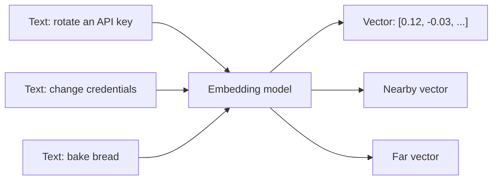
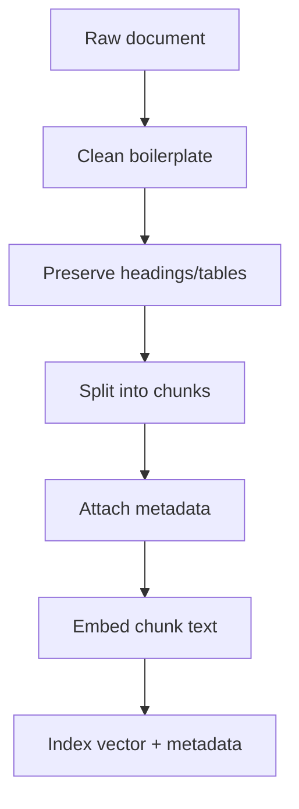
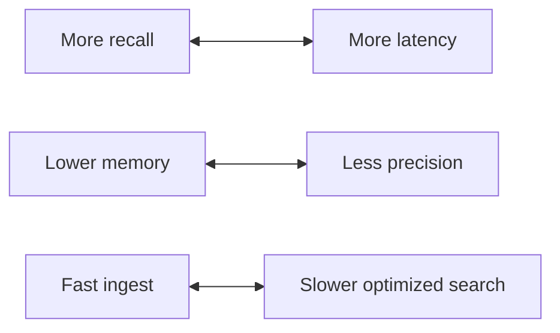
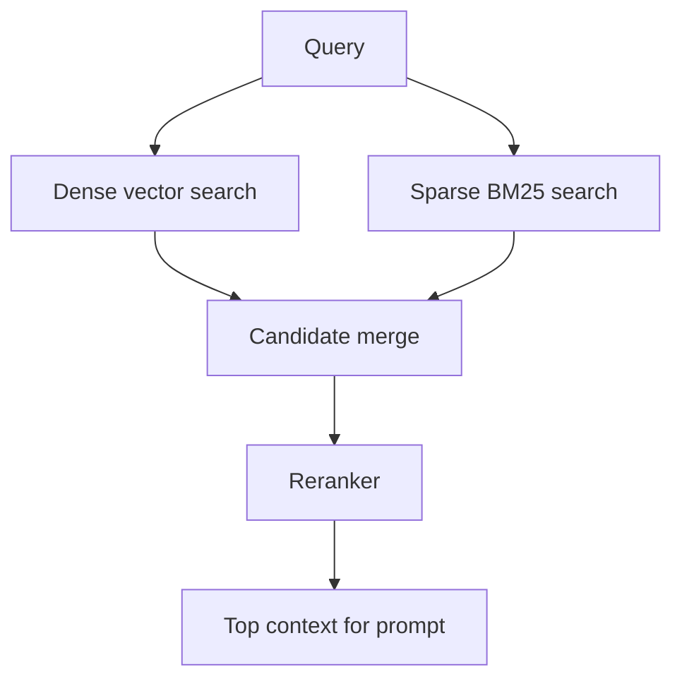

# Embeddings and Vector Databases

## Interview-ready summary

Embeddings turn text, images, code, or other objects into vectors so software can compare meaning with math. Vector databases store those vectors with metadata and indexes so applications can retrieve similar items quickly at scale. In GenAI systems, embeddings usually power semantic search, RAG, deduplication, clustering, recommendations, and memory.

The core production idea:

> Embeddings are not magic knowledge. They are a lossy representation optimized for similarity. Great retrieval requires clean source data, good chunks, correct metadata, tuned indexes, and evaluation.

---

## 1. Embedding mental model



Embedding models are trained so semantically related inputs land near each other in vector space.

### Key properties

| Property | Practical impact |
|---|---|
| Dimension | Storage cost and index size grow with vector length |
| Normalization | Affects cosine vs dot product behavior |
| Domain fit | Legal, code, multilingual, and support content may need different models |
| Max input length | Long chunks may be truncated or poorly represented |
| Version | Re-embedding may be required when model changes |

---

## 2. Similarity metrics

### Cosine similarity

Measures angle between vectors.

```text
cosine(a, b) = dot(a, b) / (||a|| * ||b||)
```

Good for normalized text embeddings.

### Dot product

Fast and common when vectors are normalized by the provider.

```text
dot(a, b) = sum(a_i * b_i)
```

### Euclidean distance

Measures straight-line distance. Useful in some ML contexts, less common for text retrieval.

### Interview answer

> I choose the similarity operator recommended by the embedding model and vector store. For many normalized text embeddings, cosine and dot product rank similarly, but index configuration must match the metric used at query time.

---

## 3. Chunking and embeddings

Embedding quality depends heavily on the text being embedded.



### Chunk design goals

- Each chunk should contain one coherent idea.
- Important headings should be included.
- Chunks should be small enough to retrieve precisely.
- Chunks should be large enough to answer real questions.
- Metadata must preserve source, tenant, ACL, document version, and section.

### Common chunk formats

```text
Title: API Key Security Policy
Section: Rotation
Source: security/api-keys.md

API keys must be rotated every 90 days...
```

Including title/section in embedded text often improves retrieval for short user queries.

---

## 4. Vector database internals

A vector database must solve two problems:

1. Store vectors and metadata.
2. Search nearest neighbors efficiently.

### Exact vs approximate nearest neighbor

| Search type | Description | Pros | Cons |
|---|---|---|---|
| Exact | Compare query vector with every vector | Highest recall | Slow/expensive at scale |
| Approximate nearest neighbor (ANN) | Use index structures to search likely neighbors | Fast at scale | May miss some true neighbors |

### Common ANN indexes

| Index | Mental model | Good for | Tuning knobs |
|---|---|---|---|
| HNSW | Graph of nearby vectors | Low-latency high-recall search | `m`, `ef_construction`, `ef_search` |
| IVF/IVFFlat | Cluster vectors into lists | Large datasets, pgvector | `lists`, `probes` |
| PQ/quantization | Compress vectors | Memory reduction | compression level, recall trade-off |

### Index trade-off diagram



Production teams tune these trade-offs with a retrieval evaluation set.

---

## 5. Metadata filtering

Metadata filters are non-negotiable in enterprise RAG.

```json
{
  "chunk_id": "security-api-keys#rotation#3",
  "tenant_id": "acme",
  "visibility": "internal",
  "acl_group_ids": ["security-team", "platform-eng"],
  "source_uri": "https://docs.example.com/security/api-keys",
  "document_version": "2026-07-01",
  "section": "Rotation",
  "updated_at": "2026-07-01T10:30:00Z"
}
```

Use metadata for:

- Tenant isolation.
- User authorization.
- Freshness filtering.
- Source citations.
- Incremental re-indexing.
- Debugging retrieval misses.
- A/B tests and prompt version analysis.

### Filtering before vs after vector search

| Approach | Risk |
|---|---|
| Pre-filter by tenant/ACL, then vector search | Best security posture |
| Vector search all docs, then filter | May leak ranking/latency signals; can hurt recall after filtering |
| Filter after generation | Severe security bug: model has already seen unauthorized content |

---

## 6. Store selection

| Store | Strengths | Watch-outs |
|---|---|---|
| pgvector | SQL, transactions, joins, backups, existing Postgres ops | Needs tuning for very large/high-QPS vector workloads |
| Qdrant | Payload filtering, HNSW, production vector DB features | Additional service to operate |
| Pinecone | Managed scaling, simple SaaS ops | Vendor dependency and cost model |
| Weaviate | Schema and hybrid search features | Operational complexity if self-hosted |
| Chroma | Great local/dev ergonomics | Not usually first choice for strict enterprise ops |
| FAISS | Very fast local library | Metadata, persistence, and multi-tenant concerns are DIY |
| Elasticsearch/OpenSearch | Hybrid keyword/vector in existing search stack | Vector features vary by version/config |

### Selection checklist

- Dataset size now and in 12 months.
- QPS and latency requirements.
- Need for hybrid search.
- Metadata filter expressiveness.
- Multi-tenant isolation model.
- Backup/restore and disaster recovery.
- Team operational familiarity.
- Cost per vector, per query, and per replica.

---

## 7. Hybrid retrieval

Vector search is not enough for every query.



Dense retrieval handles paraphrase:

- "rotate credentials" -> "change API key"

Sparse retrieval handles exact tokens:

- error code `E_AUTH_1043`
- customer ID `CUST-92019`
- function name `GetStreamingChatMessageContentsAsync`
- product name `FlexLedger`

### Reciprocal Rank Fusion

```python
def reciprocal_rank_fusion(result_lists: list[list[str]], k: int = 60) -> list[tuple[str, float]]:
    scores: dict[str, float] = {}
    for results in result_lists:
        for rank, doc_id in enumerate(results, start=1):
            scores[doc_id] = scores.get(doc_id, 0.0) + 1.0 / (k + rank)
    return sorted(scores.items(), key=lambda item: item[1], reverse=True)
```

---

## 8. Reranking

Reranking scores query-document pairs after initial retrieval.

```text
Retrieve top 100 candidates
  -> rerank with cross-encoder/LLM/provider API
  -> keep top 5-10 chunks
  -> generate answer
```

Use reranking when:

- Users ask nuanced questions.
- Top vector hits are noisy.
- You have many near-duplicate chunks.
- You need high citation precision.

Avoid reranking when:

- Latency budget is very tight.
- Queries are simple and retrieval already performs well.
- Cost of additional model/API call is not justified.

---

## 9. Embedding lifecycle and re-indexing

Embedding pipelines need lifecycle management.


### Version fields

Track:

- `embedding_model`
- `embedding_dimension`
- `chunker_version`
- `source_document_version`
- `index_version`
- `created_at`

Why:

- You cannot safely mix incompatible dimensions.
- Model upgrades can change vector neighborhoods.
- Chunker changes can require full re-ingestion.
- Eval comparisons need reproducible indexes.

---

## 10. Common failure modes

| Failure | Symptom | Fix |
|---|---|---|
| Over-large chunks | Answers cite broad irrelevant chunks | Smaller/structure-aware chunks |
| Tiny chunks | Missing context across boundaries | Parent-child retrieval or overlap |
| Missing metadata | No citations or auth filters | Preserve source metadata during ingestion |
| Poor OCR/PDF parsing | Garbage retrieved | Improve extraction and quality checks |
| Wrong metric/index | Bad nearest neighbors | Match model guidance and index config |
| No hybrid search | Error codes/product IDs missed | Add BM25/sparse retrieval |
| No eval set | Tuning by anecdotes | Build golden query/chunk labels |
| Re-embedding drift | Quality changes unexpectedly | Version indexes and run evals before promotion |

---

## 11. Evaluation metrics

### Retrieval metrics

| Metric | Question answered |
|---|---|
| Recall@k | Did we retrieve at least one relevant chunk? |
| Precision@k | How many retrieved chunks were relevant? |
| MRR | How high was the first relevant result? |
| NDCG | Did highly relevant chunks rank above weaker ones? |
| Filter correctness | Were unauthorized chunks excluded? |

### Operational metrics

- p50/p95 retrieval latency.
- Index build time.
- Embedding queue lag.
- Vector DB memory/disk usage.
- Query cost.
- No-result rate.
- Reranker drop rate.

---

## 12. Interview questions

### Q: What is an embedding?

An embedding is a dense numeric vector representing semantic features of an input. Similar inputs should produce nearby vectors, enabling semantic search and clustering.

### Q: How do you choose a vector database?

I start from workload requirements: dataset size, latency, QPS, metadata filters, hybrid search, multi-tenancy, operational maturity, and cost. The database choice matters less than ingestion quality and evaluation, but it must satisfy security and scale requirements.

### Q: Why might vector search fail on an exact error code?

Embeddings optimize semantic similarity, not exact token matching. Error codes, IDs, and names often need keyword/BM25 or hybrid retrieval.

### Q: What happens when you change embedding models?

You generally need to re-embed and build a new index version because vector dimensions or neighborhoods may change. Run retrieval evals before promoting the new index.

### Q: How do metadata filters relate to security?

Tenant and ACL filters must be applied before context reaches the model. Post-generation filtering is too late because unauthorized information may already have influenced the answer.

---

## 13. Hands-on exercises

1. Design metadata for a multi-tenant support-document index.
2. Compare fixed-size and heading-aware chunking on the same Markdown file.
3. Implement reciprocal rank fusion for vector and BM25 results.
4. Create five golden queries with relevant chunk IDs and calculate recall@3.
5. Sketch a blue/green embedding index migration plan.
