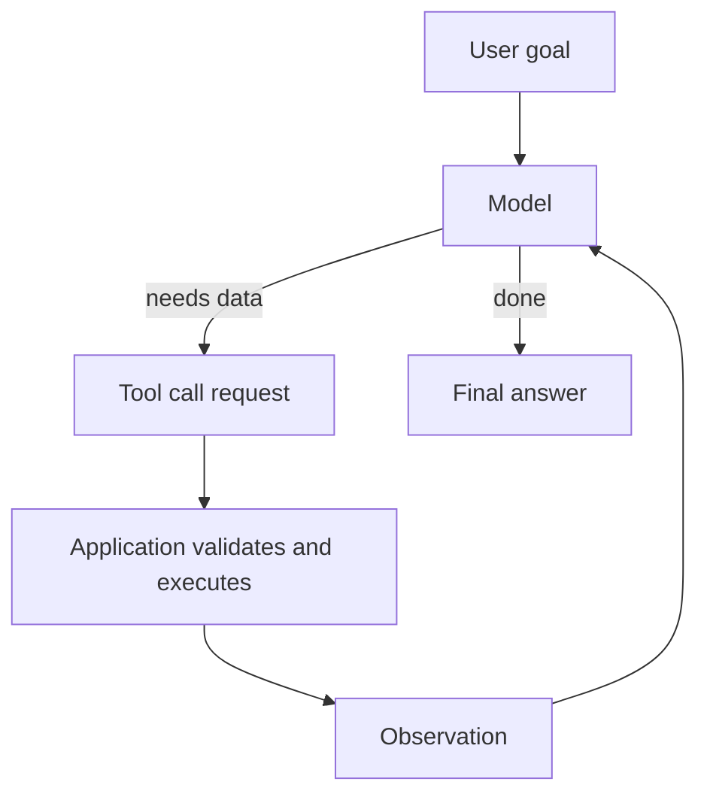
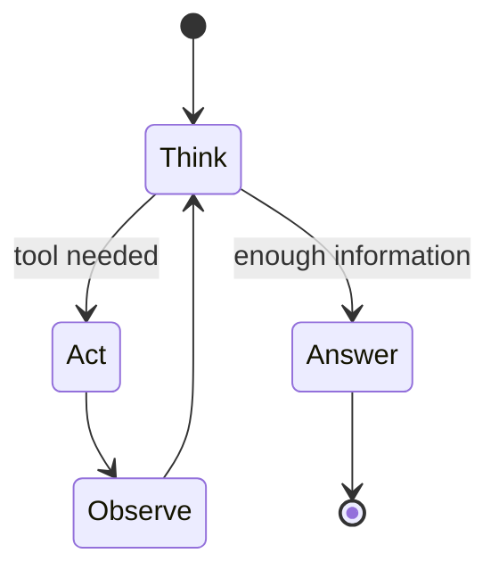
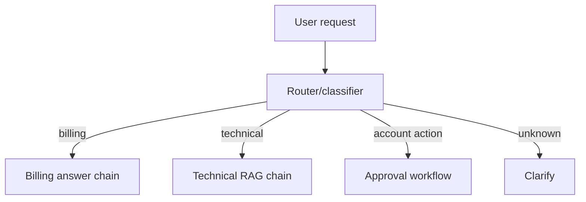
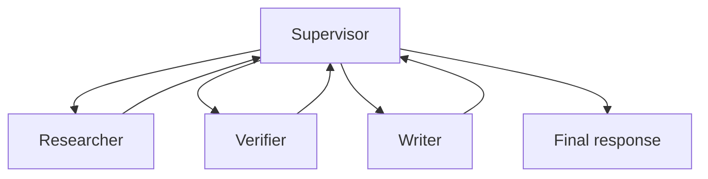
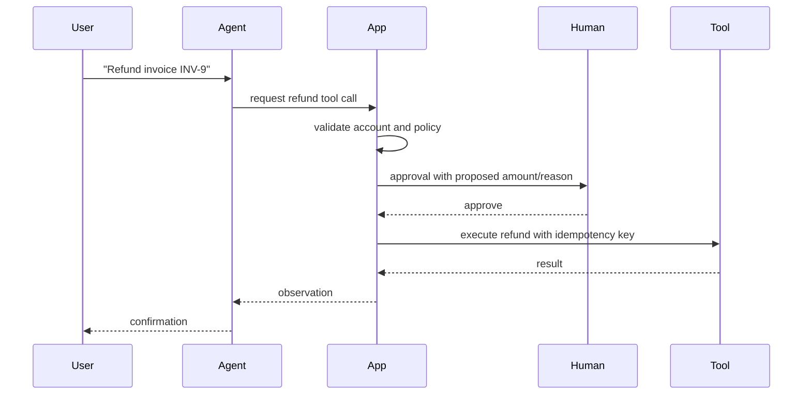
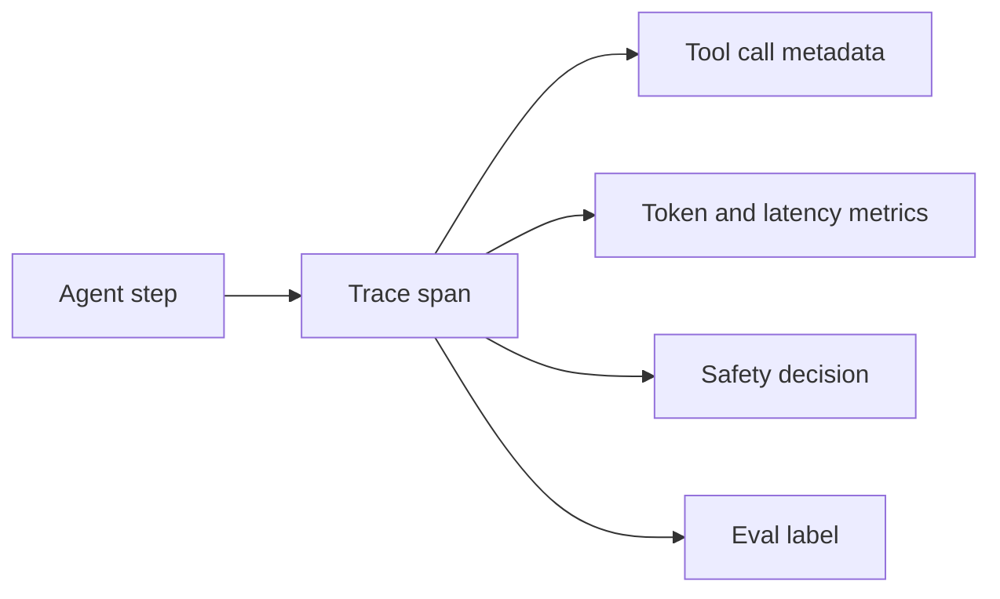

# Agents and Tools

## Interview-ready summary

An AI agent is an LLM-driven control loop that can decide what step to take next, often by calling tools, retrieving information, asking for clarification, or producing a final answer. Tools are application-owned functions exposed to the model through schemas. Production agent design is mostly about constraining autonomy: clear goals, narrow tools, state, loop limits, authorization, observability, and human approval for risky actions.

Core interview framing:

> Agents are useful when the sequence of steps is dynamic. If the workflow is known in advance, deterministic code or a fixed graph is usually safer, faster, and cheaper.

---

## 1. Tools vs agents

| Concept | Meaning | Example |
|---|---|---|
| Tool | A callable function/API exposed to the model | `lookup_order_status(order_id)` |
| Tool calling | Model requests a tool call; app executes it | Model emits JSON args |
| Agent | Loop that decides whether to call tools or answer | Research -> search -> summarize |
| Workflow/graph | Explicit state machine controlling steps | LangGraph approval flow |



The model proposes; the application disposes.

---

## 2. Tool schema design

Good tools are:

- Narrow.
- Typed.
- Auth-aware.
- Idempotent where possible.
- Observable.
- Clear about side effects.

### Poor tool

```json
{
  "name": "run_sql",
  "description": "Run SQL against production",
  "parameters": {
    "type": "object",
    "properties": {
      "sql": {"type": "string"}
    }
  }
}
```

Why it is dangerous:

- Too broad.
- Easy prompt-injection target.
- Hard to authorize.
- Can mutate data.
- No business-level validation.

### Better tool

```json
{
  "name": "get_customer_invoice_summary",
  "description": "Read invoice totals and payment status for one authorized customer.",
  "parameters": {
    "type": "object",
    "properties": {
      "customer_id": {
        "type": "string",
        "description": "Customer ID from the authenticated session scope."
      },
      "invoice_month": {
        "type": "string",
        "description": "Month in YYYY-MM format."
      }
    },
    "required": ["customer_id", "invoice_month"]
  }
}
```

Application code still verifies that the caller can access `customer_id`.

---

## 3. ReAct pattern

ReAct combines reasoning and acting:

```text
Thought: I need the policy and current account status.
Action: lookup_policy("api keys")
Observation: API keys rotate every 90 days.
Action: get_account_keys("acct-123")
Observation: Last rotation was 110 days ago.
Final Answer: Your key is overdue for rotation...
```

Modern APIs often hide this text behind structured tool calls, but the control loop is similar.



### ReAct pitfalls

- Tool overuse.
- Infinite loops.
- Acting on stale observations.
- Treating tool errors as facts.
- Leaking internal scratchpad text.
- Using natural language parsing instead of structured tool calls.

---

## 4. Agent architectures

### Single-agent tool loop

Best for:

- Simple assistant with a few read-only tools.
- Low-risk research or support tasks.
- Small dynamic decisions.

Risks:

- Harder to guarantee exact route.
- Can choose unnecessary tools.

### Router + specialist tools



Best when categories are well-defined and you want predictable behavior.

### Graph-based agent

Use LangGraph or a similar state machine when you need:

- Cycles with limits.
- Checkpoints.
- Human approval.
- Multi-step tool orchestration.
- Durable state and resumability.
- Strong observability of transitions.

### Multi-agent system

Use separate agents only when roles are genuinely distinct.



Common production issue: multi-agent systems multiply token cost and failure modes faster than they improve quality.

---

## 5. Tool safety model

### Risk categories

| Tool category | Example | Safety requirement |
|---|---|---|
| Pure calculation | cost estimate | Validate numeric inputs |
| Read-only lookup | order status | AuthZ, rate limits, data minimization |
| External search | web/doc search | Source trust and citation policy |
| Draft side effect | draft email | Human review before send |
| Irreversible action | delete account, refund | Explicit approval, idempotency, audit logs |

### Side-effect flow



The approval payload should include:

- User request.
- Tool name and arguments.
- Data used to decide.
- Expected side effect.
- Idempotency key.
- Reviewer decision.

---

## 6. State and memory

Agents need state to avoid repeating work and to support recovery.

Example state fields:

```python
class AgentState(TypedDict):
    user_id: str
    tenant_id: str
    messages: list
    tool_results: list[dict]
    plan: list[str]
    attempts: int
    approved_actions: list[str]
    final_answer: str
```

### Memory types

| Memory | Use case | Risk |
|---|---|---|
| Conversation history | Follow-up context | Token growth, stale assumptions |
| Scratchpad | Intermediate work | Should not be shown blindly |
| Tool observations | Authoritative results | Must include timestamps/source |
| User profile | Preferences | Privacy and consent |
| Checkpoints | Resume workflow | Secure storage and retention |

---

## 7. Planning

Planning can improve multi-step tasks, but plans should be treated as tentative.

```text
Goal: Create a migration checklist.
Plan:
1. Retrieve database migration policy.
2. Check service ownership.
3. Draft checklist.
4. Ask for human review if production data is affected.
```

Good planning prompts:

- Ask for short plans.
- Require tool-backed facts for unknowns.
- Allow replanning after observations.
- Stop after a bounded number of steps.

Bad planning prompts:

- Ask for elaborate hidden reasoning.
- Give broad permission to execute.
- Mix planning and irreversible actions.

---

## 8. Agent evaluation

Evaluate more than final answer quality.

| Metric | What it catches |
|---|---|
| Task success | Did the agent accomplish the goal? |
| Tool precision | Were tool calls necessary and correct? |
| Tool recall | Did it call required tools? |
| Argument accuracy | Were tool arguments valid? |
| Loop count | Did it waste steps? |
| Safety compliance | Did it ask approval when required? |
| Recovery | Did it handle tool errors/timeouts? |
| Cost/latency | Is the agent viable in production? |

### Eval scenarios

- Happy path with one tool call.
- Ambiguous request requiring clarification.
- Unauthorized account access attempt.
- Prompt injection in retrieved content.
- Tool timeout.
- Side-effect request without approval.
- Multi-turn correction by user.

---

## 9. Observability

Log agent traces with:

- Request ID and tenant/user scope.
- Prompt/tool schema versions.
- Model name and parameters.
- Each tool call request.
- Validation decision.
- Tool latency/error/result summary.
- Routing decisions.
- Token usage by step.
- Final outcome and user feedback.



Avoid logging raw PII or secrets in prompts/tool results.

---

## 10. When not to use agents

Prefer deterministic code when:

- Steps are fixed.
- Output must be exactly reproducible.
- Work is a simple CRUD operation.
- Business rules are fully known.
- Latency/cost must be minimal.
- Failure has high blast radius.

Examples:

- Password reset workflow.
- Invoice payment calculation.
- Database migration execution.
- Compliance approval decision.

You can still use an LLM for a subtask such as summarizing user input, while deterministic code controls the workflow.

---

## 11. Common pitfalls

| Pitfall | Consequence | Mitigation |
|---|---|---|
| Broad tools | Data leaks or dangerous actions | Narrow business tools |
| No loop limit | Runaway cost/latency | Attempts counter and recursion limit |
| No auth in tool layer | Cross-tenant data exposure | Enforce auth before execution |
| Tool result trusted blindly | Bad decisions from stale/errors | Include source/time/error semantics |
| Multi-agent by default | Complexity explosion | Start single-agent/graph |
| Hidden state not persisted | Cannot resume/debug | Checkpoints/traces |
| No evals | Regressions unnoticed | Scenario-based agent eval suite |

---

## 12. Interview questions

### Q: What is the difference between tool calling and an agent?

Tool calling is a model requesting a function invocation. An agent is a loop that can repeatedly decide to call tools, observe results, update state, and eventually answer.

### Q: How do you secure tool calling?

Use narrow tool schemas, validate arguments, enforce application authorization, add rate limits and idempotency, require human approval for risky side effects, and log every call.

### Q: When would you choose LangGraph over a simple LangChain agent?

When I need durable state, explicit routing, cycles with limits, checkpoints, human-in-the-loop, multi-agent orchestration, or production-grade traceability.

### Q: Why are agents expensive?

They often require multiple model calls, tool calls, reranking/retrieval steps, and retries. Each step adds tokens, latency, and failure modes.

### Q: How do you evaluate an agent?

I evaluate task success, tool selection, argument correctness, safety compliance, loop count, latency/cost, and recovery from errors using scenario-based test cases.

---

## 13. Hands-on exercises

1. Design three tools for a support assistant: one read-only, one calculation, one side-effecting.
2. Add an authorization check to a tool executor.
3. Create five agent eval scenarios, including one prompt injection case.
4. Convert a free-form agent into a graph with explicit routes.
5. Add loop limits and fallback behavior to a ReAct loop.
