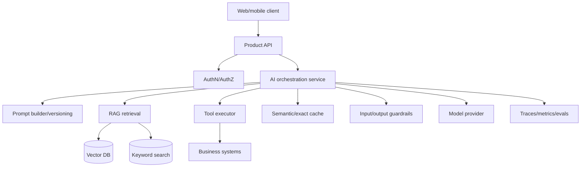
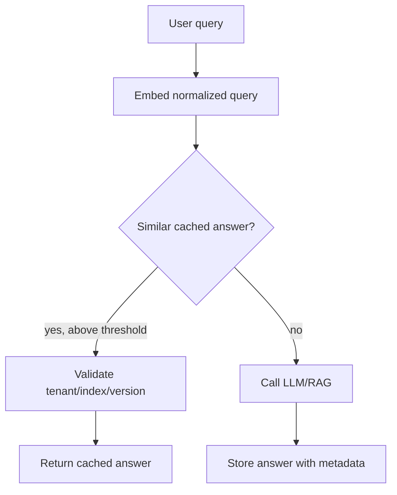
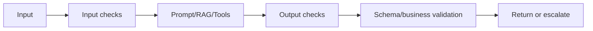
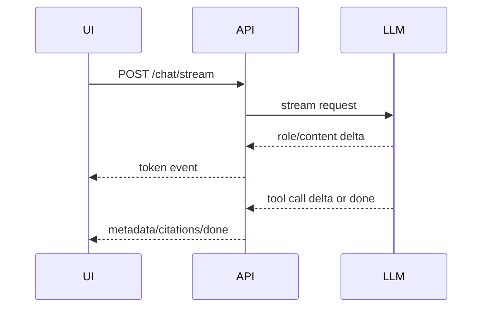
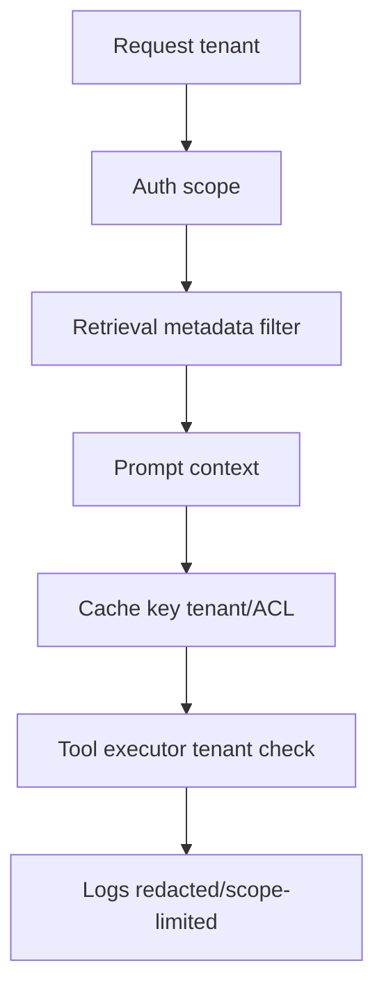

# Production GenAI Patterns

## Interview-ready summary

Production GenAI is software engineering around an unreliable, probabilistic, third-party-dependent component. The hard parts are cost control, latency, caching, guardrails, streaming UX, tenant isolation, evaluation, observability, and safe tool execution.

Senior-level framing:

> I design GenAI systems as distributed systems with probabilistic components: explicit budgets, fallbacks, validation, isolation, telemetry, and release gates.

---

## 1. Reference architecture



The API should own:

- Authentication and authorization.
- Prompt assembly.
- Context size budgets.
- Provider selection.
- Retry/fallback policy.
- Tool execution.
- Output validation.
- Telemetry.

The model should not own:

- Authorization.
- Business invariants.
- Secret handling.
- Final side-effect decisions.
- Tenant isolation.

---

## 2. Cost management

LLM costs usually depend on:

- Input tokens.
- Output tokens.
- Model choice.
- Embedding volume.
- Reranking calls.
- Agent loop steps.
- Cache hit rate.
- Provider minimums or reserved capacity.

### Cost equation

```text
request_cost =
  input_tokens / 1_000_000 * input_rate
+ output_tokens / 1_000_000 * output_rate
+ embedding_tokens / 1_000_000 * embedding_rate
+ rerank_calls * rerank_rate
+ tool/provider fixed costs
```

### Cost controls

| Control | Impact |
|---|---|
| Token budgets | Prevent runaway prompts/answers |
| Smaller models for routing | Reduce cost for simple tasks |
| Prompt compression | Lower repeated instruction tokens |
| Retrieval top-k tuning | Avoid stuffing irrelevant context |
| Output length limits | Reduce long-tail costs |
| Exact cache | Free repeated deterministic responses |
| Semantic cache | Reduce repeated similar answers |
| Agent step limits | Bound worst-case cost |
| Per-tenant quotas | Prevent abuse/noisy neighbors |

### Budget enforcement example

```python
def enforce_token_budget(system_tokens: int, history_tokens: int, context_tokens: int, answer_budget: int) -> None:
    total = system_tokens + history_tokens + context_tokens + answer_budget
    if total > 24_000:
        raise ValueError(f"Prompt budget exceeded: {total} tokens")
```

In production, use provider tokenizers or model-compatible approximations.

---

## 3. Caching patterns

Caching reduces cost and latency but can return stale or unsafe answers if designed poorly.

### Cache types

| Cache | Key | Use | Risk |
|---|---|---|---|
| Embedding cache | normalized text + model | Avoid re-embedding same chunk/query | Model version mismatch |
| Exact prompt cache | prompt hash + model params | Deterministic repeated calls | User/tenant leakage if key incomplete |
| Semantic cache | query embedding similarity | Similar FAQs | Stale/incorrect reuse |
| Retrieval cache | query + tenant + index version | Faster RAG | ACL/index drift |
| Tool cache | tool name + args + user scope | Read-only data | Stale business data |

### Safe cache key

Include:

- Tenant ID.
- User permission scope or ACL hash.
- Prompt version.
- Model name and parameters.
- Retrieval index version.
- Tool/data version.
- Locale if output language matters.

```text
cache_key = hash(
  tenant_id,
  acl_hash,
  prompt_version,
  model,
  temperature,
  index_version,
  normalized_question
)
```

### Semantic cache flow



Use semantic caching for low-risk informational answers, not personalized account facts or regulated advice.

---

## 4. Guardrails

Guardrails are policy and validation layers around model calls.



### Guardrail categories

| Category | Examples |
|---|---|
| Input safety | malware, hate, self-harm, illegal requests |
| Data protection | PII redaction, secret detection, tenant scope |
| Prompt injection | detect instruction override attempts |
| Tool safety | argument validation, authorization, approval |
| Output validation | JSON schema, citations, policy compliance |
| Business rules | refund limits, legal disclaimers, escalation |

### Guardrail placement

- **Before retrieval**: classify risky input and enforce tenant scope.
- **Before model call**: redact secrets and trim context.
- **Before tool execution**: validate arguments and permissions.
- **After model output**: validate schema, citations, and policy.
- **Before logging**: redact sensitive values.

Guardrails should fail closed for high-risk workflows.

---

## 5. Streaming

Streaming improves perceived latency because users see the answer as it is generated.

### Streaming protocols

| Protocol | Best for | Notes |
|---|---|---|
| Server-Sent Events (SSE) | Token streaming over HTTP | Simple, one-way server -> client |
| WebSockets | Bidirectional interaction | Useful for collaborative/interactive agents |
| Chunked fetch | Modern frontend streaming | Works with `ReadableStream` |
| SignalR | .NET real-time apps | Good for ASP.NET/SPA stacks |

### Streaming lifecycle



### Streaming design concerns

- Time to first token.
- Cancellation when user stops generation.
- Partial output if provider fails.
- Moderation/guardrails before displaying unsafe content.
- Citation display after final context validation.
- Backpressure and disconnect handling.
- Observability for first-token and total latency.

### UX pattern

Show:

- Spinner while retrieving context.
- Streaming assistant text.
- "Checking citations..." after final token if validation runs post-generation.
- Source cards after validation.
- Retry/regenerate controls.

---

## 6. Multi-tenant design

Multi-tenant GenAI systems must prevent data leakage through retrieval, prompts, caches, logs, and tool calls.

### Isolation points



### Requirements

- Tenant ID in every document chunk.
- ACL metadata at chunk/document level.
- Pre-retrieval filtering by tenant and permissions.
- Tenant-aware cache keys.
- Tenant-aware rate limits and budgets.
- Per-tenant audit logs.
- Data retention controls.
- No cross-tenant prompt examples containing customer data.

### Common bug

```text
Vector search top 20 across all tenants
-> filter to tenant
-> only 1 weak result remains
-> generator answers poorly
```

Better:

```text
Filter candidate set by tenant/ACL
-> vector/hybrid search within authorized scope
-> rerank authorized candidates
```

---

## 7. Reliability and fallback

LLM providers can fail, timeout, rate limit, or change behavior.

### Controls

- Timeouts per stage.
- Retries with exponential backoff for transient errors.
- Circuit breaker per provider/model.
- Fallback model for low-risk requests.
- Queue or degrade for non-interactive tasks.
- User-facing partial response handling.
- Idempotency keys for tool side effects.

### Fallback matrix

| Failure | Possible fallback |
|---|---|
| Chat provider timeout | Smaller/faster model, retry once, ask user to retry |
| Embedding provider outage | Use cached embeddings; delay ingestion |
| Vector DB unavailable | Keyword search fallback if available |
| Reranker unavailable | Use initial ranking with lower confidence |
| Tool timeout | Explain unavailable live data |
| Guardrail uncertainty | Escalate or refuse |

Do not silently fallback to a model that violates data residency or safety requirements.

---

## 8. Security and privacy

### Secret handling

- Never put API keys in prompts.
- Redact secrets from logs.
- Use managed secret stores.
- Scope provider keys per environment.
- Rotate keys and monitor usage.

### PII handling

- Minimize prompt data.
- Redact or tokenize where possible.
- Define retention periods.
- Control access to traces.
- Use synthetic data for evals when possible.

### Provider review

Understand:

- Data retention policy.
- Training/data usage policy.
- Region and residency.
- Encryption.
- Audit/compliance posture.
- Enterprise controls.

---

## 9. Deployment patterns

### Monolith-integrated AI

Best when:

- Team is small.
- Workflows are simple.
- Existing backend handles auth/data.

Risk: AI dependencies can complicate the core service.

### Dedicated AI service

Best when:

- Multiple products share AI capabilities.
- Python ecosystem is needed.
- Independent scaling/evaluation is useful.

Risk: distributed system complexity.

### Async batch pipeline

Best for:

- Document ingestion.
- Offline summarization.
- Eval runs.
- Embedding generation.

Risk: freshness and queue monitoring.

---

## 10. Production readiness checklist

### Quality

- [ ] Golden dataset exists.
- [ ] Prompt/model/retrieval changes are evaluated.
- [ ] Citation validation implemented for RAG.
- [ ] Refusal behavior tested.

### Cost

- [ ] Token budgets enforced.
- [ ] Cost tracked by endpoint and tenant.
- [ ] Caching strategy documented.
- [ ] Agent loop limits configured.

### Security

- [ ] Tenant/ACL filters happen before generation.
- [ ] Tool calls enforce authorization.
- [ ] Secrets/PII redacted in logs.
- [ ] Prompt injection tests exist.

### Reliability

- [ ] Timeouts and cancellation implemented.
- [ ] Retry/fallback policies defined.
- [ ] Streaming handles disconnects.
- [ ] Provider errors surfaced gracefully.

### Observability

- [ ] Traces include prompt/model/retrieval/tool metadata.
- [ ] Metrics dashboard exists.
- [ ] Feedback captured.
- [ ] Release gates and rollback plan defined.

---

## 11. Interview questions

### Q: How do you control LLM cost?

Set token budgets, choose smaller models for simple tasks, limit retrieved context, cap output length, cache embeddings/responses, enforce agent step limits, and monitor cost by endpoint/tenant.

### Q: What should be in a cache key for GenAI?

Tenant/user permission scope, prompt version, model and parameters, retrieval index version, normalized query or prompt hash, and any data/tool version that affects the answer.

### Q: How do you build guardrails?

Layer input checks, prompt/data separation, retrieval authorization, tool validation, output schema/citation checks, business rules, and observability. High-risk workflows fail closed or escalate.

### Q: Why stream LLM responses?

Streaming improves perceived latency and lets users cancel long generations. It requires handling partial outputs, disconnects, final validation, and token-level telemetry.

### Q: What is the most important multi-tenant RAG rule?

Filter by tenant and ACL before the model sees context. Also make caches, logs, tools, and eval data tenant-aware.

---

## 12. Hands-on exercises

1. Design a token budget for a RAG endpoint with 32k context.
2. Write a tenant-safe cache key function.
3. Add output schema validation and citation validation to a chat API.
4. Sketch an SSE streaming endpoint with cancellation.
5. Create a fallback matrix for a provider outage.
