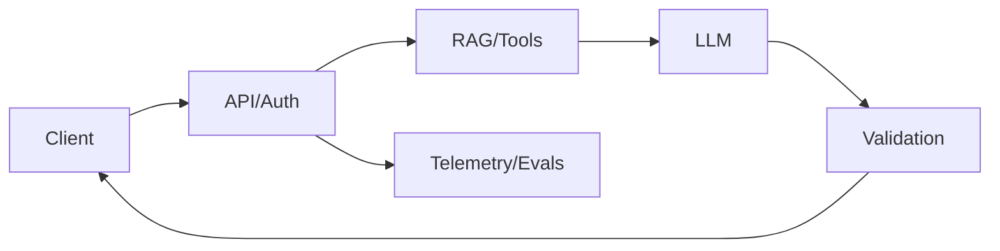
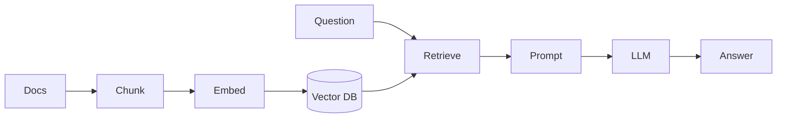
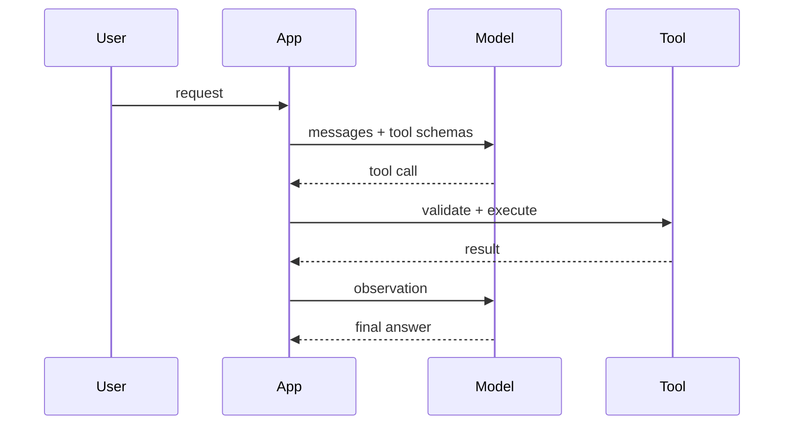
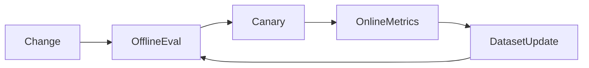

# GenAI Interview Cheat Sheet

## 1. One-minute architecture answer

```text
A production GenAI app is not just an LLM call. It has an API layer for auth and request validation, prompt assembly, retrieval or tools for external facts, model invocation, output validation, streaming UX, evaluation, observability, cost controls, and guardrails.
```



---

## 2. Core definitions

| Term | Interview definition |
|---|---|
| Token | Unit processed by the model; drives cost, latency, and context limits |
| Context window | Max input/output tokens the model can handle in one request |
| Embedding | Vector representation of semantic meaning |
| Vector DB | Store/index for vectors plus metadata filters |
| RAG | Retrieve external context, then generate grounded answer |
| Tool calling | Model requests app-owned function execution |
| Agent | Loop that decides next steps/tool calls dynamically |
| Temperature | Sampling randomness, not knowledge |
| Prompt injection | Untrusted text tries to override trusted instructions |
| Faithfulness | Answer claims are supported by context |

---

## 3. Decision table

| Problem | First choice | Why |
|---|---|---|
| Need private/current documents | RAG | Updatable, citable, access-controlled |
| Need live account/order data | Tool/API call | Authoritative system of record |
| Need strict calculation | Deterministic code/tool | Avoid probabilistic math |
| Need output format/style | Prompt/structured output | Cheapest change |
| Need behavior across many examples | Fine-tuning | Teaches patterns, not fresh facts |
| Need dynamic multi-step workflow | Agent/graph | Steps depend on observations |
| Need fixed workflow | Deterministic code/LCEL | Faster, cheaper, safer |

---

## 4. RAG checklist

- [ ] Parse documents cleanly.
- [ ] Preserve headings, tables, URLs, pages, versions.
- [ ] Chunk by content type.
- [ ] Store tenant/ACL/source metadata.
- [ ] Embed with versioned model.
- [ ] Use hybrid search for IDs/error codes.
- [ ] Rerank when precision matters.
- [ ] Filter by authorization before generation.
- [ ] Prompt requires grounded answers and citations.
- [ ] Validate cited chunk IDs.
- [ ] Evaluate retrieval and generation separately.

---

## 5. Chunk size quick guide

| Content | Starting point |
|---|---|
| FAQ/support snippets | 200-500 tokens |
| Technical docs | 500-1,000 tokens |
| Policies/legal | 800-1,500 tokens |
| Code | Function/class/module-aware |
| Tables | Preserve full rows and headers |

Overlap: start around 10-20% when important context crosses boundaries.

---

## 6. Prompt checklist

- [ ] Stable system/developer instructions.
- [ ] Clear task.
- [ ] Trusted/untrusted content separated.
- [ ] Output schema or format specified.
- [ ] Refusal condition included.
- [ ] Few-shot examples for tricky format/labels.
- [ ] No secrets in prompt.
- [ ] Versioned and evaluated.

Good RAG line:

```text
Use only the provided context. If the answer is not supported, say you do not have enough information. Cite every factual claim with provided source IDs.
```

---

## 7. Tool/agent safety checklist

- [ ] Tools are narrow and typed.
- [ ] App validates arguments.
- [ ] App enforces authZ.
- [ ] Read-only tools separated from side-effect tools.
- [ ] Human approval for risky actions.
- [ ] Idempotency keys for side effects.
- [ ] Loop/recursion limits.
- [ ] Tool calls logged.
- [ ] Tool errors handled.

---

## 8. Evaluation cheat sheet

| Area | Metrics/checks |
|---|---|
| Retrieval | recall@k, precision@k, MRR, NDCG |
| Generation | faithfulness, answer relevance, completeness |
| Citations | cited IDs exist and support claims |
| Structured output | JSON schema validity |
| Safety | refusal correctness, injection resistance |
| Tools | tool precision/recall, argument accuracy |
| Ops | latency, time to first token, cost/request |

Golden dataset must include happy paths, ambiguous cases, missing evidence, prompt injection, exact IDs, tenant/ACL boundaries, and tool failures.

---

## 9. Production cheat sheet

### Cost

- Budget input/history/context/output tokens.
- Use smaller models for routing/classification.
- Cache embeddings and stable responses.
- Limit agent steps.
- Track cost by tenant/user/endpoint.

### Caching

Cache key includes tenant, ACL hash, prompt version, model params, index version, and normalized query/prompt hash.

### Streaming

Use SSE/WebSockets/chunked fetch. Track first-token latency, cancellation, disconnects, final validation, and partial errors.

### Multi-tenant

Filter by tenant/ACL before retrieval results enter the prompt. Make caches, logs, tools, and eval data tenant-aware.

### Guardrails

Layer input checks, retrieval filters, tool validation, output schema/citation validation, and business rules.

---

## 10. Common pitfalls

| Pitfall | Better answer |
|---|---|
| "RAG is vector search" | RAG includes ingestion, retrieval, generation, validation, eval, and ops |
| "Fine-tune to add private docs" | Use RAG for fresh/private/citable knowledge |
| "Long context solves RAG" | Long context can help but costs more and still needs selection/eval |
| "Temperature improves accuracy" | Temperature affects randomness, not knowledge |
| "Filter after generation" | Security bug; filter before model sees context |
| "Agents for everything" | Use agents only for dynamic workflows |
| "Citations from model are enough" | Validate cited IDs and evidence |
| "Prompting solves tool safety" | Authorization and side-effect control live in code |

---

## 11. STAR story prompts

Use these to prepare experience-based answers:

- Designed a RAG ingestion pipeline and improved recall.
- Reduced hallucinations with citations and validation.
- Cut LLM cost with token budgets/caching/model routing.
- Built streaming chat UX with cancellation.
- Secured a tool-calling workflow with approvals.
- Created an evaluation harness and caught a regression.
- Migrated from simple chain to graph/agent workflow.

---

## 12. Fast interview Q&A

### What is RAG?

Retrieve trusted external context at request time and ask the LLM to answer using that context, usually with citations and access-control filters.

### RAG vs fine-tuning?

RAG is for knowledge, freshness, citations, and permissions. Fine-tuning is for behavior, style, and repeated patterns.

### How reduce hallucinations?

Improve retrieval, require grounded prompts, lower temperature for factual tasks, validate citations/schema, add refusal behavior, evaluate faithfulness, and expose uncertainty in UX.

### How secure prompt injection?

Separate trusted instructions from untrusted data, never let retrieved text control tools, validate tool calls, use least privilege, and monitor injection attempts.

### How evaluate?

Use golden datasets, retrieval metrics, generation rubrics, deterministic validations, safety cases, and production feedback.

### When use LangGraph?

Use it for stateful, cyclic, checkpointed, human-in-the-loop, multi-step or multi-agent workflows where explicit control matters.

### When use Semantic Kernel?

Use it when a .NET team wants AI orchestration integrated with ASP.NET Core dependency injection, configuration, logging, plugins, and enterprise deployment practices.

---

## 13. Whiteboard diagrams to memorize

### RAG



### Tool calling



### Evaluation loop


