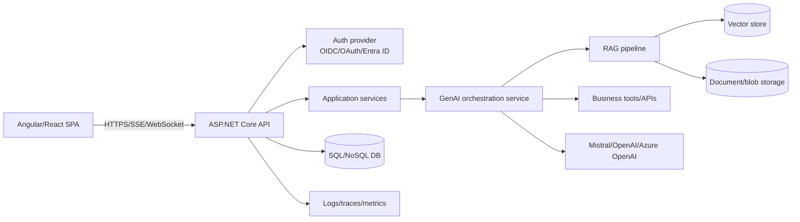
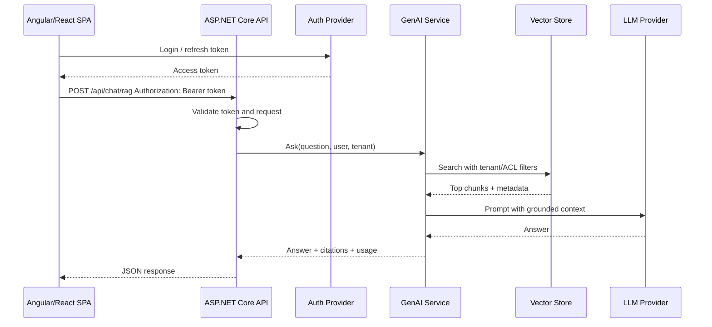
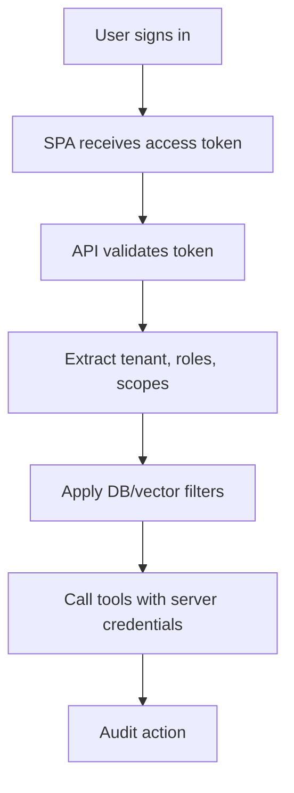
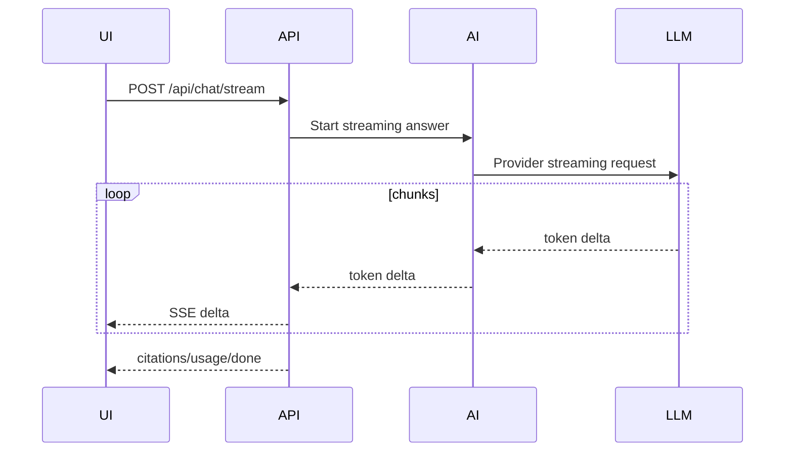
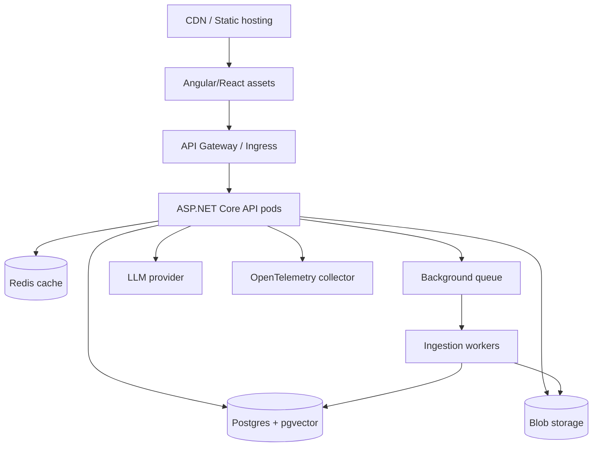

# Fullstack GenAI Architecture: ASP.NET Core API + SPA + AI Services

## Interview-ready summary

A production GenAI fullstack app is not "frontend calls LLM." The SPA should call your backend. The backend handles authentication, authorization, prompt construction, retrieval, tool execution, rate limits, observability, and provider abstraction.



---

## 1. Core services

| Component | Responsibilities |
|---|---|
| Angular/React SPA | Chat UX, streaming rendering, citations, auth token handling, feedback |
| ASP.NET Core API | AuthN/AuthZ, validation, orchestration boundary, rate limits, streaming endpoint |
| GenAI service | Prompt templates, model selection, RAG, tool calls, response validation |
| Vector store | Semantic search over authorized document chunks |
| Document store | Source PDFs/Markdown/HTML and parsed text |
| Conversation store | Chat sessions, message history, summaries, feedback |
| Observability | Traces across frontend, API, retrieval, model provider |

### Why the browser should not call the LLM directly

- Provider API keys would be exposed.
- Tenant authorization cannot be trusted client-side.
- Prompt templates and system instructions leak.
- Rate limits and spend controls are harder.
- Tool calls require server-side credentials.
- Logging and compliance need backend control.

---

## 2. Request lifecycle



---

## 3. Authentication and authorization flow

### Recommended pattern

1. SPA authenticates with OIDC/OAuth provider.
2. SPA sends access token to API.
3. API validates token signature, issuer, audience, expiry.
4. API maps claims to user/tenant/roles.
5. Retrieval filters by tenant and document ACL.
6. Tools enforce authorization again before side effects.



### Authorization must happen before prompt assembly

Do not retrieve all documents and ask the model to ignore unauthorized ones. The model must never see unauthorized content.

```sql
SELECT id, title, content, embedding
FROM document_chunks
WHERE tenant_id = @tenantId
  AND visibility <= @userClearance
ORDER BY embedding <=> @queryEmbedding
LIMIT 8;
```

---

## 4. Streaming responses

Streaming reduces perceived latency and supports rich chat UX.

### Options

| Transport | Best for | Notes |
|---|---|---|
| SSE | One-way token streaming from server to browser | Simple over HTTP; great for chat |
| WebSocket | Bidirectional realtime interaction | More operational complexity |
| SignalR | .NET-friendly realtime abstraction | Good for enterprise .NET apps |
| Chunked fetch | Simple streaming with `ReadableStream` | Works well in React/Angular |

### SSE event contract

```text
event: delta
data: {"token":"The"}

event: citation
data: {"id":"doc-1","title":"API Key Policy","url":"..."}

event: usage
data: {"inputTokens":1420,"outputTokens":210}

event: done
data: {}
```

### Streaming architecture



### Streaming implementation concerns

- Flush after each chunk.
- Propagate cancellation tokens when user stops.
- Send structured events, not only raw text.
- Handle provider errors after partial output.
- Measure time to first token and total time.
- Avoid buffering proxies; configure reverse proxy timeouts.

---

## 5. Deployment architecture



### Environments

| Environment | Purpose |
|---|---|
| Local | Fast iteration, fake providers, small Chroma/SQLite store |
| Dev | Shared integration with real auth/provider sandbox |
| Staging | Production-like data shape, eval gates |
| Production | Locked-down network, monitoring, cost controls |

### Configuration

- Provider keys in Key Vault/Secrets Manager.
- Model names and token limits in config.
- Prompt templates versioned in code or prompt registry.
- Feature flags for model/provider rollout.
- Per-tenant rate and spend limits.

---

## 6. API layering in ASP.NET Core

```text
Controllers
  -> validate HTTP shape, auth claims, cancellation

Application services
  -> business use case, orchestration, transactions

AI services
  -> prompt construction, retrieval, model calls, validation

Infrastructure
  -> vector store, SQL, blob, provider SDKs
```

### Example service boundary

```csharp
public interface IChatOrchestrator
{
    Task<ChatResponse> AskAsync(ChatRequest request, UserContext user, CancellationToken ct);
    IAsyncEnumerable<ChatStreamEvent> StreamAsync(ChatRequest request, UserContext user, CancellationToken ct);
}
```

---

## 7. Frontend architecture

Recommended SPA state:

```text
ChatPage
  - messages[]
  - activeRequestId
  - isStreaming
  - citationsByMessage
  - errors
  - feedback state

Services
  - auth token provider
  - chat API client
  - streaming parser
```

### UX features interviewers like

- Stop generating button.
- Source citation side panel.
- "I don't know" states that suggest next actions.
- Copy answer with citations.
- User feedback: helpful/not helpful plus reason.
- Token/cost visibility for admin users.
- Conversation history and rename.

---

## 8. Security threats and mitigations

| Threat | Mitigation |
|---|---|
| Prompt injection in documents | Treat retrieved text as data, not instructions; restrict tools |
| Data leakage across tenants | Retrieval filters by tenant/ACL before prompt assembly |
| Tool abuse | Validate args, enforce auth, require approval for side effects |
| API key exposure | Backend-only provider calls; secrets manager |
| Excessive spend | Per-user/tenant quotas, token caps, rate limits |
| PII leakage | Redaction, retention controls, logging policy |
| Hallucinated citations | Validate cited source IDs exist and support claims |

---

## 9. Observability

Trace one chat request across:

```text
frontend request id
  -> API request span
  -> auth validation
  -> retrieval span
  -> rerank span
  -> model span
  -> streaming span
  -> response/feedback
```

Log/measure:

- Request ID, user ID hash, tenant ID.
- Model and prompt version.
- Input/output tokens.
- Retrieved chunk IDs and scores.
- Tool calls and tool errors.
- Time to first token and total latency.
- Citation validation result.
- User feedback.

---

## 10. Interview talking points

- The backend is the trust boundary; the frontend never owns provider credentials or prompt policy.
- Tenant/ACL filtering must happen before the model sees context.
- Streaming is an end-to-end design concern: provider, API, proxy, browser parser, cancellation.
- RAG ingestion often runs asynchronously and should be observable separately from chat.
- Model provider abstraction is useful, but avoid hiding provider-specific capabilities you rely on.
- Use smaller, cheaper models for routing/classification and stronger models for final synthesis if needed.

