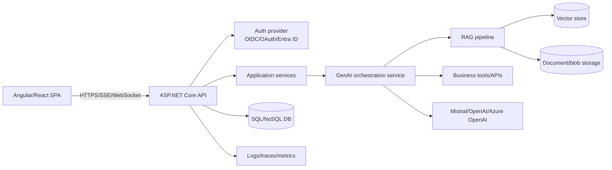
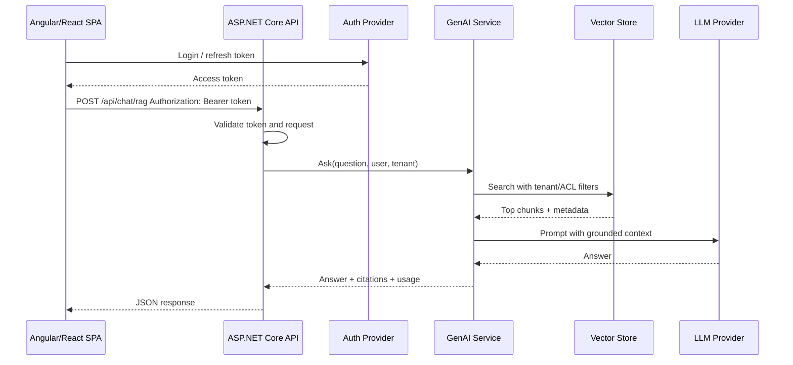
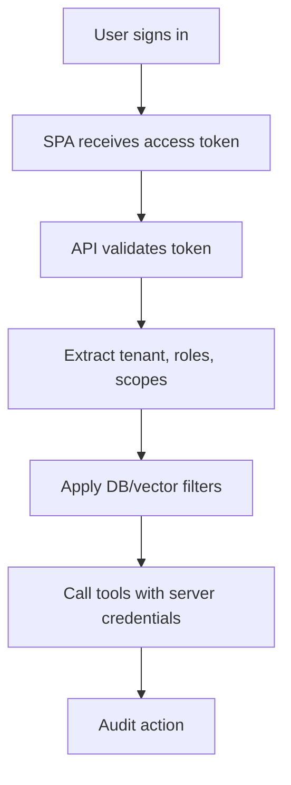
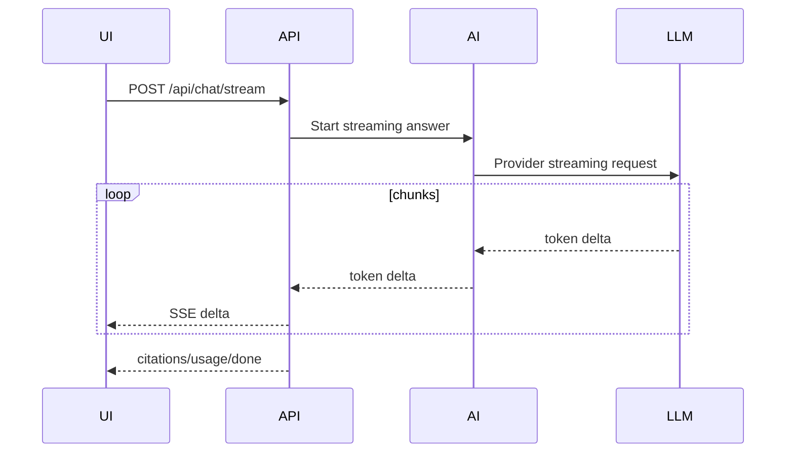
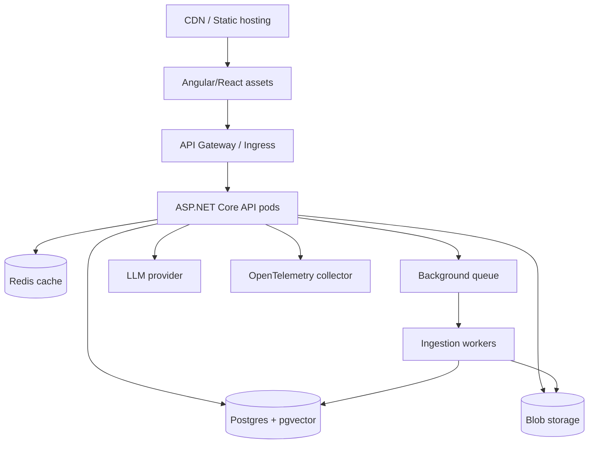

# Fullstack GenAI Architecture: ASP.NET Core API + SPA + AI Services

## Interview-ready summary

A production GenAI fullstack app is not "frontend calls LLM." The SPA should call your backend. The backend handles authentication, authorization, prompt construction, retrieval, tool execution, rate limits, observability, and provider abstraction.



---

## 1. Core services

| Component | Responsibilities |
|---|---|
| Angular/React SPA | Chat UX, streaming rendering, citations, auth token handling, feedback |
| ASP.NET Core API | AuthN/AuthZ, validation, orchestration boundary, rate limits, streaming endpoint |
| GenAI service | Prompt templates, model selection, RAG, tool calls, response validation |
| Vector store | Semantic search over authorized document chunks |
| Document store | Source PDFs/Markdown/HTML and parsed text |
| Conversation store | Chat sessions, message history, summaries, feedback |
| Observability | Traces across frontend, API, retrieval, model provider |

### Why the browser should not call the LLM directly

- Provider API keys would be exposed.
- Tenant authorization cannot be trusted client-side.
- Prompt templates and system instructions leak.
- Rate limits and spend controls are harder.
- Tool calls require server-side credentials.
- Logging and compliance need backend control.

---

## 2. Request lifecycle



---

## 3. Authentication and authorization flow

### Recommended pattern

1. SPA authenticates with OIDC/OAuth provider.
2. SPA sends access token to API.
3. API validates token signature, issuer, audience, expiry.
4. API maps claims to user/tenant/roles.
5. Retrieval filters by tenant and document ACL.
6. Tools enforce authorization again before side effects.



### Authorization must happen before prompt assembly

Do not retrieve all documents and ask the model to ignore unauthorized ones. The model must never see unauthorized content.

```sql
SELECT id, title, content, embedding
FROM document_chunks
WHERE tenant_id = @tenantId
  AND visibility <= @userClearance
ORDER BY embedding <=> @queryEmbedding
LIMIT 8;
```

---

## 4. Streaming responses

Streaming reduces perceived latency and supports rich chat UX.

### Options

| Transport | Best for | Notes |
|---|---|---|
| SSE | One-way token streaming from server to browser | Simple over HTTP; great for chat |
| WebSocket | Bidirectional realtime interaction | More operational complexity |
| SignalR | .NET-friendly realtime abstraction | Good for enterprise .NET apps |
| Chunked fetch | Simple streaming with `ReadableStream` | Works well in React/Angular |

### SSE event contract

```text
event: delta
data: {"token":"The"}

event: citation
data: {"id":"doc-1","title":"API Key Policy","url":"..."}

event: usage
data: {"inputTokens":1420,"outputTokens":210}

event: done
data: {}
```

### Streaming architecture



### Streaming implementation concerns

- Flush after each chunk.
- Propagate cancellation tokens when user stops.
- Send structured events, not only raw text.
- Handle provider errors after partial output.
- Measure time to first token and total time.
- Avoid buffering proxies; configure reverse proxy timeouts.

---

## 5. Deployment architecture



### Environments

| Environment | Purpose |
|---|---|
| Local | Fast iteration, fake providers, small Chroma/SQLite store |
| Dev | Shared integration with real auth/provider sandbox |
| Staging | Production-like data shape, eval gates |
| Production | Locked-down network, monitoring, cost controls |

### Configuration

- Provider keys in Key Vault/Secrets Manager.
- Model names and token limits in config.
- Prompt templates versioned in code or prompt registry.
- Feature flags for model/provider rollout.
- Per-tenant rate and spend limits.

---

## 6. API layering in ASP.NET Core

```text
Controllers
  -> validate HTTP shape, auth claims, cancellation

Application services
  -> business use case, orchestration, transactions

AI services
  -> prompt construction, retrieval, model calls, validation

Infrastructure
  -> vector store, SQL, blob, provider SDKs
```

### Example service boundary

```csharp
public interface IChatOrchestrator
{
    Task<ChatResponse> AskAsync(ChatRequest request, UserContext user, CancellationToken ct);
    IAsyncEnumerable<ChatStreamEvent> StreamAsync(ChatRequest request, UserContext user, CancellationToken ct);
}
```

---

## 7. Frontend architecture

Recommended SPA state:

```text
ChatPage
  - messages[]
  - activeRequestId
  - isStreaming
  - citationsByMessage
  - errors
  - feedback state

Services
  - auth token provider
  - chat API client
  - streaming parser
```

### UX features interviewers like

- Stop generating button.
- Source citation side panel.
- "I don't know" states that suggest next actions.
- Copy answer with citations.
- User feedback: helpful/not helpful plus reason.
- Token/cost visibility for admin users.
- Conversation history and rename.

---

## 8. Security threats and mitigations

| Threat | Mitigation |
|---|---|
| Prompt injection in documents | Treat retrieved text as data, not instructions; restrict tools |
| Data leakage across tenants | Retrieval filters by tenant/ACL before prompt assembly |
| Tool abuse | Validate args, enforce auth, require approval for side effects |
| API key exposure | Backend-only provider calls; secrets manager |
| Excessive spend | Per-user/tenant quotas, token caps, rate limits |
| PII leakage | Redaction, retention controls, logging policy |
| Hallucinated citations | Validate cited source IDs exist and support claims |

---

## 9. Observability

Trace one chat request across:

```text
frontend request id
  -> API request span
  -> auth validation
  -> retrieval span
  -> rerank span
  -> model span
  -> streaming span
  -> response/feedback
```

Log/measure:

- Request ID, user ID hash, tenant ID.
- Model and prompt version.
- Input/output tokens.
- Retrieved chunk IDs and scores.
- Tool calls and tool errors.
- Time to first token and total latency.
- Citation validation result.
- User feedback.

---

## 10. Interview talking points

- The backend is the trust boundary; the frontend never owns provider credentials or prompt policy.
- Tenant/ACL filtering must happen before the model sees context.
- Streaming is an end-to-end design concern: provider, API, proxy, browser parser, cancellation.
- RAG ingestion often runs asynchronously and should be observable separately from chat.
- Model provider abstraction is useful, but avoid hiding provider-specific capabilities you rely on.
- Use smaller, cheaper models for routing/classification and stronger models for final synthesis if needed.

---

## 11. Reference implementation slices

Use these slices to build the architecture incrementally. Each slice should be demoable and explainable.

### Slice 1: Auth-ready API shell

Deliver:

- ASP.NET Core API with health endpoint.
- Problem Details.
- Correlation ID logging.
- JWT bearer auth configuration or development current-user abstraction.
- CORS restricted to local SPA origins.

Interview explanation:

> I start by making the API the trust boundary. Even before adding real AI calls, I want request validation, auth-ready current user context, consistent errors, and logging in place because those concerns affect every endpoint.

### Slice 2: Notes CRUD + tenant filters

Deliver:

- `GET /api/notes`
- `POST /api/notes`
- `PUT /api/notes/{id}`
- EF Core queries filtered by `currentUser.TenantId`.
- Tests proving cross-tenant isolation.

Interview explanation:

> Tenant filtering is not a frontend concern. The server derives tenant context from validated auth claims and applies it in every data access path.

### Slice 3: Ingestion pipeline

Deliver:

- Upload or note-indexing endpoint.
- Source document record.
- Durable ingestion job.
- Background worker.
- Parser/chunker.
- Embedding call.
- Vector upsert.

Interview explanation:

> Ingestion is asynchronous because parsing, chunking, and embeddings can be slow, fail independently, and need retries. The upload request should return quickly with a queued status.

### Slice 4: RAG query

Deliver:

- Query embedding.
- Tenant/ACL-filtered vector search.
- Grounded prompt.
- Model call.
- Structured citations.
- Usage logging.

Interview explanation:

> Retrieval is security-sensitive. The model only receives chunks that the backend already authorized. Citations come from retrieval metadata, not from parsing arbitrary model text.

### Slice 5: Streaming chat

Deliver:

- `POST /api/chat/stream`.
- Structured SSE-style events.
- React/Angular parser.
- Stop generation.
- Partial error handling.

Interview explanation:

> Streaming is not only a UI feature. Cancellation must propagate from browser AbortController to ASP.NET cancellation token to provider call, and proxy buffering must be configured.

### Slice 6: Evaluation and deployment readiness

Deliver:

- Golden question set.
- Recall@k measurement.
- Citation validation.
- Feedback endpoint.
- Deployment checklist.
- Cost/latency dashboard plan.

Interview explanation:

> I treat prompt, model, chunking, and retrieval changes as behavior changes that need regression evaluation before rollout.

---

## 12. Data ownership and derived data

Separate source data from derived retrieval data.

| Data | Source of truth? | Can rebuild? | Examples |
|---|---|---|---|
| Note body | Yes | No | User-authored notes |
| Uploaded file | Yes | No | PDF, Markdown, HTML |
| Parsed text | Derived | Yes | Extracted page text |
| Chunk | Derived | Yes | 800-token section |
| Embedding | Derived | Yes | Vector for chunk |
| Retrieval score | Derived per query | Yes | Similarity/rerank score |
| Answer | Conversation record | Sometimes | Assistant response |

### Why this matters

- If chunking changes, rebuild chunks from source.
- If embedding model changes, rebuild vectors from chunks/source.
- If a user deletes a document, delete source and derived chunks/vectors.
- If citations reference chunks, store enough metadata to resolve historical answers.

---

## 13. Tenant isolation patterns

### Shared DB and shared vector index

Most common for small/medium SaaS.

Required controls:

- Tenant ID column on every tenant-scoped row.
- Tenant ID metadata on every vector.
- Composite indexes with tenant ID.
- Integration tests for cross-tenant reads.
- Audit logs for retrieved chunk IDs.

### Shared DB and per-tenant vector index

Use when:

- Tenants have large datasets.
- Vector-store filtering is weak.
- Isolation requirements are stronger.

Trade-off:

- Better isolation and potentially faster search per tenant.
- More indexes to create, monitor, and rebuild.

### Dedicated tenant database/index

Use when:

- Enterprise contract requires isolation.
- Data residency differs per tenant.
- Tenant scale justifies operational overhead.

Trade-off:

- Strong isolation.
- More complex migrations, monitoring, and cost allocation.

---

## 14. Prompt and model versioning

Every AI response should be explainable later.

Record:

- Prompt template name/version.
- Model name/version.
- Temperature/top-p.
- Retrieval settings.
- Chunk IDs and scores.
- Tool names called.
- Token counts.
- Provider request ID if available.

### Example metadata

```json
{
  "promptVersion": "rag-answer-v4",
  "model": "mistral-large-latest",
  "temperature": 0.2,
  "retrieval": {
    "topK": 8,
    "hybrid": true,
    "rerank": true,
    "chunkIds": ["doc-1#chunk-3", "doc-2#chunk-1"]
  }
}
```

### Interview talking point

> If a user reports a bad answer, I need to reconstruct which prompt, model, retrieval settings, and chunks produced it. Without versioning and metadata, GenAI debugging becomes guesswork.

---

## 15. Frontend state model for AI chat

Recommended message state:

```ts
type MessageStatus = "pending" | "streaming" | "complete" | "failed" | "canceled";

type ChatMessage = {
  id: string;
  role: "user" | "assistant";
  content: string;
  status: MessageStatus;
  citations: Citation[];
  requestId?: string;
  error?: string;
  usage?: Usage;
};
```

### State transitions

```text
User submits
  -> append user message complete
  -> append assistant message streaming
  -> delta events append content
  -> citation events append sources
  -> done marks complete
  -> error marks failed
  -> abort marks canceled
```

### UX details that show maturity

- Disable send while active request is streaming or allow queue explicitly.
- Preserve partial assistant output on cancellation.
- Show source panel separately from answer text.
- Keep request ID visible in error details.
- Let users retry from the same prompt.
- Avoid re-rendering all markdown on every token.

---

## 16. Production failure-mode map

| Failure | Layer | Symptom | Mitigation |
|---|---|---|---|
| Token expired | Auth/API | 401 or stream rejected | Refresh/re-auth flow |
| Missing tenant filter | Retrieval | Cross-tenant leakage | Tests, query conventions, audits |
| Prompt injection | RAG/tooling | Tool misuse or instruction override | Treat docs as data, validate tools |
| Provider timeout | AI provider | Partial/no answer | Timeout, error event, retry policy |
| Proxy buffering | Deployment | Tokens arrive all at once | Disable buffering/timeouts |
| Bad chunking | Retrieval | Wrong/missing context | Eval, chunk tuning, metadata |
| Dense search misses exact code | Retrieval | Error IDs not found | Hybrid/BM25/exact boost |
| Citation hallucination | Generation | Nonexistent source IDs | Structured citations and validation |
| Cost spike | Operations | Spend alert | Quotas, token caps, rate limits |
| UI markdown XSS | Frontend | Unsafe rendering | Sanitize, disable raw HTML |

---

## 17. Architecture review checklist

Before presenting this design, verify:

- [ ] Browser never receives provider secrets.
- [ ] Auth flow is explicit.
- [ ] Tenant and ACL filters happen before prompt assembly.
- [ ] Ingestion is asynchronous and retryable.
- [ ] Vector records include source and auth metadata.
- [ ] Streaming includes cancellation and error events.
- [ ] Citations are structured.
- [ ] Evaluation is included.
- [ ] Deployment covers secrets, proxy streaming, rate limits, and observability.
- [ ] Cost controls are discussed.

