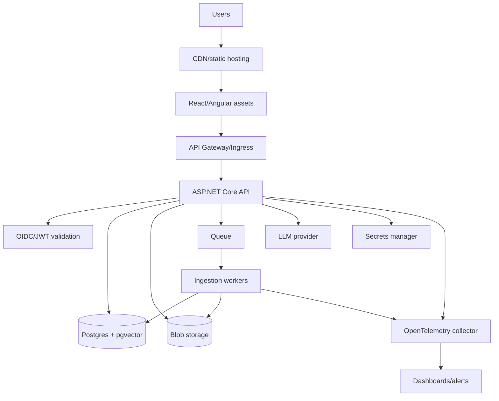

# Deployment Checklist for Fullstack GenAI Apps

Use this checklist before deploying an ASP.NET Core + React/Angular + RAG/GenAI application.

The theme:

> A GenAI deployment is a normal fullstack deployment plus extra controls for data access, model behavior, retrieval quality, latency, cost, safety, and evaluation.

---

## 1. Deployment readiness summary

### Minimum production gates

- [ ] Authentication and authorization are enforced.
- [ ] Tenant/ACL filters happen before prompt assembly.
- [ ] Provider secrets are stored outside code.
- [ ] Chat and embedding endpoints are rate-limited.
- [ ] Streaming works through the reverse proxy.
- [ ] Document ingestion is asynchronous and retryable.
- [ ] RAG quality is covered by at least a small eval set.
- [ ] Logs/traces include request IDs, model versions, retrieval IDs, and latency.
- [ ] Prompt injection and cross-tenant tests exist.
- [ ] Cost dashboards and quotas exist.

---

## 2. Environment model

| Environment | Purpose | Data | AI provider |
|---|---|---|---|
| Local | Developer iteration | Synthetic or tiny fixtures | Mock or low-cost real provider |
| Dev | Shared integration | Non-sensitive seed data | Sandbox credentials |
| Staging | Production-like validation | Sanitized production-shaped data | Production-like model config |
| Production | Real users | Real data | Locked-down provider credentials |

### Promotion rule

Do not promote a prompt, model, retriever, or chunking change directly from local to production. Treat it like an application behavior change and run evals.

---

## 3. Configuration checklist

### App configuration

- [ ] Environment name is explicit.
- [ ] API base URL is configured per environment.
- [ ] CORS origins are restricted.
- [ ] Auth authority/audience are environment-specific.
- [ ] Model names are configured, not hardcoded.
- [ ] Prompt versions are recorded.
- [ ] Token limits are configured.
- [ ] Retrieval `topK`, hybrid, and rerank settings are configured.
- [ ] Feature flags exist for risky AI changes.

### Secrets

- [ ] LLM provider API keys are in Key Vault/Secrets Manager/Kubernetes secrets.
- [ ] Database passwords are in secrets manager.
- [ ] Storage credentials are in secrets manager.
- [ ] No secrets appear in frontend bundles.
- [ ] No secrets appear in logs.
- [ ] Secret rotation path is documented.

### Example config shape

```json
{
  "Ai": {
    "ChatModel": "mistral-large-latest",
    "EmbeddingModel": "mistral-embed",
    "PromptVersion": "rag-v3",
    "MaxInputTokens": 12000,
    "MaxOutputTokens": 1000
  },
  "Retrieval": {
    "TopK": 8,
    "Hybrid": true,
    "Rerank": true
  },
  "RateLimits": {
    "ChatRequestsPerMinute": 20,
    "EmbeddingRequestsPerMinute": 60
  }
}
```

---

## 4. Frontend deployment checklist

### Build

- [ ] Production build succeeds.
- [ ] Source maps policy is decided.
- [ ] Bundle size is reviewed.
- [ ] Environment variables are injected safely.
- [ ] API URL points to the correct environment.
- [ ] Auth redirect URLs match the identity provider.

### Runtime

- [ ] Static assets served from CDN or reliable static host.
- [ ] Cache headers are correct.
- [ ] `index.html` is not cached too aggressively.
- [ ] Hashed JS/CSS assets are cached long-term.
- [ ] CSP policy is defined if possible.
- [ ] Error boundary/global error UI exists.
- [ ] Auth expiry has a user-friendly path.
- [ ] Streaming UI works in target browsers.

### GenAI UX

- [ ] Stop generation button works.
- [ ] Partial stream errors are displayed clearly.
- [ ] Citations are rendered from structured data.
- [ ] Model markdown is sanitized.
- [ ] Feedback controls are visible.
- [ ] Rate-limit errors show retry guidance.
- [ ] Long conversations remain performant.

---

## 5. ASP.NET Core API checklist

### HTTP and middleware

- [ ] Exception handling middleware is enabled.
- [ ] Problem Details responses are configured.
- [ ] Request logging includes correlation ID.
- [ ] Authentication runs before authorization.
- [ ] CORS is restricted.
- [ ] HTTPS is required.
- [ ] Request size limits are configured for uploads.
- [ ] Response compression does not break streaming.
- [ ] Health/readiness endpoints exist.

### API reliability

- [ ] Cancellation tokens are accepted and passed through.
- [ ] Provider calls have timeouts.
- [ ] Retry policy only retries safe transient failures.
- [ ] Circuit breaker or fallback policy exists where appropriate.
- [ ] Idempotency exists for side-effecting tool calls.
- [ ] Background jobs are retryable and observable.

### API security

- [ ] JWT issuer/audience/signature/expiry validation works.
- [ ] Scope/role policies protect endpoints.
- [ ] Tenant ID comes from trusted claims.
- [ ] Resource access checks exist in services/repositories.
- [ ] Tool execution validates authorization.
- [ ] Admin endpoints require admin policy.

---

## 6. Streaming deployment checklist

### Server

- [ ] Streaming endpoint uses `text/event-stream` or documented stream format.
- [ ] Backend flushes chunks.
- [ ] Cancellation token reaches provider SDK/client.
- [ ] Error events are emitted after response starts.
- [ ] Final `done` event is emitted on success.
- [ ] Partial response persistence is defined.

### Proxy/gateway

- [ ] Response buffering disabled for streaming route.
- [ ] Idle timeout is longer than expected stream duration.
- [ ] Request duration timeout is configured.
- [ ] HTTP/2 behavior is tested.
- [ ] CDN does not buffer or block streams.

### Client

- [ ] AbortController cancels request.
- [ ] Parser handles split frames.
- [ ] Parser handles multiple frames in one chunk.
- [ ] UI can display partial answer plus error.
- [ ] Time to first token is measured.

---

## 7. Database checklist

### Schema

- [ ] Tenant ID exists on tenant-scoped tables.
- [ ] Indexes include tenant ID for common queries.
- [ ] Migrations are reviewed and reversible where possible.
- [ ] Data retention columns/policies exist.
- [ ] Conversation and feedback tables are sized for growth.

### Backups and recovery

- [ ] Backups are enabled.
- [ ] Restore process is tested.
- [ ] Point-in-time recovery is configured if required.
- [ ] Deletion/retention requirements are documented.

### Performance

- [ ] Slow query logging is enabled.
- [ ] Pagination exists for list endpoints.
- [ ] Read-heavy paths use no-tracking queries.
- [ ] Connection pool settings are appropriate.

---

## 8. Vector store checklist

### Data model

- [ ] Chunk ID is stable.
- [ ] Document ID is stored.
- [ ] Tenant ID is stored and filterable.
- [ ] ACL/group metadata is stored and filterable.
- [ ] Source title/URL metadata is stored for citations.
- [ ] Embedding model/version is stored.
- [ ] Document content hash is stored for re-index decisions.

### Indexing

- [ ] Vector index type is chosen and documented.
- [ ] Index build process is automated.
- [ ] Re-index path exists for embedding model changes.
- [ ] Deleted documents remove or tombstone chunks.
- [ ] Partial ingestion failure can retry safely.

### Query

- [ ] Tenant/ACL filters apply before prompt assembly.
- [ ] Hybrid search exists if exact codes/names matter.
- [ ] Reranking is enabled or explicitly deferred.
- [ ] Retrieval metadata is logged.
- [ ] Empty retrieval has a graceful "I do not know" behavior.

---

## 9. Document ingestion checklist

### Upload

- [ ] File size limit is enforced.
- [ ] File type allowlist exists.
- [ ] Malware scanning is considered for production.
- [ ] Source files are stored securely.
- [ ] Upload returns quickly with queued status.

### Processing

- [ ] Parser handles expected file types.
- [ ] Chunker preserves headings/metadata.
- [ ] Embedding requests are batched where possible.
- [ ] Job retries have limits.
- [ ] Poison jobs are visible.
- [ ] Ingestion status is queryable.
- [ ] Warnings are surfaced for partial parse failures.

### Freshness

- [ ] Updates re-index changed content.
- [ ] Deletes remove derived chunks.
- [ ] Embedding model changes trigger re-index.
- [ ] Stale indexes are detectable.

---

## 10. Model provider checklist

### Provider calls

- [ ] Provider base URL is configured.
- [ ] API key is secret-managed.
- [ ] Timeout is set.
- [ ] Retry/backoff policy exists for transient failures.
- [ ] Rate-limit responses are handled.
- [ ] Provider status/outage behavior is documented.

### Model governance

- [ ] Model choice is documented.
- [ ] Prompt version is logged.
- [ ] Temperature/top-p are configured per task.
- [ ] Max tokens protect cost and latency.
- [ ] Fallback behavior is defined.
- [ ] Data processing/compliance terms are understood.

### Cost controls

- [ ] Per-user or per-tenant quotas exist.
- [ ] Token counts are logged.
- [ ] Cost per request is estimated.
- [ ] Alerts exist for spend spikes.
- [ ] Expensive operations are gated.

---

## 11. Security checklist

### Application

- [ ] Backend-only provider keys.
- [ ] Tenant/ACL retrieval filters.
- [ ] Prompt injection test cases.
- [ ] Tool allowlist.
- [ ] Tool argument validation.
- [ ] Human approval for risky side effects.
- [ ] Audit logs for tool calls.
- [ ] Admin functions protected.

### Data

- [ ] PII classification is known.
- [ ] Prompt/context logging policy is defined.
- [ ] Data retention policy is defined.
- [ ] Right-to-delete path removes source and derived chunks.
- [ ] Encryption at rest and in transit is enabled.

### Frontend

- [ ] Model output sanitized.
- [ ] CSP considered.
- [ ] Tokens handled according to security model.
- [ ] No trusted decisions based on hidden fields.

---

## 12. Evaluation checklist

### Offline evals

- [ ] Golden question set exists.
- [ ] Expected source chunk IDs are recorded.
- [ ] Retrieval recall@k is measured.
- [ ] Citation accuracy is measured.
- [ ] Faithfulness is reviewed.
- [ ] Prompt/model changes run regression evals.

### Online feedback

- [ ] Thumbs up/down captured.
- [ ] Reasons are categorized.
- [ ] Re-query rate is measured.
- [ ] Escalation rate is measured for support use cases.
- [ ] Feedback is tied to model/prompt/retrieval version.

### Release gate

Before releasing an AI behavior change:

```text
1. Run unit/integration tests.
2. Run RAG eval set.
3. Compare quality, latency, and cost to baseline.
4. Review failures manually.
5. Roll out behind feature flag.
6. Monitor online metrics.
```

---

## 13. Observability checklist

### Logs

- [ ] Structured JSON logs.
- [ ] Request/correlation ID.
- [ ] Tenant ID.
- [ ] User ID hash.
- [ ] Model and prompt version.
- [ ] Retrieved chunk IDs/scores.
- [ ] Tool calls.
- [ ] Provider errors.

### Metrics

- [ ] Request count/error rate.
- [ ] P50/P95/P99 latency.
- [ ] Time to first token.
- [ ] Tokens per request.
- [ ] Cost per request.
- [ ] Retrieval empty-result rate.
- [ ] Citation validation failure rate.
- [ ] Ingestion job failure rate.
- [ ] Rate-limit count.

### Traces

- [ ] API request span.
- [ ] Auth validation span.
- [ ] DB query span.
- [ ] Query embedding span.
- [ ] Vector search span.
- [ ] Reranking span.
- [ ] Provider call span.
- [ ] Streaming write span.
- [ ] Persistence span.

---

## 14. CI/CD checklist

### Build pipeline

- [ ] Backend restore/build/test.
- [ ] Frontend install/build/test.
- [ ] Lint/format checks.
- [ ] Dependency vulnerability scan.
- [ ] Container build if applicable.
- [ ] Migration script generated/reviewed.

### Deployment pipeline

- [ ] Environment-specific config is injected.
- [ ] Migrations are applied safely.
- [ ] Health checks pass.
- [ ] Smoke tests call key endpoints.
- [ ] Rollback plan exists.
- [ ] Feature flags default safely.

### AI-specific pipeline

- [ ] Prompt templates are versioned.
- [ ] Eval suite runs on prompt/retrieval/model changes.
- [ ] Eval results are stored as build artifacts.
- [ ] Cost/latency regression thresholds exist.

---

## 15. Smoke test script

Run after every deployment:

1. Open SPA.
2. Sign in.
3. Call `/health`.
4. Create a note.
5. Upload or index the note.
6. Confirm ingestion completes.
7. Ask a question that should retrieve the note.
8. Confirm streamed answer starts quickly.
9. Confirm citation points to the note.
10. Click stop on a long answer.
11. Submit feedback.
12. Check logs/traces for request ID, retrieval IDs, usage, and latency.

---

## 16. Incident response checklist

### Provider outage

- [ ] Detect elevated provider errors/timeouts.
- [ ] Show graceful user-facing error.
- [ ] Disable expensive/retry-heavy features if needed.
- [ ] Switch fallback provider/model only if quality/security approved.
- [ ] Communicate status.

### Cost spike

- [ ] Identify tenant/user/endpoint/model.
- [ ] Lower token limits or disable feature flag.
- [ ] Apply stricter rate limit.
- [ ] Inspect prompt/context size regression.
- [ ] Review abusive or looping behavior.

### Data leak suspicion

- [ ] Disable affected retrieval path.
- [ ] Preserve audit logs.
- [ ] Identify requests, users, tenants, chunk IDs.
- [ ] Verify tenant/ACL filters.
- [ ] Rotate secrets if relevant.
- [ ] Follow incident/compliance process.

### Quality regression

- [ ] Compare eval baseline.
- [ ] Identify retrieval vs generation failure.
- [ ] Roll back prompt/model/retriever change.
- [ ] Add failing examples to eval set.

---

## 17. Production architecture example



---

## 18. Interview-ready deployment answer

Use this when asked how you would deploy a GenAI fullstack app:

> I would deploy the SPA as static assets behind a CDN and the ASP.NET Core API behind an ingress or gateway. The API validates JWTs, owns provider credentials, enforces tenant authorization, and streams chat responses. Source documents go to blob storage, ingestion jobs go through a queue, workers parse/chunk/embed content, and vectors are stored with tenant and ACL metadata. I would gate deployment with normal tests plus RAG evals, configure proxy streaming, store secrets in a vault, add rate limits and quotas, and monitor quality, latency, token cost, retrieval failures, and citation accuracy.

---

## 19. Final go/no-go checklist

### Go

- [ ] Security tests pass.
- [ ] Cross-tenant retrieval test passes.
- [ ] Streaming smoke test passes.
- [ ] Eval quality is at or above baseline.
- [ ] P95 latency is acceptable.
- [ ] Cost/request is acceptable.
- [ ] Rollback path is ready.
- [ ] Dashboards and alerts are live.

### No-go

- [ ] Provider keys appear in frontend or logs.
- [ ] Tenant filter is missing from retrieval.
- [ ] Streaming is buffered by proxy.
- [ ] Upload request performs full ingestion synchronously.
- [ ] Prompt/model change has no eval comparison.
- [ ] No rate limits on chat/embedding endpoints.
- [ ] No monitoring for cost or failures.

