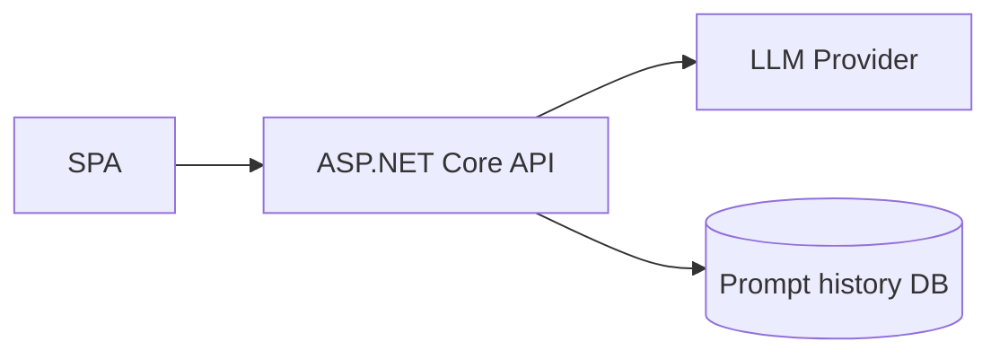
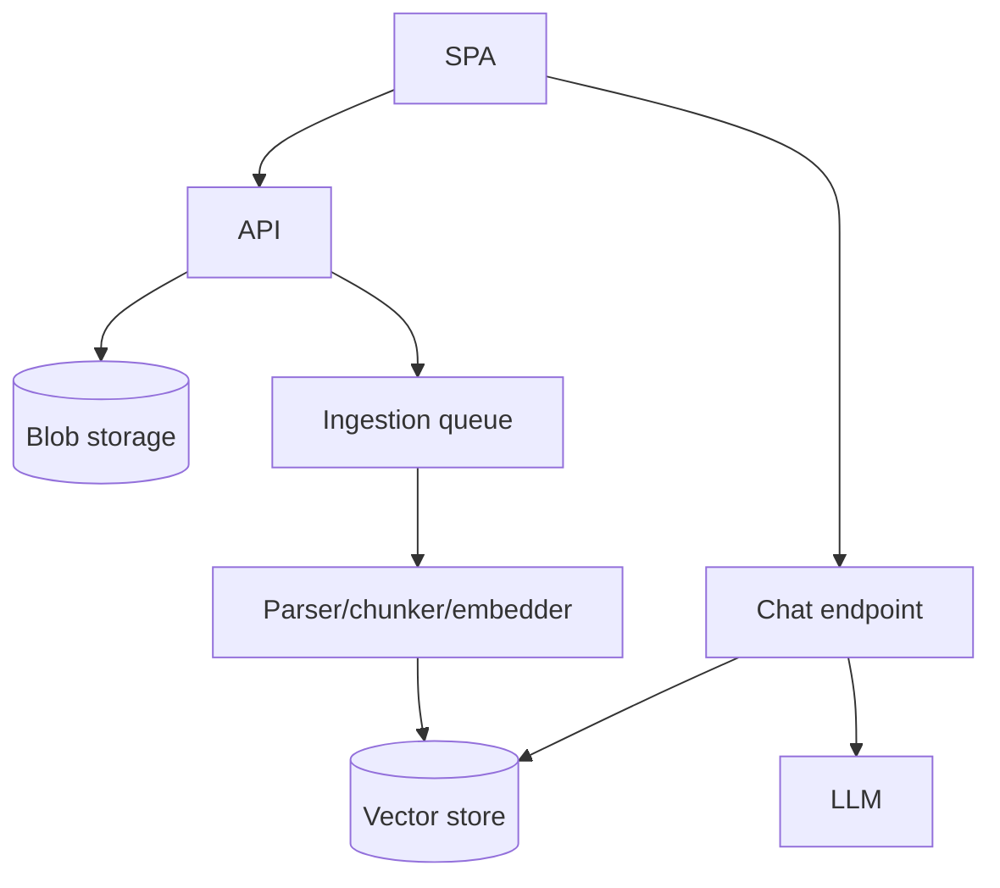
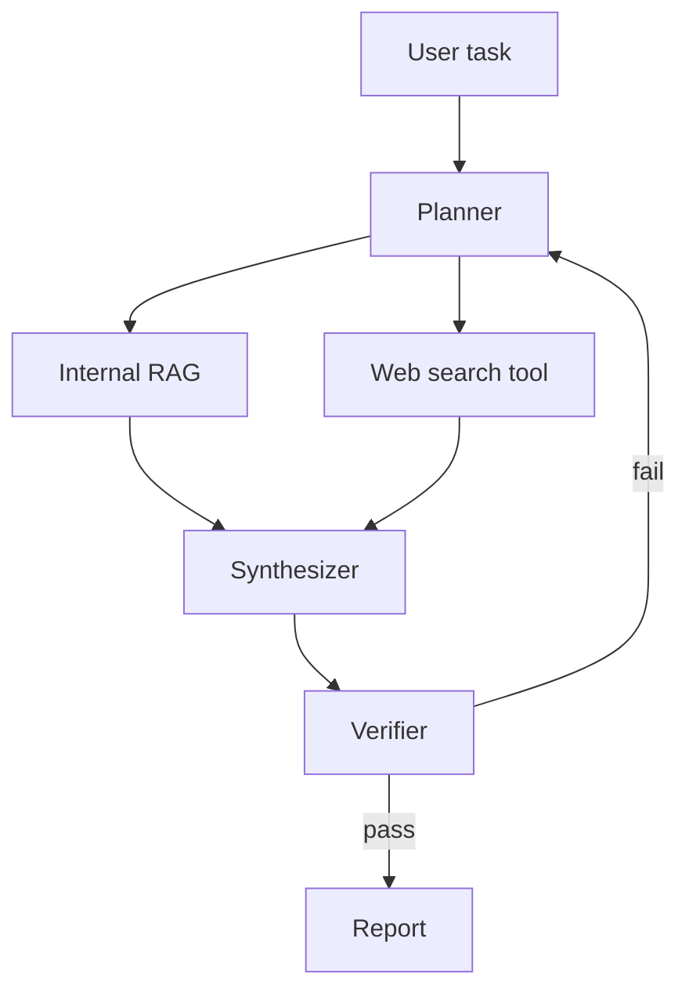
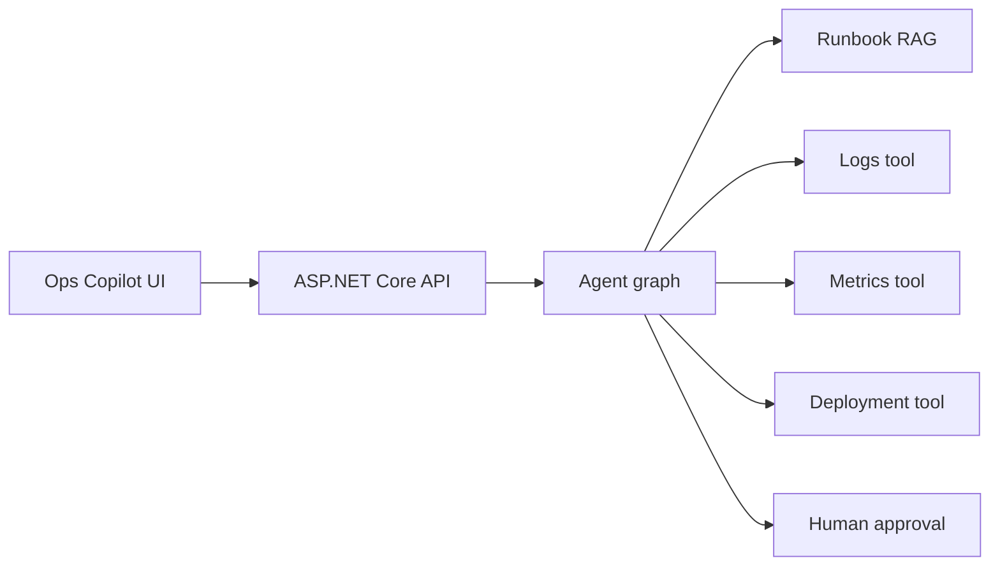

# Fullstack + GenAI Project Ideas

These projects progress from beginner to advanced. Each is designed to produce portfolio-quality talking points for MistralAI/GenAI/fullstack interviews.

---

## 1. Beginner: Prompt Playground

Build a SPA where users compare prompts, temperatures, and models.

### Features

- ASP.NET Core API wraps LLM provider.
- React/Angular form for prompt, model, temperature, max tokens.
- Streaming response view.
- Token usage and latency display.
- Save favorite prompts.

### Architecture

### Interview talking points

- Why provider keys stay server-side.
- Temperature and token trade-offs.
- Streaming implementation and cancellation.

---

## 2. Beginner: Interview Question Generator

Generate role-specific interview questions and model answers.

### Features

- Inputs: role, stack, seniority, focus areas.
- Structured JSON output: questions, expected signals, red flags.
- Export to Markdown/PDF.
- User feedback rating.

### Concepts practiced

- Prompt templates.
- Structured outputs.
- Validation and retry when JSON is invalid.
- Basic CRUD around saved prep sets.

---

## 3. Intermediate: Document Q&A

Upload PDFs/Markdown and ask questions with citations.

### Features

- File upload endpoint.
- Background ingestion worker.
- Chunking and embeddings.
- Vector store with metadata.
- Chat endpoint with citations.
- Source viewer highlighting cited chunks.

### Architecture

### Stretch goals

- Hybrid search.
- Reranking.
- Evaluation dataset.
- Tenant isolation.

---

## 4. Intermediate: Support Agent

Build an AI support assistant grounded in product docs and capable of creating support tickets.

### Features

- RAG over knowledge base.
- Tool call to create support ticket.
- Escalation when confidence is low.
- Conversation history.
- Admin dashboard for unresolved questions.

### Safety requirements

- Tool calls require server-side authorization.
- Ticket creation arguments validated.
- User sees summary before submitting.

---

## 5. Intermediate: Knowledge Base Maintenance Assistant

Detect gaps in documentation from chat logs and support tickets.

### Features

- Cluster unanswered questions.
- Suggest new article titles.
- Draft documentation updates.
- Human approval workflow.
- Track accepted/rejected suggestions.

### GenAI techniques

- Embeddings for clustering.
- Summarization.
- RAG over existing docs.
- Human-in-the-loop review.

---

## 6. Advanced: Agentic Research Assistant

An assistant that plans research, searches internal/external sources, summarizes findings, and produces a cited report.

### Features

- LangGraph-style plan/retrieve/summarize/review graph.
- Web search and internal RAG tools.
- Citation validation.
- Report export.
- Reviewer agent checks unsupported claims.

### Architecture

---

## 7. Advanced: Multi-tenant Enterprise RAG Platform

Build a SaaS-style RAG platform for multiple customers.

### Features

- Tenant management.
- Document ACLs.
- Ingestion pipelines per tenant.
- pgvector/Qdrant vector store.
- Prompt/version management.
- Evaluation dashboard.
- Usage/cost analytics.

### Interview talking points

- Tenant isolation.
- Retrieval filters before prompt assembly.
- Background re-indexing.
- Observability and cost controls.
- Data retention and deletion.

---

## 8. Advanced: AI Code Review Assistant

Analyze pull requests and produce review comments grounded in repository style guides.

### Features

- GitHub/GitLab webhook ingestion.
- Retrieve relevant style guide and changed files.
- Generate findings ordered by severity.
- Avoid duplicate comments.
- Human approval before posting.

### GenAI techniques

- RAG over docs and codebase.
- Tool calls to fetch diffs.
- Structured output for findings.
- Human-in-the-loop.

---

## 9. Advanced: Conversational Analytics Assistant

Ask natural-language questions over business metrics with governed SQL generation.

### Features

- Semantic layer of approved metrics.
- LLM generates SQL only against whitelisted schema.
- SQL validator and dry-run.
- Chart/table response.
- Explanation and data lineage.

### Safety requirements

- Read-only DB user.
- Query timeout and row limits.
- SQL parser validation.
- No direct access to raw sensitive fields.

---

## 10. Capstone: Fullstack AI Operations Copilot

An internal copilot for incidents, logs, runbooks, and deployment status.

### Features

- RAG over runbooks and postmortems.
- Tool calls to metrics/log systems.
- Incident summary generation.
- Suggested next actions.
- Human approval for operational commands.
- Streaming chat and timeline view.

### Architecture

### Portfolio value

This project demonstrates fullstack engineering, GenAI architecture, RAG, tools, human-in-the-loop, security, and production operations.

