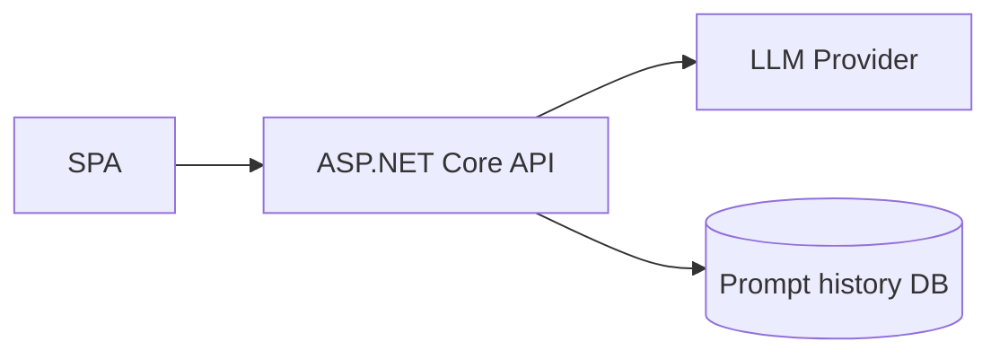
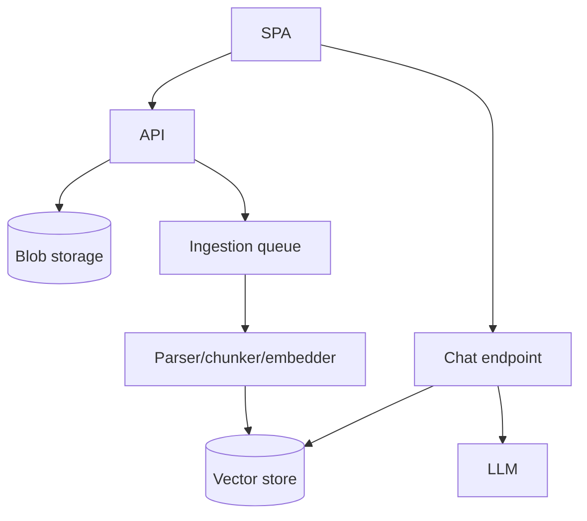
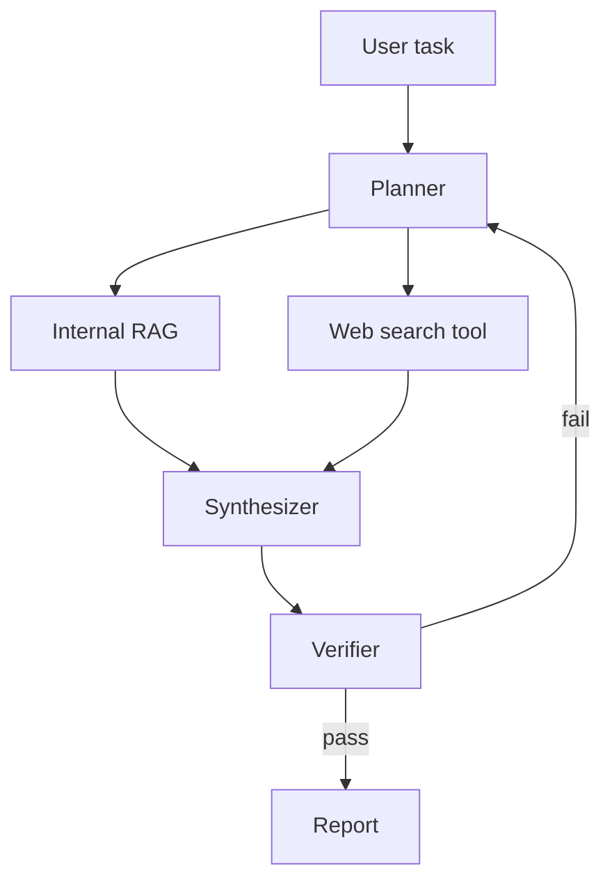
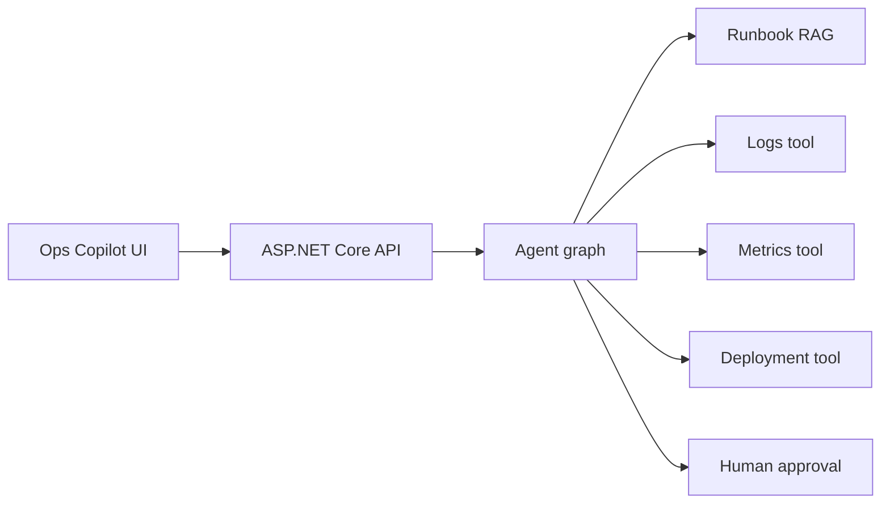

# Fullstack + GenAI Project Ideas

These projects progress from beginner to advanced. Each is designed to produce portfolio-quality talking points for MistralAI/GenAI/fullstack interviews.

---

## 1. Beginner: Prompt Playground

Build a SPA where users compare prompts, temperatures, and models.

### Features

- ASP.NET Core API wraps LLM provider.
- React/Angular form for prompt, model, temperature, max tokens.
- Streaming response view.
- Token usage and latency display.
- Save favorite prompts.

### Architecture



### Interview talking points

- Why provider keys stay server-side.
- Temperature and token trade-offs.
- Streaming implementation and cancellation.

---

## 2. Beginner: Interview Question Generator

Generate role-specific interview questions and model answers.

### Features

- Inputs: role, stack, seniority, focus areas.
- Structured JSON output: questions, expected signals, red flags.
- Export to Markdown/PDF.
- User feedback rating.

### Concepts practiced

- Prompt templates.
- Structured outputs.
- Validation and retry when JSON is invalid.
- Basic CRUD around saved prep sets.

---

## 3. Intermediate: Document Q&A

Upload PDFs/Markdown and ask questions with citations.

### Features

- File upload endpoint.
- Background ingestion worker.
- Chunking and embeddings.
- Vector store with metadata.
- Chat endpoint with citations.
- Source viewer highlighting cited chunks.

### Architecture



### Stretch goals

- Hybrid search.
- Reranking.
- Evaluation dataset.
- Tenant isolation.

---

## 4. Intermediate: Support Agent

Build an AI support assistant grounded in product docs and capable of creating support tickets.

### Features

- RAG over knowledge base.
- Tool call to create support ticket.
- Escalation when confidence is low.
- Conversation history.
- Admin dashboard for unresolved questions.

### Safety requirements

- Tool calls require server-side authorization.
- Ticket creation arguments validated.
- User sees summary before submitting.

---

## 5. Intermediate: Knowledge Base Maintenance Assistant

Detect gaps in documentation from chat logs and support tickets.

### Features

- Cluster unanswered questions.
- Suggest new article titles.
- Draft documentation updates.
- Human approval workflow.
- Track accepted/rejected suggestions.

### GenAI techniques

- Embeddings for clustering.
- Summarization.
- RAG over existing docs.
- Human-in-the-loop review.

---

## 6. Advanced: Agentic Research Assistant

An assistant that plans research, searches internal/external sources, summarizes findings, and produces a cited report.

### Features

- LangGraph-style plan/retrieve/summarize/review graph.
- Web search and internal RAG tools.
- Citation validation.
- Report export.
- Reviewer agent checks unsupported claims.

### Architecture



---

## 7. Advanced: Multi-tenant Enterprise RAG Platform

Build a SaaS-style RAG platform for multiple customers.

### Features

- Tenant management.
- Document ACLs.
- Ingestion pipelines per tenant.
- pgvector/Qdrant vector store.
- Prompt/version management.
- Evaluation dashboard.
- Usage/cost analytics.

### Interview talking points

- Tenant isolation.
- Retrieval filters before prompt assembly.
- Background re-indexing.
- Observability and cost controls.
- Data retention and deletion.

---

## 8. Advanced: AI Code Review Assistant

Analyze pull requests and produce review comments grounded in repository style guides.

### Features

- GitHub/GitLab webhook ingestion.
- Retrieve relevant style guide and changed files.
- Generate findings ordered by severity.
- Avoid duplicate comments.
- Human approval before posting.

### GenAI techniques

- RAG over docs and codebase.
- Tool calls to fetch diffs.
- Structured output for findings.
- Human-in-the-loop.

---

## 9. Advanced: Conversational Analytics Assistant

Ask natural-language questions over business metrics with governed SQL generation.

### Features

- Semantic layer of approved metrics.
- LLM generates SQL only against whitelisted schema.
- SQL validator and dry-run.
- Chart/table response.
- Explanation and data lineage.

### Safety requirements

- Read-only DB user.
- Query timeout and row limits.
- SQL parser validation.
- No direct access to raw sensitive fields.

---

## 10. Capstone: Fullstack AI Operations Copilot

An internal copilot for incidents, logs, runbooks, and deployment status.

### Features

- RAG over runbooks and postmortems.
- Tool calls to metrics/log systems.
- Incident summary generation.
- Suggested next actions.
- Human approval for operational commands.
- Streaming chat and timeline view.

### Architecture



### Portfolio value

This project demonstrates fullstack engineering, GenAI architecture, RAG, tools, human-in-the-loop, security, and production operations.

---

## How to choose a project

Use this scoring matrix. Pick the project with the highest total for your target role.

| Criteria | Weight | What high score means |
|---|---:|---|
| Fullstack depth | 1-5 | Meaningful backend and frontend work |
| GenAI depth | 1-5 | RAG/tools/evals beyond a wrapper |
| Demo clarity | 1-5 | Can show value in 5 minutes |
| Interview talking points | 1-5 | Many trade-offs to discuss |
| Feasibility | 1-5 | Can finish a polished version |
| Differentiation | 1-5 | Not just another chatbot |
| Safety/security | 1-5 | Shows responsible engineering |

### Recommended choices by goal

| Goal | Best project |
|---|---|
| First portfolio project | Prompt Playground or Interview Question Generator |
| Fullstack job | Document Q&A or Support Agent |
| GenAI platform job | Multi-tenant Enterprise RAG Platform |
| Agentic workflow job | Agentic Research Assistant or AI Operations Copilot |
| Frontend-heavy role | Streaming chat + citation UX around Document Q&A |
| Backend-heavy role | Ingestion pipeline + tenant-safe RAG API |

---

## Project build plan template

Use this for any project above.

### Phase 1: Product definition

- [ ] User persona.
- [ ] Problem statement.
- [ ] 3 core user stories.
- [ ] Non-goals.
- [ ] Success metrics.
- [ ] Demo script.

### Phase 2: Architecture

- [ ] Frontend pages/components.
- [ ] Backend endpoints.
- [ ] Data model.
- [ ] Auth model.
- [ ] AI orchestration flow.
- [ ] Deployment diagram.

### Phase 3: Core fullstack slice

- [ ] API route works.
- [ ] Frontend calls API.
- [ ] Loading/error states.
- [ ] Persistence.
- [ ] Basic tests.

### Phase 4: GenAI slice

- [ ] Prompt/model call.
- [ ] RAG or tool flow.
- [ ] Structured output or citations.
- [ ] Token/latency logging.
- [ ] Fallback/error behavior.

### Phase 5: Production hardening

- [ ] Auth-ready boundary.
- [ ] Rate limits.
- [ ] Input length limits.
- [ ] Secrets documented.
- [ ] Observability.
- [ ] Evaluation.
- [ ] Security notes.

### Phase 6: Interview packaging

- [ ] README with setup.
- [ ] Architecture diagram.
- [ ] Trade-offs section.
- [ ] "What I would do next" section.
- [ ] 5-minute demo path.
- [ ] 2-minute verbal pitch.

---

## README template for portfolio projects

```md
# Project Name

## What it does

One paragraph describing the user problem and solution.

## Demo

1. Step one.
2. Step two.
3. Step three.

## Architecture

Diagram and explanation.

## Tech stack

- Backend:
- Frontend:
- GenAI:
- Storage:

## Key features

- Feature 1
- Feature 2
- Feature 3

## RAG / AI design

- Ingestion:
- Retrieval:
- Prompting:
- Citations:
- Evaluation:

## Security and safety

- Auth:
- Tenant isolation:
- Prompt injection:
- Tool safety:
- Secrets:

## Observability

- Logs:
- Metrics:
- Traces:
- Cost:

## Trade-offs

| Decision | Why | Alternative |
|---|---|---|

## What I would improve next

- Improvement 1
- Improvement 2
```

---

## Interview demo rubric

A strong project demo includes:

- [ ] Clear product problem.
- [ ] Working fullstack flow.
- [ ] One technical deep dive.
- [ ] One security/safety decision.
- [ ] One trade-off.
- [ ] One metric/eval result.
- [ ] One honest limitation.
- [ ] One next-step improvement.

### Five-minute demo structure

```text
0:00-0:30 Problem and architecture
0:30-2:30 Live user flow
2:30-3:30 Technical deep dive
3:30-4:15 Safety/evaluation/observability
4:15-5:00 Trade-offs and next steps
```

---

## Feature depth ladders

### RAG depth ladder

| Level | Feature |
|---|---|
| 1 | Basic vector search |
| 2 | Citations |
| 3 | Tenant/ACL filters |
| 4 | Hybrid search |
| 5 | Reranking |
| 6 | Eval set |
| 7 | Feedback dashboard |
| 8 | Prompt injection tests |

### Streaming depth ladder

| Level | Feature |
|---|---|
| 1 | Non-streaming response |
| 2 | Token streaming |
| 3 | Stop generation |
| 4 | Structured events |
| 5 | Partial error state |
| 6 | Proxy-ready deployment |
| 7 | Time-to-first-token metric |

### Tool/agent depth ladder

| Level | Feature |
|---|---|
| 1 | Deterministic backend action |
| 2 | Model proposes tool call |
| 3 | Schema validation |
| 4 | Authorization policy |
| 5 | Human approval |
| 6 | Audit log |
| 7 | Agent graph with loop limits |
| 8 | Evaluation of tool success |

---

## Project-specific stretch prompts

### Prompt Playground

- Add side-by-side model comparison.
- Add prompt version history.
- Add cost estimator.
- Add prompt regression tests.

### Interview Question Generator

- Generate rubric and red flags.
- Add difficulty calibration.
- Add spaced repetition.
- Add user performance tracking.

### Document Q&A

- Add document-level permissions.
- Add exact phrase search.
- Add source highlighting.
- Add eval dashboard.

### Support Agent

- Add ticket draft approval.
- Add escalation confidence threshold.
- Add unresolved question clustering.
- Add admin knowledge-gap dashboard.

### Enterprise RAG Platform

- Add tenant admin UI.
- Add per-tenant quotas.
- Add re-indexing workflow.
- Add model/prompt rollout flags.

### AI Operations Copilot

- Add incident timeline.
- Add fake logs/metrics tools.
- Add runbook citations.
- Add human approval for risky commands.

---

## Capstone final checklist

- [ ] The app can be run locally.
- [ ] The README explains setup clearly.
- [ ] The architecture diagram matches implementation.
- [ ] The API owns provider calls and secrets.
- [ ] The frontend handles loading, error, and streaming states.
- [ ] RAG answers include citations.
- [ ] Tenant/security assumptions are explicit.
- [ ] Evaluation is at least minimally implemented.
- [ ] Trade-offs are documented.
- [ ] Demo script is rehearsed.

