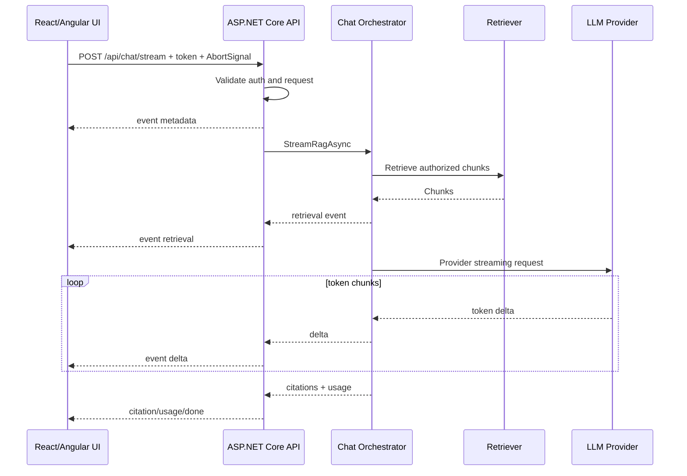
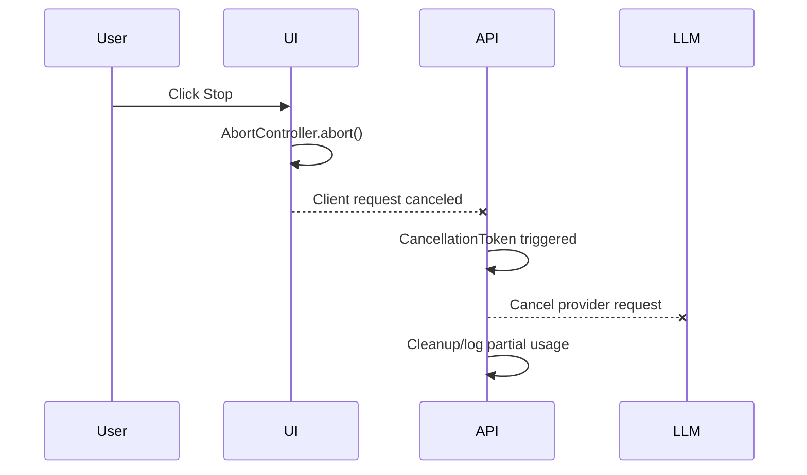

# Streaming Deep Dive: SSE, WebSocket, SignalR, and Fetch Streams

Streaming is one of the most visible parts of a GenAI fullstack app. It affects latency, cancellation, frontend state, backend resource usage, reverse proxy configuration, observability, and interview discussions.

---

## 1. Why stream LLM responses?

Without streaming:

```text
User sends message -> waits silently -> full answer appears
```

With streaming:

```text
User sends message -> answer starts quickly -> tokens appear progressively -> user can stop
```

### Benefits

- Better perceived latency.
- Time to first token becomes visible.
- User can interrupt long answers.
- Partial progress is useful even if the provider later fails.
- The UX feels conversational.

### Costs

- More complex client state.
- More complex error handling.
- Reverse proxies may buffer unless configured.
- Testing is harder than normal JSON requests.
- Observability needs event-level timing.

---

## 2. Transport comparison

| Transport | Direction | Browser support | Auth headers | Best for | Trade-offs |
|---|---|---|---|---|---|
| Fetch stream | Server -> client response stream | Modern browsers | Yes | Authenticated chat streaming | Manual parsing |
| SSE with EventSource | Server -> client | Broad | No custom headers | Public/simple event streams | Auth header limitation |
| WebSocket | Bidirectional | Broad | Handshake/token patterns | Realtime collaboration/control | More stateful ops |
| SignalR | Bidirectional abstraction | Good with client library | Yes | .NET realtime apps | Framework dependency |
| Chunked HTTP | Server -> client | Broad | Yes | Simple progressive text | Need contract discipline |

### Default recommendation

For authenticated LLM token streaming from ASP.NET Core to React/Angular, use `fetch` with a readable response body and an SSE-style event format.

Why:

- Works with bearer tokens.
- Supports `AbortController`.
- Uses normal HTTP infrastructure.
- Can carry structured events.
- Avoids WebSocket operational complexity for one-way streams.

---

## 3. SSE event format

SSE frames are text blocks separated by blank lines.

```text
event: delta
data: {"text":"Hello"}

event: citation
data: {"id":"doc-1#chunk-2","title":"API Policy"}

event: done
data: {}
```

### Recommended event names

| Event | Payload | Purpose |
|---|---|---|
| `metadata` | request ID, model, prompt version | Initialize UI/debug state |
| `retrieval` | chunk IDs/scores, optional | Developer/admin debugging |
| `delta` | text/token | Append to assistant message |
| `citation` | source metadata | Build source panel |
| `usage` | token counts/cost | Admin/cost display |
| `warning` | non-fatal issue | Partial degradation |
| `error` | code/message | Failure after stream starts |
| `done` | empty/final metadata | Mark stream complete |

### Why structured events beat raw tokens

Raw text streams are easy at first but become limiting. Structured events let you add citations, retrieval diagnostics, moderation warnings, and usage without inventing fragile delimiters later.

---

## 4. End-to-end streaming lifecycle



### Cancellation path



---

## 5. ASP.NET Core streaming endpoint

### Minimal controller

```csharp
[ApiController]
public sealed class ChatStreamController : ControllerBase
{
    private readonly IChatOrchestrator _chat;

    public ChatStreamController(IChatOrchestrator chat)
    {
        _chat = chat;
    }

    [HttpPost("/api/chat/stream")]
    public async Task Stream(ChatStreamRequest request, CancellationToken ct)
    {
        Response.Headers.ContentType = "text/event-stream";
        Response.Headers.CacheControl = "no-cache";
        Response.Headers.Connection = "keep-alive";

        await foreach (var item in _chat.StreamAsync(request, ct))
        {
            await WriteEventAsync(item.Event, item.Payload, ct);
        }
    }

    private async Task WriteEventAsync(string eventName, object payload, CancellationToken ct)
    {
        await Response.WriteAsync($"event: {eventName}\n", ct);
        await Response.WriteAsync($"data: {JsonSerializer.Serialize(payload)}\n\n", ct);
        await Response.Body.FlushAsync(ct);
    }
}
```

### Stream event record

```csharp
public sealed record ChatStreamEvent(string Event, object Payload);
```

### Important implementation details

- Set `Content-Type` to `text/event-stream`.
- Flush after every event.
- Pass the `CancellationToken` to retrieval, provider calls, and database writes.
- Catch provider errors and emit an `error` event if headers/body are already started.
- Keep final persistence in `finally` if you need to record partial responses.
- Use structured payloads.

---

## 6. Handling errors after streaming starts

Before response starts, you can return normal HTTP errors:

- 400 validation error
- 401 unauthenticated
- 403 unauthorized
- 429 rate limit

After streaming starts, status code has already been sent. Use an event:

```text
event: error
data: {"code":"provider_timeout","message":"The model provider timed out. Partial answer may be incomplete."}
```

### UI behavior

When `error` arrives:

- Keep partial assistant text.
- Mark message as failed/incomplete.
- Show retry button.
- Preserve request ID for support.
- Do not pretend the answer is complete.

---

## 7. React fetch stream client

```tsx
export type ChatStreamEvent =
  | { type: "metadata"; payload: { requestId: string; model: string } }
  | { type: "delta"; payload: { text: string } }
  | { type: "citation"; payload: Citation }
  | { type: "usage"; payload: Usage }
  | { type: "error"; payload: { code: string; message: string } }
  | { type: "done"; payload: Record<string, never> };

export async function streamChat(
  request: { conversationId: string; message: string },
  accessToken: string,
  onEvent: (event: ChatStreamEvent) => void,
  signal: AbortSignal
) {
  const response = await fetch("/api/chat/stream", {
    method: "POST",
    headers: {
      "Content-Type": "application/json",
      Authorization: `Bearer ${accessToken}`,
    },
    body: JSON.stringify(request),
    signal,
  });

  if (!response.ok) {
    throw new Error(`Chat stream failed with ${response.status}`);
  }

  if (!response.body) {
    throw new Error("Readable streams are not supported.");
  }

  const reader = response.body.getReader();
  const decoder = new TextDecoder();
  let buffer = "";

  while (true) {
    const { done, value } = await reader.read();
    if (done) break;

    buffer += decoder.decode(value, { stream: true });

    const frames = buffer.split("\n\n");
    buffer = frames.pop() ?? "";

    for (const frame of frames) {
      const parsed = parseSseFrame(frame);
      if (parsed) onEvent(parsed);
    }
  }
}

function parseSseFrame(frame: string): ChatStreamEvent | null {
  const eventType = frame.match(/^event: (.+)$/m)?.[1];
  const data = frame.match(/^data: (.*)$/m)?.[1];

  if (!eventType || data == null) {
    return null;
  }

  return {
    type: eventType,
    payload: data ? JSON.parse(data) : {},
  } as ChatStreamEvent;
}
```

### React state pattern

```tsx
const [messages, setMessages] = useState<Message[]>([]);
const [activeController, setActiveController] = useState<AbortController | null>(null);

async function send(message: string) {
  const controller = new AbortController();
  setActiveController(controller);

  const userMessage: Message = { id: crypto.randomUUID(), role: "user", content: message };
  const assistantId = crypto.randomUUID();
  const assistantMessage: Message = {
    id: assistantId,
    role: "assistant",
    content: "",
    citations: [],
    isStreaming: true,
  };

  setMessages(current => [...current, userMessage, assistantMessage]);

  try {
    await streamChat(
      { conversationId: "active", message },
      accessToken,
      event => {
        if (event.type === "delta") {
          setMessages(current => appendDelta(current, assistantId, event.payload.text));
        }
        if (event.type === "citation") {
          setMessages(current => appendCitation(current, assistantId, event.payload));
        }
        if (event.type === "error") {
          setMessages(current => markError(current, assistantId, event.payload.message));
        }
      },
      controller.signal
    );
  } finally {
    setMessages(current => markDone(current, assistantId));
    setActiveController(null);
  }
}
```

---

## 8. Angular fetch stream client

Angular `HttpClient` is excellent for normal JSON APIs. For streaming, wrapping `fetch` in an Observable is usually simpler.

```ts
@Injectable({ providedIn: 'root' })
export class ChatStreamingClient {
  stream(
    request: ChatStreamRequest,
    accessToken: string,
    signal: AbortSignal
  ): Observable<ChatStreamEvent> {
    return new Observable<ChatStreamEvent>(subscriber => {
      fetch('/api/chat/stream', {
        method: 'POST',
        headers: {
          'Content-Type': 'application/json',
          Authorization: `Bearer ${accessToken}`,
        },
        body: JSON.stringify(request),
        signal,
      })
        .then(response => {
          if (!response.ok || !response.body) {
            throw new Error(`Stream failed with ${response.status}`);
          }
          return readSse(response.body, subscriber);
        })
        .catch(error => subscriber.error(error));

      return () => {
        if (!signal.aborted) {
          // The component should own and abort the controller.
        }
      };
    });
  }
}
```

### Component responsibilities

- Create and store `AbortController`.
- Subscribe to stream events.
- Append deltas to active assistant message.
- Unsubscribe/abort on destroy.
- Mark partial response on error.
- Use `ChangeDetectionStrategy.OnPush` for message components.

---

## 9. WebSocket design

Use WebSocket when interaction is truly bidirectional or long-lived.

### Good WebSocket use cases

- Collaborative chat room.
- Agent workflow that asks multiple follow-up control questions.
- Live operational dashboard.
- Server-pushed notifications independent of a request.
- Multimodal realtime audio interaction.

### WebSocket message contract

```json
{ "type": "user_message", "conversationId": "conv-1", "text": "Explain RAG." }
```

```json
{ "type": "assistant_delta", "messageId": "msg-2", "text": "RAG" }
```

```json
{ "type": "stop", "messageId": "msg-2" }
```

### Operational trade-offs

- Connections are stateful.
- Load balancing needs sticky sessions or backplane if state is local.
- Backpressure and reconnection handling matter.
- Auth must happen at connection and/or message level.
- Observability should include connection ID and message IDs.

---

## 10. SignalR design

SignalR is a .NET abstraction over WebSockets and fallback transports.

### Hub sketch

```csharp
public sealed class ChatHub : Hub
{
    private readonly IChatOrchestrator _chat;

    public ChatHub(IChatOrchestrator chat)
    {
        _chat = chat;
    }

    public async IAsyncEnumerable<ChatStreamEvent> Stream(
        ChatStreamRequest request,
        [EnumeratorCancellation] CancellationToken ct)
    {
        await foreach (var item in _chat.StreamAsync(request, ct))
        {
            yield return item;
        }
    }
}
```

### When SignalR is a strong answer

SignalR is especially compelling if the application is already .NET-heavy, needs bidirectional realtime features, and benefits from groups, hubs, connection management, and Azure SignalR Service.

---

## 11. Reverse proxy and hosting concerns

### Nginx

Streaming may be buffered by default. Configure:

```nginx
location /api/chat/stream {
  proxy_pass http://api;
  proxy_http_version 1.1;
  proxy_buffering off;
  proxy_cache off;
  proxy_read_timeout 300s;
}
```

### Cloud proxies

Check:

- Idle timeout.
- Response buffering.
- Maximum request duration.
- Header size.
- HTTP/2 behavior.
- CDN support for streaming.

### ASP.NET Core hosting

Watch for:

- Response compression buffering.
- Middleware that reads/buffers response body.
- Exception handling after headers are sent.
- Request timeout policies.

---

## 12. Backpressure and batching

Token providers may produce many tiny chunks. Updating UI for every tiny token can be expensive.

### Backend batching option

Collect small provider chunks for 20-50 ms before flushing.

Pros:

- Fewer writes.
- Less browser re-rendering.

Cons:

- Slightly higher time between tokens.

### Frontend batching option

Append deltas to a ref, then flush to React/Angular state on animation frame.

```tsx
let pending = "";
let scheduled = false;

function onDelta(text: string) {
  pending += text;
  if (scheduled) return;

  scheduled = true;
  requestAnimationFrame(() => {
    setMessages(current => appendDelta(current, assistantId, pending));
    pending = "";
    scheduled = false;
  });
}
```

---

## 13. Markdown rendering during streams

Rendering markdown on every token can be slow and visually unstable.

Options:

- Render plain text while streaming, markdown after `done`.
- Throttle markdown rendering.
- Memoize message components.
- Virtualize long conversations.
- Disable raw HTML or sanitize it.

Security reminder: model output is untrusted content.

---

## 14. Persistence strategy

### Persist after full response

Pros:

- Simple.
- Stores clean final answer.

Cons:

- Loses partial answer if canceled or provider fails.

### Persist incrementally

Pros:

- Can resume/audit partial answers.
- Better for long-running workflows.

Cons:

- More writes.
- Need idempotency and finalization state.

### Practical choice

For a chat app, store:

- User message at request start.
- Assistant message with `status = streaming`.
- Append/finalize answer at completion or cancellation.
- Record error/canceled status if interrupted.

---

## 15. Observability metrics

Track:

| Metric | Why it matters |
|---|---|
| Time to first byte | API/proxy starts streaming |
| Time to first token | Retrieval + provider startup latency |
| Tokens per second | Provider/model throughput |
| Stream duration | UX and resource usage |
| Cancellation rate | Answers too slow/wrong/long |
| Error after first token rate | Provider reliability |
| Partial response count | Quality and support |
| Client parse errors | Contract compatibility |

### Trace spans

```text
chat.stream request
  auth.validate
  retrieval.embed_query
  retrieval.vector_search
  prompt.build
  provider.stream
  stream.write_client
  persistence.finalize
```

---

## 16. Testing streaming

### Unit tests

- SSE frame parser handles split chunks.
- Parser handles multiple frames in one read.
- Parser ignores comments/empty frames.
- UI appends deltas to active message only.
- Error event marks partial answer.

### Integration tests

- Endpoint returns `text/event-stream`.
- Endpoint flushes metadata before model completes.
- Cancellation propagates to orchestrator.
- Invalid token returns 401 before stream starts.
- Provider failure emits error event after stream starts.

### Manual test script

1. Open dev tools network tab.
2. Send chat request.
3. Confirm response streams progressively.
4. Click stop.
5. Confirm request is canceled.
6. Confirm backend logs cancellation.
7. Confirm partial assistant message is marked canceled.

---

## 17. Interview decision tree

### If asked "SSE or WebSocket?"

Answer:

> If the app only needs server-to-client token streaming for one request, I prefer SSE-style events over fetch because it works well with normal HTTP, auth headers, and AbortController. If we need bidirectional realtime collaboration, server push outside a request, or complex control messages, I would consider WebSocket or SignalR.

### If asked "How do you support auth with SSE?"

Answer:

> Native EventSource cannot send Authorization headers, so I would use fetch streaming with bearer tokens, same-site cookies via a BFF, a short-lived stream token, or WebSocket/SignalR depending on the security model.

### If asked "How do you handle errors mid-stream?"

Answer:

> Once headers are sent, I cannot change the status code. I emit a structured error event, preserve the partial answer, mark it incomplete, log the request ID and provider error, and offer retry.

### If asked "Why is stop generation hard?"

Answer:

> The UI stop button must abort the browser request, ASP.NET must observe the cancellation token, the orchestrator must pass it to retrieval and provider calls, and persistence must correctly mark the message canceled or partial.

---

## 18. Final streaming checklist

- [ ] Endpoint validates auth before streaming starts.
- [ ] Response content type is `text/event-stream`.
- [ ] Events are structured and version-tolerant.
- [ ] Backend flushes after each event or small batch.
- [ ] Frontend supports AbortController.
- [ ] Cancellation token reaches provider call.
- [ ] UI preserves partial answer on error/cancel.
- [ ] Citations and usage can arrive as structured events.
- [ ] Proxy buffering is disabled for stream path.
- [ ] Time to first token and cancellation rate are measured.

