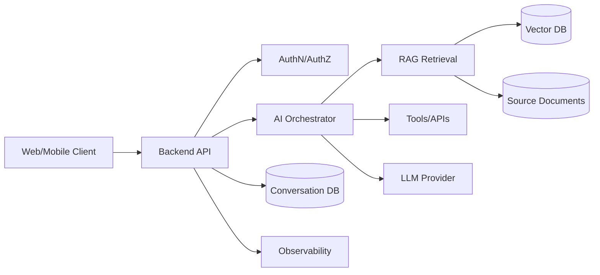
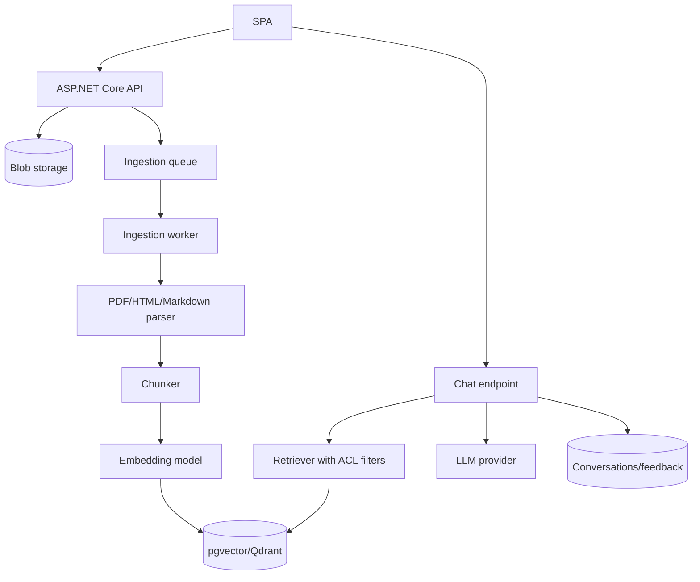
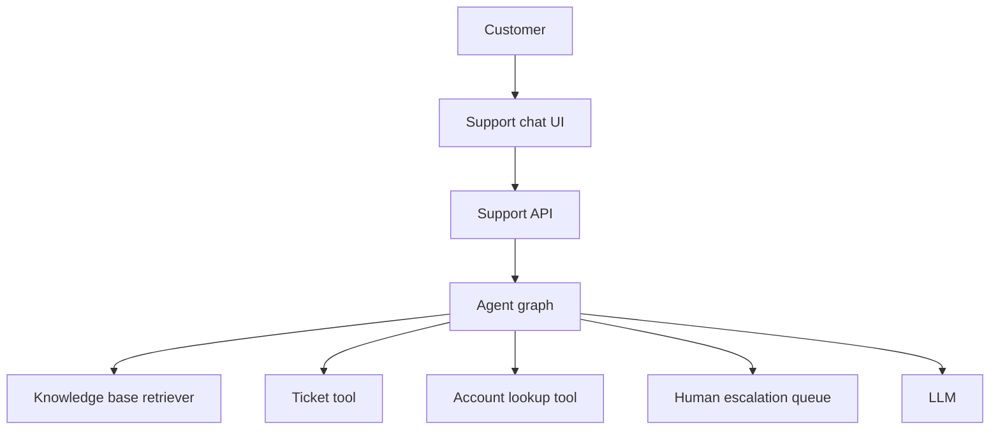
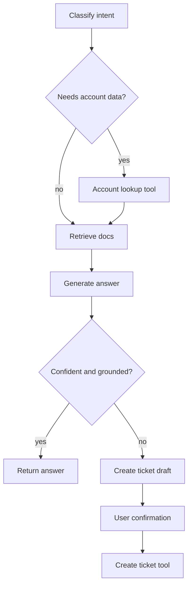
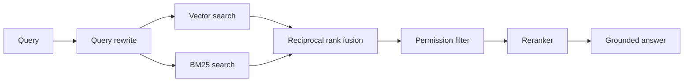
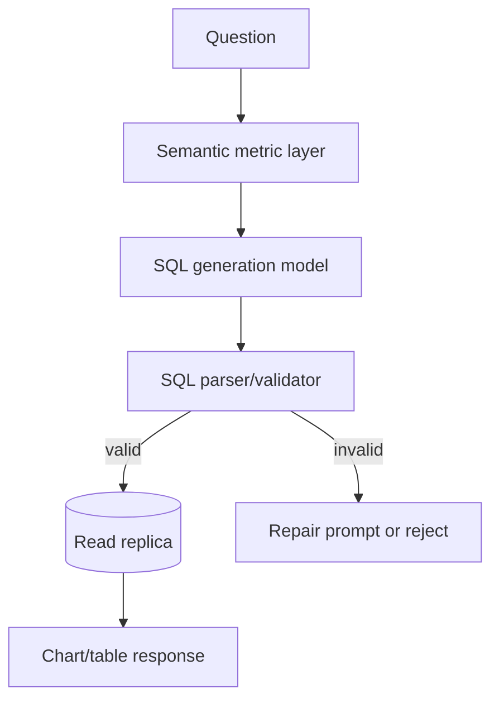
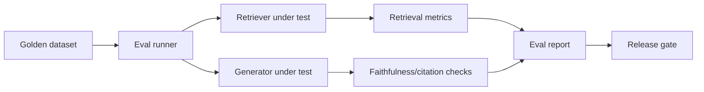
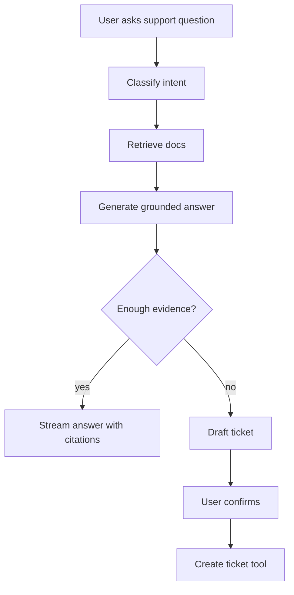
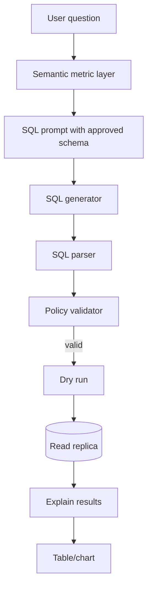

# System Design for AI Applications

## Interview framework

When asked to design an AI app, use this structure:

1. Clarify requirements.
2. Define users and core flows.
3. Draw high-level architecture.
4. Deep dive into retrieval/tools/model orchestration.
5. Discuss data, security, evaluation, scaling, cost, and observability.
6. Name trade-offs and failure modes.

---

## 1. Universal AI app architecture



### Key design principle

The LLM is not the system. The system includes data pipelines, authorization, retrieval, prompts, tools, validation, UX, and evaluation.

---

## 2. Clarifying questions

Ask:

- Who are the users?
- What data can the model access?
- Does the answer need citations?
- Is the data private, tenant-scoped, or regulated?
- Are actions/tool calls required?
- Latency target? Cost constraints?
- Need streaming?
- What is the acceptable failure behavior?
- How will quality be measured?

---

## 3. Design prompt: Document Q&A system

### Requirements

- Users upload documents.
- Ask questions with citations.
- Tenant isolation.
- Streaming answers.
- Feedback collection.

### Architecture



### Query flow

1. Validate user token.
2. Resolve tenant and permissions.
3. Rewrite follow-up question if needed.
4. Retrieve top-k chunks with tenant/ACL filters.
5. Hybrid search and rerank if needed.
6. Build prompt with context and citation IDs.
7. Stream answer.
8. Validate citations.
9. Store message, retrieval metadata, usage.

### Trade-offs

| Choice | Pros | Cons |
|---|---|---|
| pgvector | Simple if already on Postgres | May need tuning at high scale |
| Managed vector DB | Scaling/features | More infra/vendor cost |
| Long context | Simpler retrieval | Higher cost/latency |
| Reranking | Better precision | Extra latency |

---

## 4. Design prompt: AI support agent

### Requirements

- Answer product questions.
- Create support tickets when needed.
- Escalate uncertain answers.
- Use internal knowledge base.

### Architecture



### Agent graph



### Safety

- Ticket tool validates fields.
- User confirms before ticket creation.
- Account lookup enforces user identity.
- Tool calls audited.

---

## 5. Design prompt: Enterprise AI search

### Requirements

- Search across docs, tickets, and wiki.
- Respect permissions.
- Return answers and source links.
- Support exact IDs and semantic questions.

### Retrieval design



Important note: ACL filtering should happen inside search where possible. If not, over-retrieve and filter before prompt assembly, but never pass unauthorized chunks to the model.

---

## 6. Design prompt: Conversational SQL analytics

### Requirements

- Users ask questions about business metrics.
- System generates SQL.
- Results shown as table/chart.
- Prevent unsafe queries.

### Architecture



### Guardrails

- Whitelisted tables/views only.
- Read-only DB user.
- Query timeout.
- Row limits.
- SQL parser validation.
- No PII fields unless authorized.
- Explanation of generated query.

---

## 7. Evaluation strategy

### Offline evals

- Golden question set.
- Expected citations.
- Faithfulness scorer.
- Retrieval recall@k.
- Regression tests when prompts/models change.

### Online evals

- User feedback.
- Escalation rate.
- Re-query rate.
- Citation click-through.
- Human review sampling.

### Example quality dashboard

```text
RAG Quality
  Recall@5:              0.86
  Faithfulness:          0.91
  Citation accuracy:     0.88
  Helpful feedback:      78%
  P95 latency:           4.8s
  Avg cost/request:      $0.004
```

---

## 8. Scaling considerations

### Ingestion scale

- Queue document processing.
- Deduplicate content.
- Incremental re-indexing.
- Batch embedding requests.
- Track version/hash per document.

### Query scale

- Cache query embeddings.
- Use approximate nearest neighbor indexes.
- Tune top-k and reranking.
- Stream final answer.
- Use regional provider endpoints if available.

### Cost scale

- Model routing by task complexity.
- Prompt/context compression.
- Token budgets.
- Per-tenant quotas.
- Batch offline tasks.

---

## 9. Security checklist

- Backend-only provider keys.
- Tenant/ACL filters before prompt assembly.
- Prompt injection red-team tests.
- Tool argument validation.
- Human approval for side effects.
- PII redaction and retention policy.
- Audit logs for AI decisions/actions.
- Secrets in vault.

---

## 10. Failure modes and responses

| Failure | Detection | Response |
|---|---|---|
| Retrieval misses relevant doc | Low recall@k, user feedback | Improve chunking, hybrid search, metadata |
| Hallucinated answer | Faithfulness eval, citation validation | Grounded prompt, lower temperature, verifier |
| Cross-tenant leak | Security tests, audit | Enforce filters, test isolation |
| Provider timeout | Logs/metrics | Retry, fallback, graceful error |
| Tool misuse | Audit/review | Validate, authorize, human approval |
| Cost spike | Usage metrics | Quotas, rate limits, token caps |

---

## 11. Whiteboard answer template

```text
I would split this into:
1. Client UX: streaming, citations, feedback.
2. API trust boundary: auth, validation, rate limits.
3. AI orchestration: prompt templates, model calls, tools.
4. Knowledge pipeline: ingestion, chunking, embeddings, vector store.
5. Evaluation/observability: quality, latency, cost, traces.
6. Security: tenant filters, prompt injection, tool permissions.
```

---

## 12. Practice prompts

1. Design a multi-tenant document Q&A platform.
2. Design a coding assistant for internal repositories.
3. Design an AI support agent with ticket creation.
4. Design a healthcare policy assistant with strict compliance.
5. Design an AI ops copilot that can read logs and suggest actions.
6. Design RAG evaluation infrastructure.

---

## 13. 45-minute system design scorecard

Use this to self-grade after practice.

| Category | Strong signal | Red flag |
|---|---|---|
| Requirements | Clarifies users, data, latency, citations, privacy | Starts drawing immediately |
| Architecture | Clear client/API/data/AI boundaries | "LLM does everything" |
| Auth/security | Tenant/ACL filters before prompt assembly | Model sees unauthorized data |
| Retrieval | Chunking, metadata, hybrid/rerank trade-offs | Vector DB treated as magic |
| Streaming UX | Transport, cancellation, partial errors | Ignores long latency |
| Evaluation | Offline and online metrics | "Users will tell us" only |
| Observability | Tokens, cost, latency, chunk IDs, traces | Only generic logs |
| Cost | Quotas, model routing, token budgets | No cost controls |
| Reliability | Timeouts, retries, fallback, queues | Synchronous ingestion |
| Communication | Summarizes trade-offs and risks | Too much implementation detail too early |

Score each category 1-5. Any red flag in auth/security should be treated as a major issue.

---

## 14. Deep dive: multi-tenant document Q&A

### Functional requirements

- Upload documents.
- Ask questions with citations.
- Stream answers.
- Manage collections.
- Delete documents.
- Give feedback.
- Admin views usage and quality.

### Non-functional requirements

- Tenant isolation.
- P95 chat latency target.
- Ingestion retry.
- Cost limits.
- Audit logs.
- Data deletion.
- Provider outage handling.

### APIs

```text
POST /api/documents
GET  /api/documents/{id}/ingestion-status
POST /api/rag/query
POST /api/chat/stream
POST /api/feedback
GET  /api/admin/usage
```

### Data model

```text
Tenant
User
Document
DocumentChunk
IngestionJob
Conversation
Message
Citation
Feedback
UsageRecord
```

### Retrieval deep dive

```text
question
  -> optional conversation-aware rewrite
  -> query embedding
  -> vector search with tenant/ACL filter
  -> keyword search for exact terms
  -> reciprocal rank fusion
  -> rerank top candidates
  -> context packing/token budgeting
  -> grounded prompt
```

### Security deep dive

- Tenant ID comes from validated token.
- Document ACLs are stored as metadata.
- Search filters enforce tenant/ACL before prompt assembly.
- Tool calls use server-side authorization.
- Audit logs include retrieved chunk IDs.
- Prompt injection examples are included in evals.

### Scaling deep dive

| Bottleneck | Scaling option |
|---|---|
| Upload parsing | Queue + worker pool |
| Embeddings | Batch requests and retry |
| Vector search | ANN index, partitioning, managed search |
| Reranking | Apply only to top N or high-value tenants |
| Model latency | Streaming, smaller model routing |
| Cost | Token budgets, quotas, caching |

---

## 15. Deep dive: RAG evaluation platform

### Goal

Design infrastructure that tells whether RAG changes improved or regressed quality.

### Core flow



### Dataset schema

```json
{
  "id": "q-001",
  "question": "How often should API keys rotate?",
  "expectedChunkIds": ["security#chunk-4"],
  "expectedAnswerFacts": ["90 days"],
  "tags": ["security", "exact-fact"]
}
```

### Metrics

- Recall@k.
- MRR/NDCG.
- Context precision.
- Faithfulness.
- Citation accuracy.
- Answer relevance.
- Latency.
- Cost.

### Release gate

```text
Block rollout if:
- Recall@5 drops by more than 3%.
- Citation accuracy drops by more than 2%.
- P95 latency increases by more than 20%.
- Cost/request increases by more than 25% without approval.
- Any cross-tenant test fails.
```

---

## 16. Deep dive: AI support agent with ticket creation

### Key design choice

Use deterministic workflow plus limited tool calling before using a broad autonomous agent.



### Tool contract

```json
{
  "tool": "CreateSupportTicket",
  "arguments": {
    "subject": "Cannot rotate API key",
    "description": "User tried...",
    "priority": "normal"
  }
}
```

### Tool safety

- Tool name allowlist.
- JSON schema validation.
- User authorization.
- Idempotency key.
- Human confirmation.
- Audit log.

### Interview trade-off

> I would avoid a fully autonomous agent for ticket creation at first. A deterministic flow with a model-generated draft and user confirmation gives most of the value with much lower risk.

---

## 17. Deep dive: conversational analytics

### Architecture



### Safety rules

- Read-only database user.
- Whitelisted views only.
- No raw PII fields.
- Query timeout.
- Row limit.
- SQL parser validation.
- Dry run before execution.
- Show generated SQL/explanation to advanced users.

### Failure modes

| Failure | Mitigation |
|---|---|
| Invalid SQL | Parser + repair/reject |
| Expensive query | Timeout, limit, dry run |
| Wrong metric | Semantic layer and examples |
| PII exposure | Whitelisted views and policy |
| Hallucinated column | Schema-grounded prompt and validator |

---

## 18. System design closing script

Use the last 60-90 seconds to summarize:

```text
To summarize, I separated the system into a client UX, ASP.NET Core API trust boundary, ingestion pipeline, retrieval layer, model orchestration, and observability/evaluation. The most important risks are tenant leakage, retrieval quality, hallucinated citations, provider latency/outage, and cost. I would start with a deterministic RAG flow, add streaming and citations, measure quality with a golden dataset, and roll out behind feature flags with monitoring.
```

This closing shows that you can connect architecture choices back to product and operational risk.

