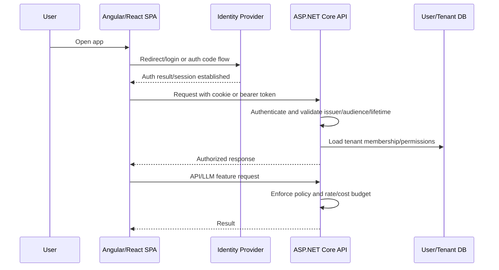

# Auth and Session Design

## Problem statement

Design authentication and session management for an Angular/React SPA backed by ASP.NET Core APIs, with optional GenAI features and multi-tenant authorization.

## Requirements to clarify

- Users sign in securely through an identity provider or first-party auth service.
- SPA can call APIs without exposing provider or LLM secrets.
- API enforces authentication and authorization on every request.
- Support token refresh, logout, session expiry, and revocation.
- Support tenant membership and roles/permissions.
- Protect against XSS, CSRF, token theft, and privilege escalation.

## High-level architecture

- SPA handles UX state and route guards, not final security decisions.
- Identity provider issues tokens or auth server manages cookie session.
- ASP.NET Core API validates tokens/cookies, maps claims, and enforces policies.
- Session store/refresh token store tracks revocation and device sessions if needed.
- Audit log records sign-in, failed auth, tenant switches, and privileged actions.
- Secrets stay server-side; AI provider keys are never shipped to the browser.

## API sketch

```http
GET /api/me
POST /api/auth/logout
GET /api/tenants
POST /api/tenants/{tenantId}/switch
GET /api/admin/users  Authorization: policy AdminOnly
```


## Data model sketch

- User: id, subject, email, status.
- Tenant: id, name, plan.
- Membership: user_id, tenant_id, role, permissions, status.
- Session/device: user_id, refresh_token_hash, expires_at, revoked_at, ip/device metadata.
- AuditEvent: actor, tenant, action, resource, outcome, correlation_id.


## Main sequence



## Deep dives and expected talking points

### Token storage

Prefer secure, HttpOnly, SameSite cookies for browser sessions when the architecture supports it; bearer tokens in browser storage increase XSS blast radius. If using tokens in memory/storage, minimize lifetime, use refresh rotation, and harden against XSS.

### Authorization

Do not rely on route guards. Use policy-based authorization, resource checks, tenant membership validation, and query-level filters. Claims are inputs, not the entire authorization model.

### Session lifecycle

Define idle timeout, absolute timeout, refresh rotation, revocation, logout everywhere, and behavior for expired sessions during streaming or long operations.

### CSRF and CORS

Cookie auth needs CSRF protection and SameSite strategy. CORS controls browser access but is not authentication. Allow only known origins and credentials when necessary.

### GenAI-specific auth

The API should check whether the user can access retrieved documents and tools. Prompt/tool execution must inherit user/tenant permissions.
## Risks and mitigations

| Risk | Mitigation |
|---|---|
| Token theft | Short lifetimes, HttpOnly cookies, refresh rotation, device/session revocation, XSS prevention. |
| Tenant breakout | Server-side tenant membership checks and mandatory tenant filters in queries/retrieval/tools. |
| CSRF | SameSite cookies, antiforgery tokens, no unsafe GET actions. |
| Over-privileged claims | Validate issuer, audience, scopes, and load current permissions from trusted store when needed. |
| Leaked AI keys | All provider calls server-side; secrets in managed secret store. |

## Metrics

- Login success/failure rate
- Auth latency p95
- Token refresh failure rate
- Unauthorized/forbidden rate by route
- Session revocation propagation time
- Tenant access violation count
- Security incident count

## Rollout and validation

Start with one auth mode, write integration tests for 401/403/tenant filtering, run threat modeling, enable audit logs, and test logout/refresh/session expiry before adding privileged AI tools.
