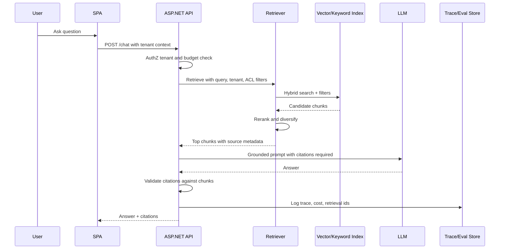

# Multi-Tenant RAG

## Problem statement

Design a RAG system where multiple tenants upload documents and ask questions, with strict isolation, citations, evaluation, and cost controls.

## Requirements to clarify

- Tenants can upload, index, search, and ask questions over only their own documents.
- Answers include citations to accessible sources.
- Support document updates/deletes and index freshness.
- Handle PDFs/docs/web pages with metadata.
- Measure retrieval/generation quality.
- Control cost and latency per tenant.

## High-level architecture

- Frontend calls ASP.NET API for upload/chat/search.
- API enforces tenant/auth policies and stores document metadata in SQL.
- Ingestion pipeline extracts text, chunks, embeds, and writes vector/keyword indexes with tenant and ACL metadata.
- Query path performs ACL-filtered hybrid retrieval, reranking, prompt assembly, LLM generation, citation validation, and trace logging.
- Evaluation pipeline runs offline test sets and monitors online feedback.

## API sketch

```http
POST /api/documents
GET /api/documents?tenantId=...
DELETE /api/documents/{id}
POST /api/chat/sessions
POST /api/chat/sessions/{id}/messages
GET /api/chat/sessions/{id}/messages
```


## Data model sketch

- Document: id, tenant_id, title, source_uri, status, version, created_by.
- Chunk: id, document_id, tenant_id, acl_hash/tags, text, section, page, offset, embedding_id, token_count.
- ChatSession/Message: tenant_id, user_id, prompt, answer, citations, cost, feedback.
- EvalCase: question, expected_sources, rubric, tenant/domain.


## Main sequence



## Deep dives and expected talking points

### Tenant isolation

Tenant ID and ACL metadata must be part of document metadata and retrieval filters. Do not retrieve globally and filter after generation. Also ensure object storage paths and document downloads are tenant-scoped.

### Chunking

Chunk by semantic sections where possible, preserve headings/page numbers, include overlap only where it improves recall, and track source offsets for citations.

### Hybrid retrieval

Use keyword/BM25 for exact names, IDs, and terms; vector search for semantic recall; rerank top candidates; apply max chunks and diversity to control context.

### Deletes and updates

Use document versioning and tombstones. Reindex asynchronously but make deleted documents unavailable immediately through metadata state and filters.

### Evaluation

Maintain golden questions per tenant/domain, expected sources, and rubrics. Run evals on changes to chunking, embeddings, prompts, reranker, or model.
## Risks and mitigations

| Risk | Mitigation |
|---|---|
| Data leakage | Mandatory tenant/ACL filters in SQL and vector queries, integration tests, audit logs. |
| Hallucinated citations | Citation validation and answer refusal when evidence is insufficient. |
| Stale index | Index freshness metrics, versioned documents, retry/dead-letter ingestion. |
| High cost | Token budgets, chunk limits, model routing, tenant quotas. |
| Poor retrieval | Hybrid search, reranking, eval sets, query rewriting for hard cases. |

## Metrics

- Retrieval recall@k
- Context precision
- Citation accuracy
- Faithfulness score
- Answer acceptance/thumbs-up rate
- p95 retrieval and generation latency
- Index freshness lag
- Cost per tenant/query
- ACL violation count

## Rollout and validation

Pilot with one document type and one tenant, build a small eval set before broad launch, compare keyword/vector/hybrid retrieval, and gate expansion on citation accuracy and tenant isolation tests.
