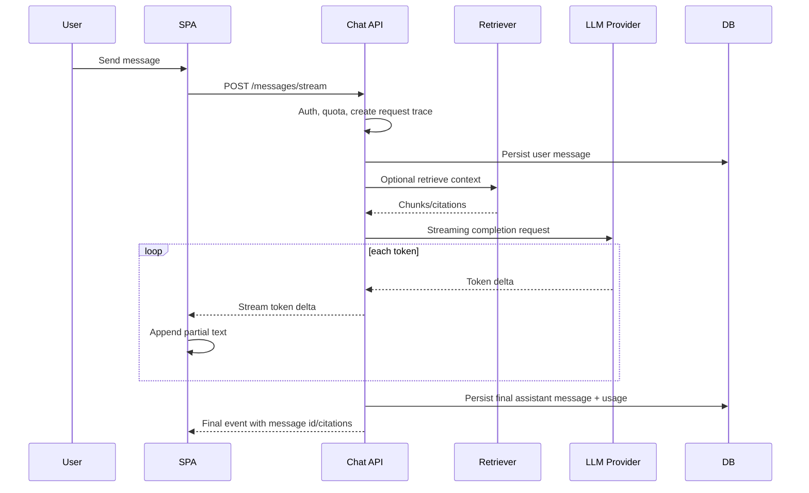

# Streaming Chat

## Problem statement

Design a chat experience that streams LLM output to a web client while supporting auth, cancellation, persistence, retrieval, and partial failure handling.

## Requirements to clarify

- Show first tokens quickly and continue streaming.
- Support stop generation/cancellation.
- Persist final conversation messages.
- Optionally include RAG citations.
- Work for Angular/React clients.
- Avoid exposing LLM provider credentials.

## High-level architecture

- SPA sends message to ASP.NET API.
- API validates auth, rate limits, and creates a message record.
- API optionally retrieves context, calls model provider, and streams tokens via SSE/chunked HTTP or SignalR.
- Client renders partial assistant message and can send cancellation.
- API stores final message, citations, token usage, and trace.

## API sketch

```http
POST /api/chat/sessions
POST /api/chat/sessions/{sessionId}/messages:stream
POST /api/chat/sessions/{sessionId}/messages/{messageId}:cancel
GET /api/chat/sessions/{sessionId}/messages
```

Example stream events: `metadata`, `token`, `citation`, `warning`, `final`, `error`.


## Data model sketch

- ChatSession: id, tenant_id, user_id, title, created_at.
- Message: id, session_id, role, content, status, model, token_count, cost, created_at.
- Citation: message_id, document_id, chunk_id, title, page, url.
- Trace: request_id, retrieval_ids, provider_latency, error_code.


## Main sequence



## Deep dives and expected talking points

### Transport choice

SSE is simple for server-to-client token streams. SignalR is better if the app already needs bidirectional realtime features or group messaging. WebSockets work but require more protocol ownership.

### Cancellation

Use AbortController on the client and CancellationToken/RequestAborted on the server. Propagate cancellation to retrieval, provider calls, and persistence logic.

### Persistence

Persist the user message before generation. Persist assistant output at finalization or periodically for long streams. Mark interrupted/failed messages explicitly.

### Backpressure

Avoid overwhelming clients with too many tiny events. Buffer modestly if needed, but preserve responsiveness. Enforce max tokens and max duration.

### Error UX

Stream structured events: token, citation, warning, final, error. The client should distinguish provider failure, auth expiry, cancellation, and moderation refusal.
## Risks and mitigations

| Risk | Mitigation |
|---|---|
| Client disconnect wastes tokens | Propagate cancellation tokens to provider calls. |
| Partial output lost | Persist state and mark incomplete messages. |
| Provider latency | Show status events, optimize retrieval, choose model routing. |
| Unsafe output | Moderation, grounded prompts, refusal rules, post-processing where needed. |
| Duplicate sends on retry | Idempotency keys for message creation. |

## Metrics

- Time to first token
- Tokens per second
- p95 total response time
- Cancellation success rate
- Stream error rate
- Cost per message
- User retry rate
- Conversation completion rate

## Rollout and validation

Start with a narrow pilot, define success metrics, run load/security/evaluation tests, release behind feature flags, and monitor regressions before expanding.
