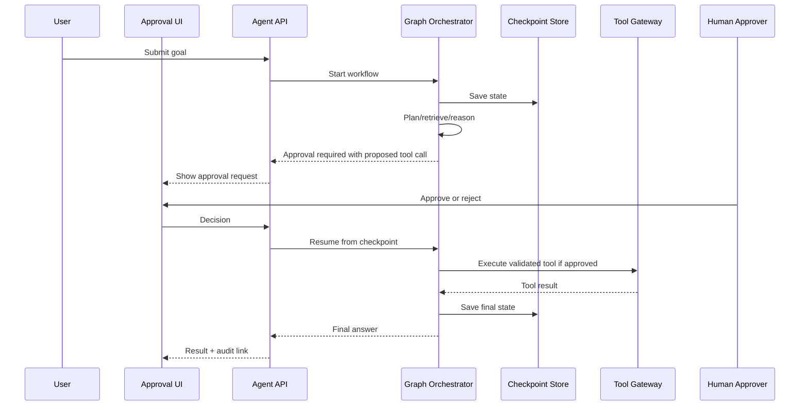

# Agent with Human-in-the-Loop

## Problem statement

Design an agent that can research, reason, and propose actions, but requires human approval before risky tool execution.

## Requirements to clarify

- Agent can use retrieval and tools to complete a task.
- Risky actions require human approval.
- Workflow is resumable after approval or rejection.
- All tool calls are authorized, validated, and audited.
- Support timeouts, retries, and cost limits.

## High-level architecture

- User submits goal to API.
- Orchestrator runs a state graph: plan, retrieve, decide, maybe request approval, execute tool, summarize.
- State/checkpoint store persists workflow state.
- Approval UI shows proposed action, arguments, evidence, and risk level.
- Tool gateway validates schema, auth, tenant, idempotency, and audit before execution.

## API sketch

```http
POST /api/agent/runs
GET /api/agent/runs/{runId}
POST /api/agent/runs/{runId}/approvals/{approvalId}/approve
POST /api/agent/runs/{runId}/approvals/{approvalId}/reject
GET /api/agent/runs/{runId}/audit
```


## Data model sketch

- AgentRun: id, tenant_id, user_id, status, goal, budget, current_node.
- Checkpoint: run_id, version, state_json, created_at.
- Approval: id, run_id, action_type, args_hash, args_json, evidence, status, approver_id.
- ToolExecution: id, run_id, approval_id, tool, idempotency_key, outcome.


## Main sequence



## Deep dives and expected talking points

### Graph state

Define explicit state: goal, plan, evidence, proposed actions, approvals, tool results, errors, budget. This makes the workflow testable and resumable.

### Approval design

Approval screens should show what will happen, why, affected resources, confidence, evidence, and rollback options. Approval should be tied to a specific immutable action payload.

### Tool safety

The model proposes; code disposes. Validate schema, permissions, tenant, resource state, and idempotency. Use allowlists and deny high-risk tools by default.

### Retries

Retries should not duplicate side effects. Read-only tools can retry more freely; write tools need idempotency keys and state checks.

### Audit

Record actor, model, prompt trace reference, proposed arguments, approver, decision, execution result, and timestamps.
## Risks and mitigations

| Risk | Mitigation |
|---|---|
| Unauthorized action | Server-side policy checks and approval tied to immutable payload. |
| Approval confusion | Clear UX with diff/evidence/risk labels. |
| Runaway loop | Step limits, timeouts, budget checks, graph guards. |
| Duplicate side effect | Idempotency keys and tool execution ledger. |
| Model deception or prompt injection | Treat retrieved content as data, validate tools, require human approval for risky actions. |

## Metrics

- Approval request count
- Approval acceptance/rejection rate
- Tool success/failure rate
- Manual override rate
- Workflow completion time
- Cost per workflow
- Policy violation count
- User satisfaction after completion

## Rollout and validation

Start with a narrow pilot, define success metrics, run load/security/evaluation tests, release behind feature flags, and monitor regressions before expanding.
