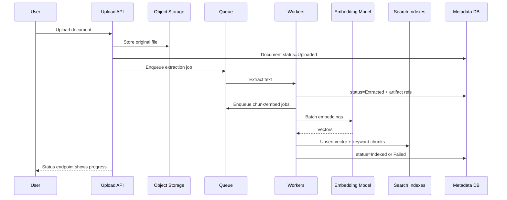

# Document Ingestion Pipeline

## Problem statement

Design a pipeline that ingests tenant documents, extracts text, chunks content, computes embeddings, indexes search data, and handles failures.

## Requirements to clarify

- Accept PDFs, docs, markdown, HTML, and text.
- Track ingestion status and errors.
- Support updates, deletes, retries, and versioning.
- Preserve metadata for citations and ACL filtering.
- Scale workers independently from API.
- Monitor freshness and quality.

## High-level architecture

- Upload API stores file in object storage and metadata in SQL.
- Queue triggers extraction worker.
- Extractor normalizes text, detects sections/pages, and stores raw text artifact.
- Chunker creates chunks with metadata and token counts.
- Embedding worker batches model calls and writes vector index.
- Keyword indexer writes lexical index.
- Status service reports progress and failures.

## API sketch

```http
POST /api/documents
GET /api/documents/{id}/status
POST /api/documents/{id}/reindex
DELETE /api/documents/{id}
GET /api/documents/{id}/chunks
```


## Data model sketch

- Document: id, tenant_id, version, status, content_hash, source_uri, error_code.
- DocumentArtifact: document_id, version, type, uri.
- Chunk: id, document_id, version, tenant_id, text, metadata, token_count.
- IngestionJob: id, document_id, type, status, attempts, next_retry_at.


## Main sequence



## Deep dives and expected talking points

### Idempotency

Jobs must be safe to retry. Use document version, chunk IDs derived from version/content, and upsert semantics. Avoid duplicate chunks after retries.

### Extraction quality

PDFs and scans can fail. Track extraction confidence, OCR status, page numbers, and unsupported file errors. Let users inspect failed documents.

### Chunking strategy

Use semantic boundaries, headings, page breaks, token limits, and overlap. Store source offsets to support citation highlighting.

### Batching embeddings

Batch calls to reduce overhead while respecting provider limits. Add retry with backoff and dead-letter failed jobs.

### Delete/update

Immediate metadata tombstone prevents retrieval. Background cleanup removes old chunks/vectors/object files.
## Risks and mitigations

| Risk | Mitigation |
|---|---|
| Poisoned or malicious docs | File scanning, content-type validation, sandbox extraction, prompt-injection-aware prompting. |
| Index duplicates | Idempotent chunk IDs and versioned indexing. |
| Stale deleted docs | Tombstone filters and cleanup jobs. |
| High embedding cost | Batching, dedupe by content hash, quotas. |
| OCR failure | Status visibility and manual remediation path. |

## Metrics

- Ingestion success rate
- Average indexing time
- Index freshness lag
- Extraction failure rate by file type
- Embedding cost per document
- Queue depth/age
- Dead-letter count
- Chunk count/token distribution

## Rollout and validation

Start with a narrow pilot, define success metrics, run load/security/evaluation tests, release behind feature flags, and monitor regressions before expanding.
