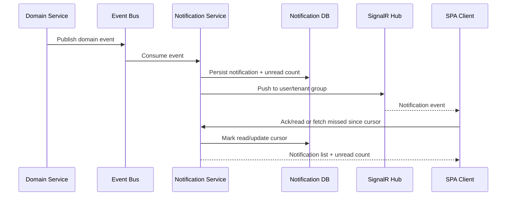

# Realtime Notifications

## Problem statement

Design realtime notifications for a web app: server events, user/group targeting, persistence, unread counts, and delivery over SignalR or similar transport.

## Requirements to clarify

- Deliver notifications to online users quickly.
- Persist important notifications for offline users.
- Support user, tenant, role, and group targeting.
- Show unread count and notification history.
- Handle reconnects and missed messages.
- Scale across multiple API instances.

## High-level architecture

- Domain services publish notification events to a queue/event bus.
- Notification service persists durable notifications and updates unread counts.
- Realtime gateway pushes to connected clients through SignalR groups.
- Clients reconnect and fetch missed notifications using last seen cursor.
- Backplane or managed SignalR service coordinates multiple servers.

## API sketch

```http
GET /api/notifications?afterCursor=...
POST /api/notifications/{id}/read
POST /api/notifications/read-all
GET /api/notifications/unread-count
/ws or /hubs/notifications
```


## Data model sketch

- Notification: id, tenant_id, type, title, body, resource_ref, created_at.
- NotificationRecipient: notification_id, user_id, read_at, delivered_at.
- NotificationCursor: user_id, last_seen_id/time.


## Main sequence



## Deep dives and expected talking points

### Durability

SignalR delivery is transient. Persist important notifications and use cursor-based fetch for missed events. Ephemeral typing/presence events do not need durable storage.

### Targeting

Assign connections to user/tenant/group after authentication and authorization. Never let clients choose arbitrary groups without server validation.

### Unread counts

Maintain counts carefully under concurrency. Either compute from read state for correctness or maintain counters with transactional updates for speed.

### Scaling

Use Redis backplane or managed realtime service. Avoid in-memory-only connection state for critical logic.

### Client behavior

On reconnect, fetch missed notifications since last cursor, dedupe by notification ID, and update unread count from server truth.
## Risks and mitigations

| Risk | Mitigation |
|---|---|
| Missed notifications | Persistent store + cursor sync on reconnect. |
| Unauthorized group access | Server-side group assignment and auth checks. |
| Duplicate events | Notification IDs and client/server idempotency. |
| Fanout overload | Batching, rate limits, groups, async queue workers. |
| Unread inconsistency | Transactional updates or source-of-truth recomputation. |

## Metrics

- Delivery latency p95
- Notification creation rate
- Push success rate
- Reconnect missed-event fetch count
- Unread count mismatch rate
- Queue lag
- Connection count
- Fanout failures

## Rollout and validation

Start with a narrow pilot, define success metrics, run load/security/evaluation tests, release behind feature flags, and monitor regressions before expanding.
