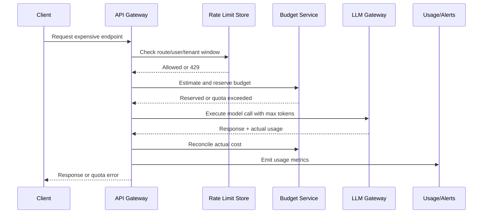

# Rate Limits and Cost Control

## Problem statement

Design rate limiting and cost controls for an API with expensive LLM/RAG endpoints, multiple tenants, and abuse risk.

## Requirements to clarify

- Limit request volume by user, tenant, IP/API key, route, and model.
- Track token and dollar budgets.
- Protect shared infrastructure during spikes.
- Return clear errors and quota information.
- Support admin visibility and overrides.
- Prevent one tenant from starving others.

## High-level architecture

- API middleware enforces cheap request limits early.
- Cost budget service estimates and reserves LLM budget before work.
- Distributed counter store tracks windows/quotas.
- LLM gateway records actual tokens/cost and reconciles budget.
- Admin dashboard exposes usage by tenant/user/model/feature.
- Alerts fire on anomalies.

## API sketch

```http
GET /api/usage/current
GET /api/usage/tenants/{tenantId}
POST /api/admin/tenants/{tenantId}/quota
POST /api/chat/messages:stream  X-Idempotency-Key: ...
```


## Data model sketch

- UsageEvent: tenant_id, user_id, route, model, input_tokens, output_tokens, cost, request_id.
- Quota: tenant_id, period, request_limit, token_limit, cost_limit.
- Reservation: request_id, estimated_cost, actual_cost, status.


## Main sequence



## Deep dives and expected talking points

### Limit dimensions

Use different keys: IP for anonymous abuse, user for fairness, tenant for plan limits, route/model for expensive features, and global limits for system protection.

### Algorithms

Fixed window is simple but bursty; sliding window is smoother; token bucket allows bursts while enforcing average rate; concurrency limits protect live resources.

### LLM budget

Estimate input tokens from prompt/retrieval plus max output tokens. Reserve before calling provider and reconcile actual usage after completion/cancellation.

### Graceful degradation

When limits hit, offer smaller model, reduced context, slower queue, or retry-after guidance depending on product tier.

### Abuse and anomalies

Detect sudden spend spikes, prompt loops, scraping, repeated failures, or tenant-level anomalies.
## Risks and mitigations

| Risk | Mitigation |
|---|---|
| Runaway LLM spend | Budgets, max tokens, model routing, alerts, kill switches. |
| Distributed counter inconsistency | Use Redis/central store and tolerate small approximations. |
| Bad UX on limits | Clear 429 body, retry-after, quota dashboard. |
| Noisy neighbor | Tenant quotas and concurrency isolation. |
| Streaming cancellation not counted | Track partial token usage and reconcile provider usage. |

## Metrics

- 429 rate by route/tenant
- Cost per request/user/tenant
- Token usage by model
- Budget exhaustion events
- p95 latency under throttling
- Limit store latency
- Anomaly alert count
- Concurrency saturation

## Rollout and validation

Start with a narrow pilot, define success metrics, run load/security/evaluation tests, release behind feature flags, and monitor regressions before expanding.
