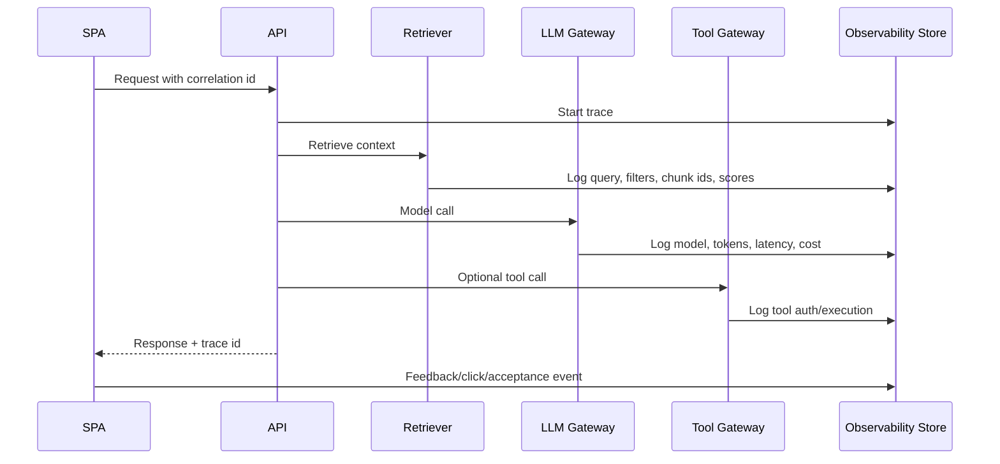

# Observability for LLM Apps

## Problem statement

Design observability for a GenAI application so engineers can debug quality, latency, cost, retrieval failures, tool failures, and safety issues.

## Requirements to clarify

- Trace full request path from frontend to API to retrieval/model/tools.
- Capture quality signals without leaking sensitive data.
- Track cost and latency by tenant/model/feature.
- Support offline evals and online feedback.
- Debug hallucinations and bad citations.
- Alert on failures, spend spikes, and safety incidents.

## High-level architecture

- Frontend emits UX events and correlation IDs.
- API creates a trace/span per request.
- Retriever logs query, filters, chunk IDs, scores, and rerank results.
- LLM gateway logs model, token counts, latency, stop reason, and redacted prompt references.
- Tool gateway logs arguments hash, auth decision, execution status.
- Eval/feedback store links traces to user ratings and test cases.

## Event schema sketch

```json
{
  "traceId": "...",
  "tenantId": "...",
  "feature": "rag_chat",
  "model": "...",
  "inputTokens": 1234,
  "outputTokens": 456,
  "retrievedChunkIds": ["..."],
  "latencyMs": 2100,
  "costUsd": 0.012,
  "outcome": "success"
}
```


## Storage sketch

- Metrics backend for aggregates and alerts.
- Trace backend for spans and timings.
- Secure eval/feedback store for prompt/model/retrieval versions and ratings.
- Audit log for tools and privileged actions.


## Main sequence



## Deep dives and expected talking points

### Trace schema

Use stable request IDs and span names: auth, rate_limit, retrieval, rerank, prompt_build, model_call, stream, tool_call, persistence. Store enough to debug without storing secrets unnecessarily.

### Prompt logging

Logging raw prompts can expose PII/secrets. Prefer redaction, sampling, secure access controls, or storing references/hashes plus retrieved chunk IDs.

### Quality telemetry

Collect explicit feedback, edits, accepted answers, escalation, citations clicked, refusal rate, and eval scores. Tie them back to prompt/model/retrieval versions.

### Cost telemetry

Track input/output tokens, embedding tokens, rerank calls, tool calls, provider/model, tenant/user, feature, and retries.

### Alerting

Alert on provider errors, latency spikes, cost anomalies, low citation accuracy, retrieval empty rates, and tool failures.
## Risks and mitigations

| Risk | Mitigation |
|---|---|
| Sensitive data leakage in logs | Redaction, access controls, sampling, retention policies. |
| Cannot reproduce bad answer | Trace retrieval ids, prompt/template version, model version, parameters. |
| Metric overload | Define SLOs and dashboards per workflow. |
| Quality blind spots | Offline evals plus online feedback and human review. |
| Cost surprises | Real-time usage events and anomaly alerts. |

## Metrics

- p50/p95/p99 latency by span
- Time to first token
- Input/output tokens
- Cost per feature/tenant
- Retrieval empty rate
- Citation correctness
- Faithfulness/eval score
- Tool error rate
- User feedback score
- Safety incident rate

## Rollout and validation

Start with a narrow pilot, define success metrics, run load/security/evaluation tests, release behind feature flags, and monitor regressions before expanding.
