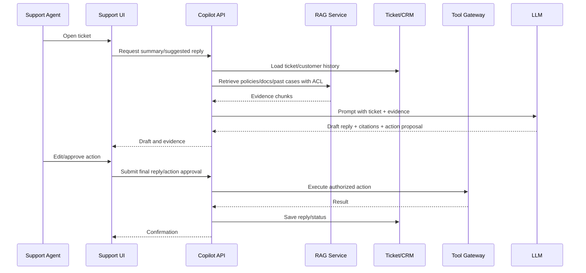

# Support Copilot End-to-End

## Problem statement

Design a support copilot that helps agents answer customer tickets, retrieves policy/product knowledge, summarizes history, and proposes safe actions.

## Requirements to clarify

- Support agent sees grounded suggested replies with citations.
- Copilot can summarize ticket/customer history.
- Copilot can propose actions like refund/escalate/update status, with approval.
- Respect tenant/customer permissions and PII rules.
- Integrate with ticketing/CRM/order systems.
- Measure impact on resolution and quality.

## High-level architecture

- Support UI embeds copilot panel.
- ASP.NET BFF/API authenticates agent and loads ticket context.
- Retrieval searches help docs, policies, past resolved tickets, and product docs with ACL filters.
- LLM generates answer draft with citations and confidence.
- Tool gateway can fetch order status or propose actions; write actions require approval.
- Feedback/eval loop captures accepted edits, escalations, and quality review.

## API sketch

```http
GET /api/tickets/{ticketId}/copilot/context
POST /api/tickets/{ticketId}/copilot/draft-reply
POST /api/tickets/{ticketId}/copilot/summarize
POST /api/tickets/{ticketId}/copilot/actions/{actionId}/approve
POST /api/tickets/{ticketId}/reply
```


## Data model sketch

- CopilotRequest: ticket_id, agent_id, tenant_id, type, status, trace_id.
- Draft: request_id, content, citations, confidence, accepted, edit_distance.
- ActionProposal: type, args, evidence, risk, status, approver.
- Feedback: rating, reason, final_outcome, QA flags.


## Main sequence



## Deep dives and expected talking points

### Grounding

Use current policies and product docs as primary sources. Past tickets can help style and precedent but should be filtered and labeled carefully to avoid copying bad resolutions.

### PII and compliance

Minimize sensitive data in prompts, redact where needed, enforce role permissions, and log access. Agents should not see data outside their support scope.

### Action safety

Read-only tools can run with normal auth; write tools like refunds or account changes require explicit approval, limits, and audit records.

### Agent workflow

The copilot should assist without blocking. Provide citations, confidence, and editable drafts; never auto-send customer replies unless policy allows.

### Learning loop

Capture accepted drafts, edits, rejected suggestions, supervisor QA, and final outcomes to improve evals and prompts.
## Risks and mitigations

| Risk | Mitigation |
|---|---|
| Wrong answer sent | Citations, confidence, human review, evals, QA sampling. |
| PII leakage | Redaction, access control, secure logs, provider policy review. |
| Unauthorized refund/action | Tool gateway auth, approval, limits, audit. |
| Bad retrieval from outdated docs | Document freshness, owner workflows, stale warnings. |
| Agent overreliance | Require review, show evidence, train users, monitor quality. |

## Metrics

- Average handle time
- First contact resolution
- Escalation rate
- Draft acceptance/edit distance
- CSAT/QA score
- Citation click rate
- Hallucination/unsupported answer rate
- Tool action error rate
- Cost per ticket
- p95 suggestion latency

## Rollout and validation

Start read-only: summaries and draft replies. Add citations and QA review. Only then add low-risk tools, followed by approval-gated write actions with strict audit and quotas.
