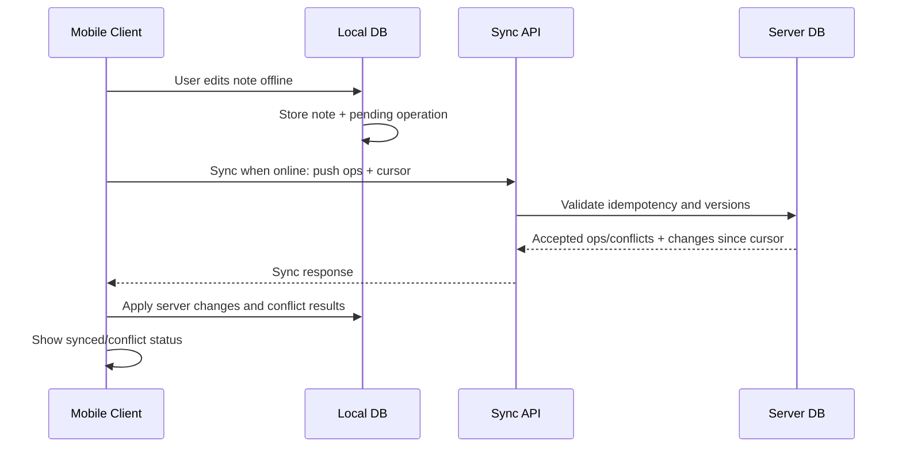

# Mobile Offline Sync Notes

## Problem statement

Design an offline-capable notes app where mobile clients can create/edit/delete notes without connectivity and sync later across devices.

## Requirements to clarify

- Users can read and edit notes offline.
- Sync when connectivity returns.
- Resolve conflicts safely.
- Support multiple devices per user.
- Avoid data loss and duplicate operations.
- Show sync status clearly.

## High-level architecture

- Mobile app stores notes and pending operations in local database.
- API exposes idempotent sync endpoint with client operation IDs and cursors.
- Server stores canonical notes, versions, tombstones, and operation log.
- Client pushes pending changes, pulls server changes since cursor, applies conflict resolution, and updates local state.
- Realtime push can notify online devices, but sync protocol remains source of truth.

## API sketch

```http
POST /api/sync

Request:
{
  "clientId": "device-1",
  "cursor": "abc",
  "operations": [
    {"operationId":"op-1","type":"update_note","noteId":"n1","baseVersion":4,"payload":{}}
  ]
}
```


## Data model sketch

- Note: id, user_id, title, body, version, updated_at, deleted_at.
- Client: id, user_id, last_cursor, last_seen_at.
- OperationLog: operation_id, client_id, note_id, base_version, result, server_version.
- ChangeLog: sequence, user_id, note_id, operation_type, version, tombstone.


## Main sequence



## Deep dives and expected talking points

### Operation log

Represent local changes as operations with stable client_operation_id, note_id, base_version, timestamp, and payload. This makes retries idempotent.

### Conflict strategy

For simple notes, last-write-wins may be acceptable but can lose data. Better options include field-level merge, keeping conflict copies, or CRDTs for collaborative editing.

### Deletes

Use tombstones so deletes sync to offline devices. Garbage collect tombstones after all active clients have advanced beyond them or after a retention period.

### Cursors

Each client tracks a sync cursor. Server returns changes after that cursor plus a new cursor. Handle cursor expiration by full resync.

### UX

Show local saved, syncing, synced, and conflict states. Never silently drop user edits.
## Risks and mitigations

| Risk | Mitigation |
|---|---|
| Data loss conflict | Base versions, conflict copies, merge UI for important notes. |
| Duplicate operations | Idempotency keys/client operation IDs. |
| Deleted note resurrects | Tombstones and version checks. |
| Large sync payload | Pagination, cursors, compression, delta sync. |
| Clock skew | Server versions/cursors, not client time, as authority. |
| Auth expiry offline | Queue locally and reauth before sync. |

## Metrics

- Sync success rate
- Conflict rate
- Duplicate op rejection count
- Time to sync after reconnect
- Local operation queue age
- Data loss incidents
- Cursor reset count
- p95 sync latency
- Offline edit completion rate

## Rollout and validation

Build deterministic sync tests first: create offline, edit same note on two devices, delete while offline, retry same operation, expired cursor full resync. Release behind beta flag and log conflict/data-loss signals aggressively.
