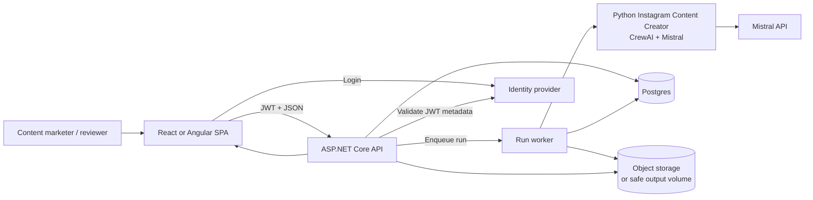
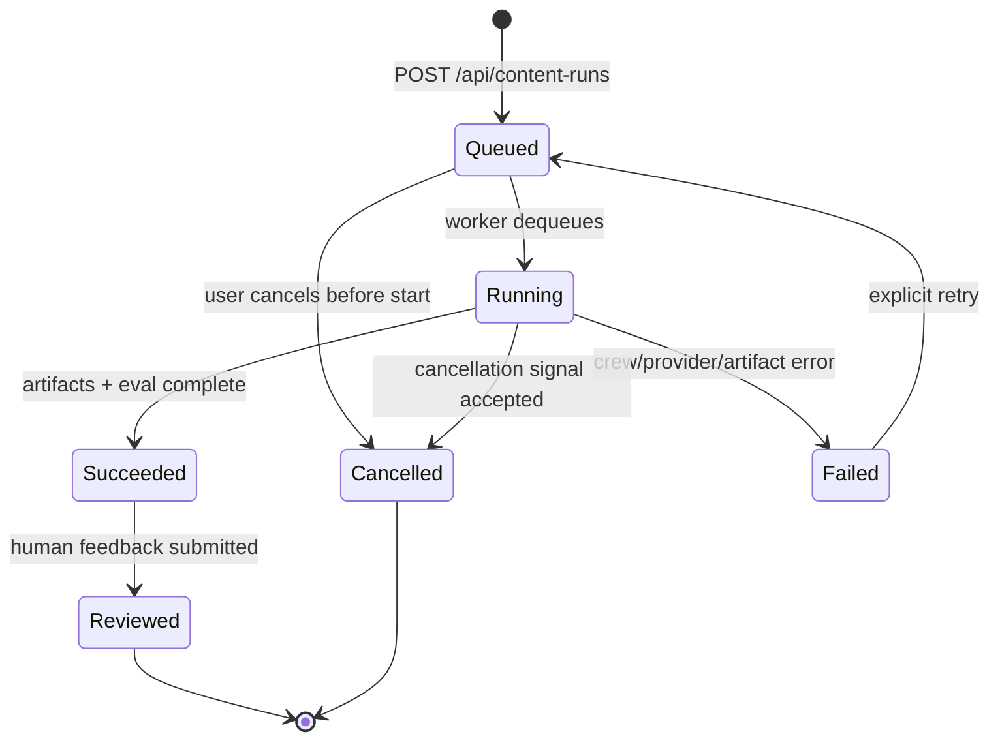
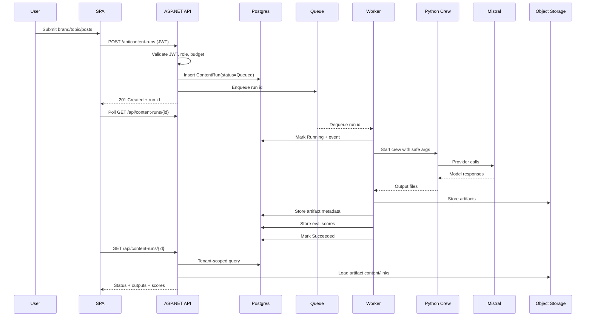
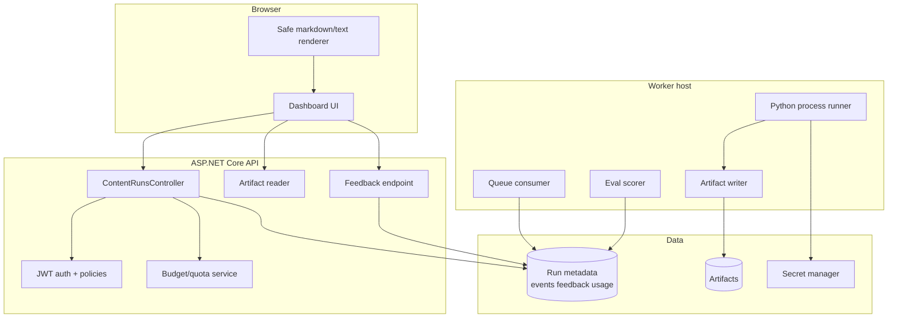
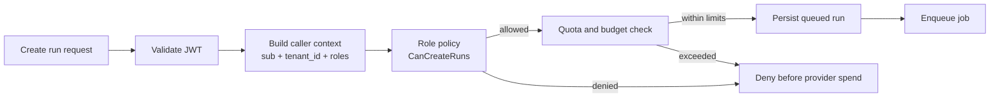
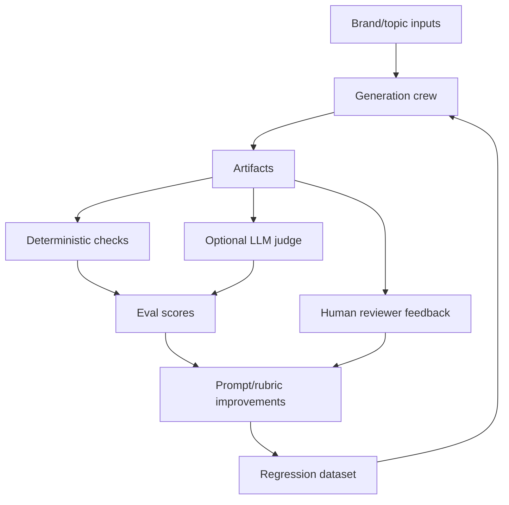
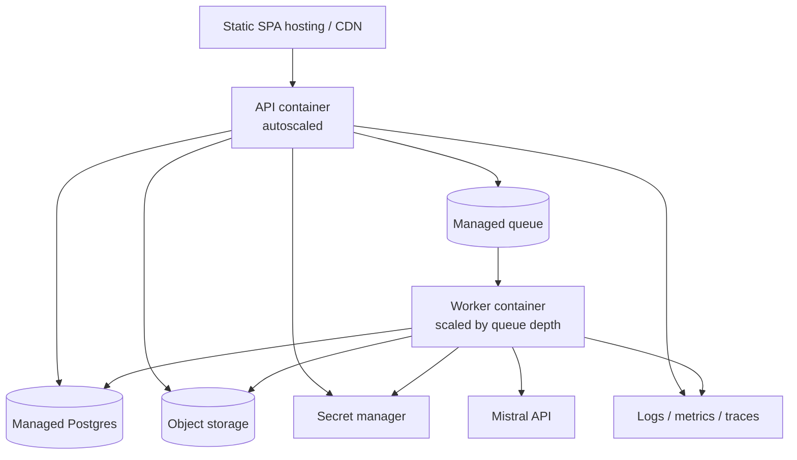

# Architecture Diagrams

Use these diagrams in your portfolio README, interview notes, or system-design practice. They show how the existing CrewAI/Mistral package fits into a production-style full-stack application.

## Context diagram

## Run lifecycle

## Sequence: create and complete run

## Component responsibilities

## Tenancy and cost-control path

## Evaluation feedback loop

## Deployment topology

## Interview narration

When walking through the architecture:

1. Start with the user journey: "A marketer submits brand/topic input from the SPA."
2. Point out the trust boundary: "The API validates JWT and derives tenant; the client cannot set tenant or provider key."
3. Explain async design: "The API persists a queued run and returns immediately; the worker owns long-running generation."
4. Explain AI boundary: "The worker invokes the existing Python CrewAI/Mistral package with safe arguments and server-side secrets."
5. Explain persistence: "Metadata lives in Postgres; generated markdown artifacts live in object storage."
6. Explain eval: "After generation, deterministic and optional judge scoring create quality signals."
7. Explain operations: "Costs, run events, failures, and feedback are observable and tenant-scoped."

## Architecture trade-offs

| Decision | Simple option | Scalable option | Interview note |
| --- | --- | --- | --- |
| Worker | Hosted service in API | Separate worker container | Separate scaling reduces API contention |
| Python integration | Launch CLI process | Python service or queue worker | CLI reuse is fastest; service boundary scales better |
| Updates | Polling | SSE | Start simple, add realtime when valuable |
| Artifacts | Local output volume | Object storage | Object storage supports multiple workers |
| Eval | Deterministic script | Script + LLM judge + human feedback | Keep explainable checks even with judge |
| Auth | Dev JWT | Real IdP/OIDC | Same API policies should apply |

