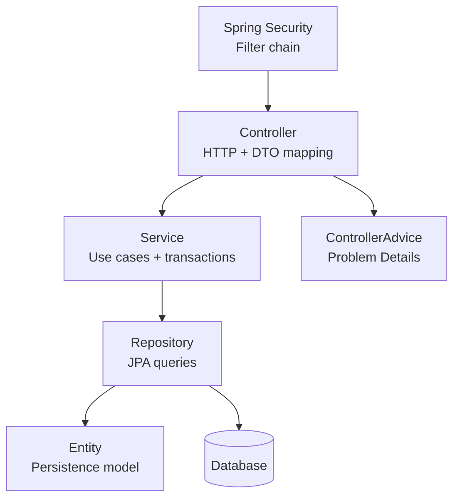
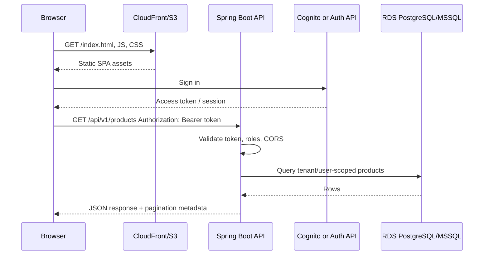
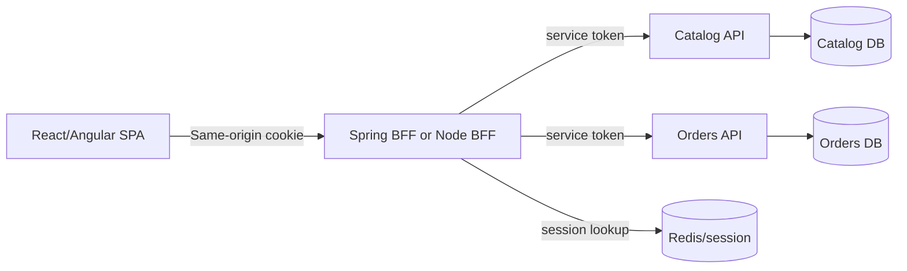
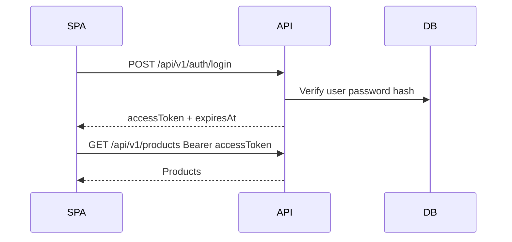
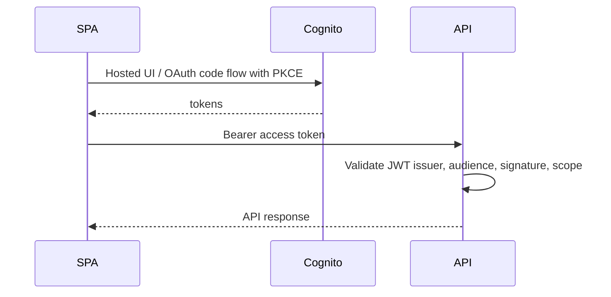
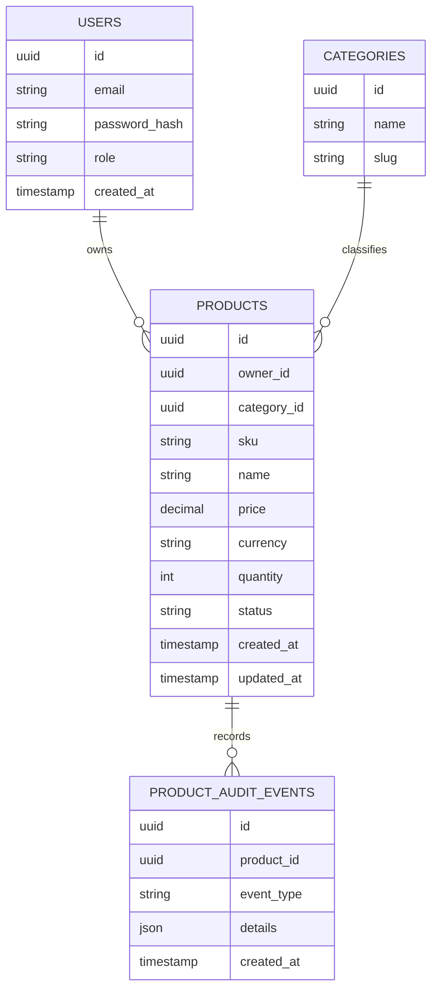
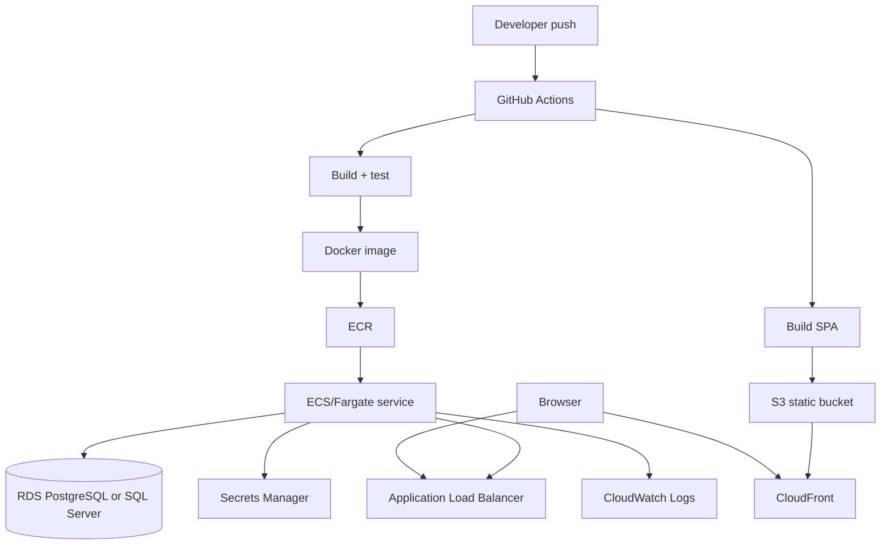

# 01 - Architecture for Spring Boot + SPA Fullstack Systems

This guide explains how to structure a Java fullstack application so it is understandable, testable, deployable, and easy to discuss in interviews.

The default shape:

- A **React or Angular SPA** handles browser UI, routing, forms, and client-side state.
- A **Spring Boot API** owns business logic, authentication enforcement, validation, transactions, and integration boundaries.
- A **relational database** stores durable business data.
- Optional **object storage, queues, cache, search, or BFF** are added when requirements justify them.

## Core architecture principles

### 1. Keep browser, API, and database responsibilities distinct

| Layer | Owns | Should not own |
|---|---|---|
| SPA | Presentation, client routing, form UX, optimistic UI, API calls | Business invariants, secrets, database logic |
| API controllers | HTTP mapping, DTO validation, status codes, auth annotations | Complex business rules, SQL, frontend-specific state |
| Application services | Use cases, transactions, orchestration, authorization decisions | HTTP request/response details |
| Domain model | Invariants, calculations, state transitions | Persistence annotations if using strict clean architecture |
| Repositories | Query/persistence abstraction | Business decisions |
| Database | Constraints, indexes, durable state, concurrency | UI-specific transformations |

Interview line:

> I keep HTTP concerns at the edge, business decisions in services/domain, and persistence details behind repositories. That lets me test the use case without booting the whole web stack and keeps the API contract stable when database details change.

### 2. Start modular before distributed

Most interview and take-home projects should start as one Spring Boot service with clear internal modules:

```text
com.example.catalog
  auth/
  products/
  orders/
  shared/
```

Split into separate services only when you can name a real force:

- independent deployment cadence
- separate ownership
- very different scaling profile
- data isolation boundary
- regulatory boundary
- asynchronous workflow that would benefit from queue-based decoupling

Do not claim microservices are automatically more scalable. They also add distributed transactions, network failures, deployment complexity, observability requirements, and harder local development.

## Layered architecture

Layered architecture is the most common Spring Boot organization. It is easy to understand and productive for CRUD-heavy systems.



### Typical package shape

```text
src/main/java/com/acme/catalog
  CatalogApplication.java
  config/
    SecurityConfig.java
    WebConfig.java
  common/
    ApiErrorCode.java
    ProblemDetailsExceptionHandler.java
    PageResponse.java
  auth/
    AuthController.java
    AuthService.java
    JwtService.java
    UserAccount.java
    UserAccountRepository.java
  products/
    ProductController.java
    ProductService.java
    ProductRepository.java
    Product.java
    dto/
      ProductCreateRequest.java
      ProductUpdateRequest.java
      ProductResponse.java
```

### Pros

- Familiar to Spring teams.
- Fast to build.
- Easy to explain in a take-home README.
- Works well with Spring Data JPA.
- Good enough for many production systems when modules remain disciplined.

### Cons

- Entities can leak into controllers if the team is careless.
- Services can become large "god services."
- Cross-cutting concerns may spread.
- Domain rules may be hidden in transaction scripts instead of explicit domain methods.

### Layered architecture rules

1. Controllers accept and return DTOs, not JPA entities.
2. Services own transactions.
3. Repositories do not return mutable query internals to the web layer.
4. Validation annotations check request shape; services enforce business rules.
5. Exceptions are translated once in `@ControllerAdvice`.
6. Database constraints backstop critical invariants.

## Clean architecture / hexagonal architecture

Clean architecture is useful when domain rules are complex or you want stronger boundaries between application logic and frameworks.

```mermaid
flowchart LR
    subgraph WebAdapter[Inbound adapter]
      Controller[REST Controller]
      RequestDto[Request DTO]
    end

    subgraph Application[Application core]
      UseCase[Use case service]
      Port[Repository port]
      Domain[Domain model]
    end

    subgraph PersistenceAdapter[Outbound adapter]
      JpaRepo[Spring Data repository]
      Mapper[Entity mapper]
      Entity[JPA entity]
    end

    Controller --> UseCase
    UseCase --> Domain
    UseCase --> Port
    Port <|.. PersistenceAdapter
    JpaRepo --> DB[(Database)]
```

### Package shape

```text
products/
  application/
    CreateProductUseCase.java
    UpdateProductUseCase.java
    ProductCatalogService.java
    ProductRepositoryPort.java
  domain/
    Product.java
    Money.java
    ProductStatus.java
    ProductAlreadyExistsException.java
  adapter/
    web/
      ProductController.java
      ProductRequest.java
      ProductResponse.java
    persistence/
      ProductJpaEntity.java
      ProductJpaRepository.java
      ProductRepositoryAdapter.java
      ProductPersistenceMapper.java
```

### When clean architecture is worth it

Use it when:

- The domain has real behavior: pricing, approvals, inventory, billing, policy.
- You need to test business rules without Spring.
- You expect persistence or transport details to change.
- You want explicit ports for integrations such as payment, email, object storage, or identity.

Avoid overdoing it when:

- The app is mostly CRUD.
- The team is junior and the indirection slows delivery.
- The "domain" is only an anemic wrapper over database rows.

Interview line:

> I would not add clean architecture ceremony everywhere. I would apply it around domains with meaningful rules and keep simple lookup/admin features layered.

## SPA + API topology



### Important boundary decisions

| Decision | Default | When to change |
|---|---|---|
| SPA and API separate deployments | Yes | Same-origin server rendering, strict cookie auth, or BFF needs |
| API returns JSON DTOs | Yes | File streaming, SSE, WebSocket, or GraphQL-specific needs |
| JWT bearer tokens | Common for SPA/API | Use BFF/session cookies for stronger browser token containment |
| Single API service | Yes | Split when domain/ownership/scaling boundaries justify |
| Relational database | Yes | Add cache/search/object storage based on access patterns |

## Optional BFF pattern

A **Backend for Frontend (BFF)** is a server-side component tailored to a specific frontend. It can:

- Hide tokens from browser JavaScript by storing auth in secure, HTTP-only cookies.
- Aggregate calls from multiple backend services.
- Shape responses for a specific UI.
- Enforce same-origin browser security more easily.



### BFF trade-offs

| Benefit | Cost |
|---|---|
| Better token containment | More server code and deployment |
| Easier UI-specific aggregation | BFF can become a dumping ground |
| Same-origin cookies reduce CORS complexity | CSRF protection becomes important |
| Good for enterprise auth flows | Additional latency hop |

Use BFF when browser token exposure or backend aggregation is a major concern. For a portfolio project, mention it as an option and implement direct SPA-to-API unless the requirements require stronger browser-session control.

## Authentication architecture options

### Option A: Spring API issues JWTs



Good for learning and take-home projects. You implement password hashing, login, claims, and JWT validation yourself.

Risks:

- Token storage in browser needs careful handling.
- Refresh token rotation adds complexity.
- You own account recovery, MFA, lockout, and password policy unless added.

### Option B: AWS Cognito issues tokens



Good for production AWS deployments where you want managed user pools, hosted login, MFA options, and federation.

### Option C: BFF with secure cookies

The SPA never reads access tokens directly. The BFF stores tokens server-side or in encrypted, secure cookies and calls APIs on behalf of the browser.

Good when:

- Security requirements are higher.
- You integrate multiple identity providers.
- You want web sessions instead of JavaScript-visible tokens.

## Data architecture

### Product catalog baseline



Design from queries:

- List active products by owner, sorted by newest.
- Search by name or SKU.
- Filter by category and status.
- Fetch product detail by ID with ownership check.
- Enforce SKU uniqueness per owner.

## Deployment architecture



Explain production concerns:

- ALB health checks hit `/actuator/health`.
- ECS task uses IAM role to read Secrets Manager.
- API logs are JSON and include correlation IDs.
- RDS is private, not public.
- CloudFront caches static assets aggressively but not `index.html` for too long.
- Migrations run as a controlled step, not accidentally from every scaled task if the team has multiple instances.

## Testing architecture

| Test type | Tooling | What to cover |
|---|---|---|
| Unit | JUnit 5, AssertJ, Mockito | Domain rules, service decisions, mappers |
| Slice | `@WebMvcTest`, `@DataJpaTest` | Controllers, validation, repository queries |
| Integration | Testcontainers | API + real PostgreSQL/SQL Server behavior |
| Frontend unit | Vitest/RTL or Angular TestBed | Components, hooks/services, guards |
| E2E | Playwright or Cypress | Login, product CRUD, error states |
| Contract | Spring Cloud Contract or OpenAPI checks | API compatibility |

Testing interview line:

> I test business rules without the web stack, test controllers for HTTP behavior, and use Testcontainers for database-specific SQL and Flyway migrations because H2 can hide PostgreSQL or SQL Server differences.

## Common architecture mistakes

1. **Returning JPA entities directly from controllers.**
   - Causes lazy-loading surprises, overexposure of fields, and unstable contracts.
2. **Putting business rules in React or Angular only.**
   - Browser checks improve UX but cannot be trusted.
3. **Skipping database constraints.**
   - Application validation can race; the database should protect uniqueness and referential integrity.
4. **Using one giant service class.**
   - Split by use case or cohesive domain behavior.
5. **Running migrations casually in all app instances.**
   - Coordinate migrations in CI/CD or understand Flyway locking and startup behavior.
6. **Ignoring CORS and cookie/token implications.**
   - Browser security is part of architecture, not a frontend afterthought.
7. **No observability story.**
   - In interviews, show how you debug production: logs, metrics, traces, health checks, dashboards, alerts.

## Decision checklist

Before coding, answer:

- What are the main user flows?
- What are the API resources?
- What data must be tenant/user scoped?
- What are the read/list access patterns?
- Which fields need unique constraints?
- Will auth be self-managed, Cognito, or BFF/session-based?
- Which frontend framework is required by the role?
- Will deployment use ECS/Fargate, Elastic Beanstalk, or another platform?
- What is the local development topology?
- What tests will prove the risky paths?

## Whiteboard script

Use this 90-second answer:

> I would host the React or Angular SPA as static assets on S3 behind CloudFront. The SPA calls a Spring Boot API through an HTTPS API domain. Spring Security validates JWTs from either the app's auth endpoint or Cognito. Controllers expose versioned REST endpoints using DTOs and Problem Details. Services own use cases and transactions. Repositories persist through JPA to RDS PostgreSQL or SQL Server, with Flyway migrations and indexes designed around list/search/detail access patterns. Local development uses Docker Compose with the API and database. Production uses ECS/Fargate or Elastic Beanstalk, Secrets Manager, CloudWatch, ALB health checks, and GitHub Actions. I would start modular and split services only when ownership or scaling boundaries justify it.
