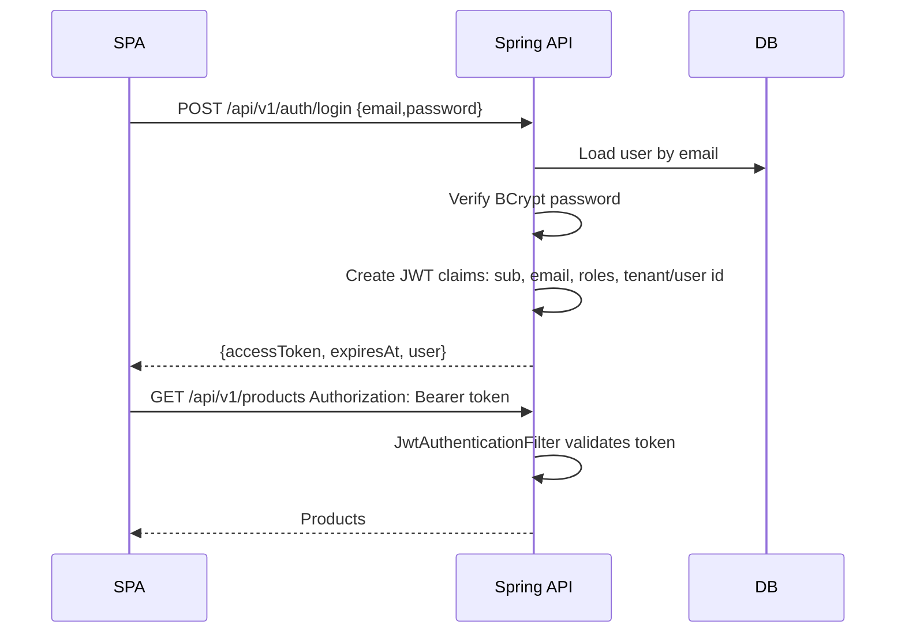

# 02 - Spring Boot API Design

This guide covers the API design details interviewers expect from a Java fullstack engineer: resource modeling, status codes, versioning, validation, Problem Details, pagination, authentication, authorization, CORS, and operational endpoints.

## API design goals

A good Spring Boot API should be:

- **Predictable:** resource names, status codes, errors, and pagination follow consistent rules.
- **Secure:** authentication and authorization are enforced server-side.
- **Stable:** DTOs and versioning protect clients from persistence changes.
- **Observable:** logs, metrics, correlation IDs, and health checks support debugging.
- **Testable:** controllers, services, repository queries, and security rules can be tested independently.

## Resource conventions

Use nouns for resources and HTTP verbs for actions:

| Operation | Endpoint | Status |
|---|---|---|
| List products | `GET /api/v1/products` | `200 OK` |
| Get product | `GET /api/v1/products/{id}` | `200 OK` or `404 Not Found` |
| Create product | `POST /api/v1/products` | `201 Created` |
| Replace/update product | `PUT /api/v1/products/{id}` | `200 OK` or `204 No Content` |
| Partial update | `PATCH /api/v1/products/{id}` | `200 OK` |
| Delete product | `DELETE /api/v1/products/{id}` | `204 No Content` |
| Search products | `GET /api/v1/products?query=shoe&status=ACTIVE` | `200 OK` |

Avoid:

- `GET /api/v1/getProducts`
- `POST /api/v1/product/delete`
- `PUT /api/v1/products/create`

Use action endpoints only when the operation is not a simple CRUD state transition:

```text
POST /api/v1/products/{id}/publish
POST /api/v1/orders/{id}/cancel
POST /api/v1/import-jobs
```

## DTO boundaries

Do not return JPA entities directly.

```java
public record ProductCreateRequest(
    @NotBlank @Size(max = 80) String name,
    @NotBlank @Size(max = 40) String sku,
    @NotNull @DecimalMin("0.00") BigDecimal price,
    @NotBlank @Size(min = 3, max = 3) String currency,
    @Min(0) int quantity
) {}

public record ProductResponse(
    UUID id,
    String name,
    String sku,
    BigDecimal price,
    String currency,
    int quantity,
    String status,
    Instant createdAt,
    Instant updatedAt
) {}
```

Why DTOs matter:

- Prevent leaking internal columns such as password hashes, internal flags, or audit metadata.
- Avoid lazy-loading serialization failures.
- Keep API compatibility when database schema changes.
- Allow request-specific validation.
- Make OpenAPI documentation clearer.

## Versioning

### URL versioning

```text
/api/v1/products
/api/v2/products
```

Pros:

- Easy to see and debug.
- Works with browsers, logs, proxies, and simple clients.
- Common in take-home projects.

Cons:

- Can encourage duplicating controllers if not managed carefully.

### Header/media type versioning

```http
Accept: application/vnd.acme.catalog.v1+json
```

Pros:

- Keeps URLs cleaner.
- More REST-purist friendly.

Cons:

- Harder for casual clients and demos.
- More hidden in logs unless configured.

Recommendation for this track: use URL versioning and keep version changes rare. Version when contracts break, not when implementation changes.

## Status code conventions

| Status | Use |
|---|---|
| `200 OK` | Successful read or update with response body |
| `201 Created` | Successful create; include `Location` header |
| `204 No Content` | Successful delete or update without body |
| `400 Bad Request` | Malformed request, invalid query parameter, validation failure |
| `401 Unauthorized` | Missing/invalid authentication |
| `403 Forbidden` | Authenticated but not allowed |
| `404 Not Found` | Resource does not exist or is hidden by ownership rules |
| `409 Conflict` | Unique constraint, version conflict, illegal state transition |
| `422 Unprocessable Entity` | Optional: semantically invalid request shape if team distinguishes from 400 |
| `429 Too Many Requests` | Rate limit exceeded |
| `500 Internal Server Error` | Unexpected server failure |

Security note: for user-owned resources, returning `404` for another user's resource is often safer than `403` because it avoids confirming existence.

## Problem Details

Use RFC 9457/7807-style Problem Details for consistent errors.

Example validation response:

```json
{
  "type": "https://api.example.com/problems/validation-error",
  "title": "Validation failed",
  "status": 400,
  "detail": "One or more fields are invalid.",
  "instance": "/api/v1/products",
  "traceId": "01HVK4QX7V8FK7XAH0X0A4Z6ZB",
  "errors": {
    "name": ["must not be blank"],
    "price": ["must be greater than or equal to 0.00"]
  }
}
```

Spring Boot 3 has `ProblemDetail`:

```java
@RestControllerAdvice
class ApiExceptionHandler {

    @ExceptionHandler(MethodArgumentNotValidException.class)
    ResponseEntity<ProblemDetail> handleValidation(MethodArgumentNotValidException ex, HttpServletRequest request) {
        ProblemDetail problem = ProblemDetail.forStatus(HttpStatus.BAD_REQUEST);
        problem.setType(URI.create("https://api.example.com/problems/validation-error"));
        problem.setTitle("Validation failed");
        problem.setDetail("One or more fields are invalid.");
        problem.setInstance(URI.create(request.getRequestURI()));

        Map<String, List<String>> errors = ex.getBindingResult()
            .getFieldErrors()
            .stream()
            .collect(Collectors.groupingBy(
                FieldError::getField,
                LinkedHashMap::new,
                Collectors.mapping(FieldError::getDefaultMessage, Collectors.toList())
            ));

        problem.setProperty("errors", errors);
        problem.setProperty("traceId", MDC.get("traceId"));
        return ResponseEntity.badRequest().body(problem);
    }

    @ExceptionHandler(ProductNotFoundException.class)
    ResponseEntity<ProblemDetail> handleNotFound(ProductNotFoundException ex, HttpServletRequest request) {
        ProblemDetail problem = ProblemDetail.forStatus(HttpStatus.NOT_FOUND);
        problem.setType(URI.create("https://api.example.com/problems/not-found"));
        problem.setTitle("Resource not found");
        problem.setDetail(ex.getMessage());
        problem.setInstance(URI.create(request.getRequestURI()));
        return ResponseEntity.status(HttpStatus.NOT_FOUND).body(problem);
    }
}
```

Interview line:

> I use Problem Details so React or Angular can handle errors consistently. Validation errors include a field-to-messages map, while domain conflicts use stable type URIs and machine-readable error codes.

## Pagination and sorting

### Request

```text
GET /api/v1/products?page=0&size=20&sort=createdAt,desc&query=shoe&status=ACTIVE
```

### Response

```json
{
  "items": [
    {
      "id": "b4b59f4b-4f28-48d6-a651-e2e2d014f78e",
      "name": "Trail Shoe",
      "sku": "SHOE-001",
      "price": 89.99,
      "currency": "USD",
      "quantity": 12,
      "status": "ACTIVE"
    }
  ],
  "page": 0,
  "size": 20,
  "totalItems": 143,
  "totalPages": 8,
  "hasNext": true,
  "hasPrevious": false
}
```

### Spring shape

```java
public record PageResponse<T>(
    List<T> items,
    int page,
    int size,
    long totalItems,
    int totalPages,
    boolean hasNext,
    boolean hasPrevious
) {
    static <T> PageResponse<T> from(Page<T> page) {
        return new PageResponse<>(
            page.getContent(),
            page.getNumber(),
            page.getSize(),
            page.getTotalElements(),
            page.getTotalPages(),
            page.hasNext(),
            page.hasPrevious()
        );
    }
}
```

### Pagination decisions

| Approach | Use when | Trade-off |
|---|---|---|
| Offset pagination | Admin tables, moderate datasets | Easy but slow/deceptive at deep pages |
| Cursor/keyset pagination | Infinite scroll, large datasets | More complex, stable sort required |
| Search-after | Search indexes | Coupled to search backend |

For product catalog interviews, start with offset pagination and mention keyset pagination for large or high-write lists.

## Filtering and sorting safely

Whitelist fields. Do not pass arbitrary user-supplied column names into dynamic SQL.

```java
private static final Set<String> ALLOWED_SORTS = Set.of("name", "sku", "price", "createdAt");

private Pageable toPageable(int page, int size, String sortField, Sort.Direction direction) {
    if (!ALLOWED_SORTS.contains(sortField)) {
        throw new InvalidSortException(sortField);
    }
    int safeSize = Math.min(Math.max(size, 1), 100);
    return PageRequest.of(Math.max(page, 0), safeSize, Sort.by(direction, sortField));
}
```

## Validation strategy

Use layers:

1. **Frontend validation** for fast UX.
2. **Bean Validation** on request DTOs for boundary validation.
3. **Service/domain checks** for business rules.
4. **Database constraints** for final integrity.

Example:

- DTO: `price >= 0`, `name` not blank.
- Service: SKU cannot be changed after publishing.
- Database: unique `(owner_id, sku)`.

## Authentication flow with SPA

### Login flow



### Token storage choices

| Storage | Pros | Cons |
|---|---|---|
| Memory only | Best against persistent XSS token theft | Lost on refresh; needs refresh/session strategy |
| `sessionStorage` | Cleared on tab close | JavaScript-readable, XSS risk |
| `localStorage` | Simple persistence | JavaScript-readable, common XSS target |
| Secure HTTP-only cookie | JS cannot read token | CSRF protection and same-site design required |
| BFF session | Strong browser containment | More backend infrastructure |

For learning examples, `localStorage` may be acceptable if you explicitly call out the production trade-off. For production, prefer Authorization Code + PKCE with Cognito or a BFF/session model when requirements are strict.

## Spring Security configuration sketch

```java
@Bean
SecurityFilterChain securityFilterChain(HttpSecurity http) throws Exception {
    return http
        .csrf(csrf -> csrf.disable()) // OK for stateless bearer APIs; revisit for cookie auth.
        .cors(Customizer.withDefaults())
        .sessionManagement(sm -> sm.sessionCreationPolicy(SessionCreationPolicy.STATELESS))
        .authorizeHttpRequests(auth -> auth
            .requestMatchers(HttpMethod.POST, "/api/v1/auth/login", "/api/v1/auth/register").permitAll()
            .requestMatchers("/actuator/health").permitAll()
            .requestMatchers(HttpMethod.GET, "/api/v1/products/**").hasAnyRole("USER", "ADMIN")
            .requestMatchers("/api/v1/admin/**").hasRole("ADMIN")
            .anyRequest().authenticated()
        )
        .oauth2ResourceServer(oauth -> oauth.jwt(Customizer.withDefaults()))
        .build();
}
```

If your API issues its own JWTs, configure a custom decoder/signing key. If using Cognito, configure issuer URI and audience validation.

## Authorization patterns

### Role-based checks

```java
@PreAuthorize("hasRole('ADMIN')")
@DeleteMapping("/{id}")
public ResponseEntity<Void> delete(@PathVariable UUID id) {
    productService.delete(id);
    return ResponseEntity.noContent().build();
}
```

### Ownership checks

```java
public ProductResponse getProduct(UUID productId, AuthenticatedUser user) {
    Product product = productRepository.findByIdAndOwnerId(productId, user.id())
        .orElseThrow(() -> new ProductNotFoundException(productId));
    return mapper.toResponse(product);
}
```

Do not trust `ownerId` submitted by the client. Derive ownership from the authenticated principal.

## CORS

CORS is a browser security policy. It is not API authentication.

```java
@Bean
CorsConfigurationSource corsConfigurationSource(AppCorsProperties props) {
    CorsConfiguration config = new CorsConfiguration();
    config.setAllowedOrigins(props.allowedOrigins());
    config.setAllowedMethods(List.of("GET", "POST", "PUT", "PATCH", "DELETE", "OPTIONS"));
    config.setAllowedHeaders(List.of("Authorization", "Content-Type", "X-Correlation-Id"));
    config.setExposedHeaders(List.of("Location", "X-Correlation-Id"));
    config.setAllowCredentials(false);

    UrlBasedCorsConfigurationSource source = new UrlBasedCorsConfigurationSource();
    source.registerCorsConfiguration("/api/**", config);
    return source;
}
```

Rules:

- Never use `*` with credentials.
- Configure exact origins per environment.
- Keep dev origins separate from production origins.
- Debug preflight by checking `OPTIONS` response headers.

## Request correlation

Support `X-Correlation-Id`:

1. Read header or generate UUID.
2. Add to MDC/log context.
3. Return it in response headers.
4. Include it in Problem Details.

This is a strong interview signal because it shows operational thinking.

## OpenAPI

Springdoc example dependency:

```xml
<dependency>
  <groupId>org.springdoc</groupId>
  <artifactId>springdoc-openapi-starter-webmvc-ui</artifactId>
  <version>2.6.0</version>
</dependency>
```

Document:

- auth scheme
- response status codes
- Problem Details schema
- pagination query parameters
- examples

Keep OpenAPI generated from code but review it as part of API design. Generated docs are not automatically good docs.

## Actuator and health checks

Expose only what is needed:

```yaml
management:
  endpoints:
    web:
      exposure:
        include: health,info,metrics,prometheus
  endpoint:
    health:
      probes:
        enabled: true
      show-details: never
```

Endpoints:

- `/actuator/health/liveness` for container liveness.
- `/actuator/health/readiness` for load balancer readiness.
- Avoid exposing environment or beans in production.

## Controller checklist

Before considering an endpoint production-ready:

- [ ] Resource path is noun-based and versioned.
- [ ] Request and response DTOs are separate from entities.
- [ ] Bean Validation covers request shape.
- [ ] Service enforces ownership and business rules.
- [ ] Problem Details covers validation, not found, conflict, and unexpected errors.
- [ ] Pagination size has an upper bound.
- [ ] Sort fields are whitelisted.
- [ ] Endpoint has auth rules.
- [ ] Integration tests cover success, validation failure, unauthorized, forbidden/not found, and conflict.
- [ ] OpenAPI docs show examples.

## Common interview questions

### Why use Problem Details?

It gives clients a consistent machine-readable error shape. Frontends can map validation errors to fields and handle domain errors by `type` or `code` instead of parsing strings.

### Where do you put transactions?

At the service/use-case boundary. A controller should not manage transactions. Repository methods are smaller persistence operations; the service coordinates them into one business operation.

### How do you prevent overposting?

Use request DTOs with only allowed fields. Do not bind directly to entities. Derive sensitive values like `ownerId`, `createdBy`, or role from the authenticated user or server logic.

### How do you handle duplicate SKU?

Use a database unique constraint and catch the resulting conflict, translating it to `409 Conflict` Problem Details. Also pre-check in the service for a nicer message, but rely on the database for race safety.

### How do you version APIs?

Version externally visible breaking contracts. Prefer additive changes for backward compatibility. Use `/api/v1` for clarity in a portfolio project, and introduce `/api/v2` only when changing response meaning or removing/renaming fields.
