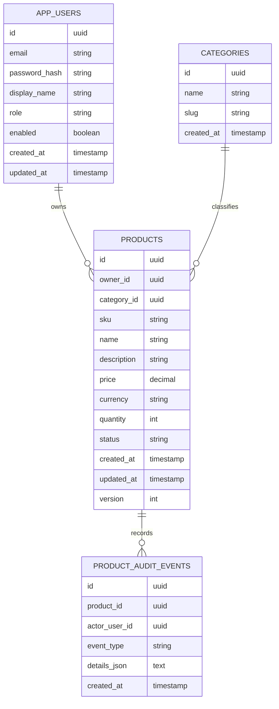

# 05 - Microsoft SQL Server and PostgreSQL for Spring Boot

This guide covers relational design for a Spring Boot product catalog or notes app using PostgreSQL and Microsoft SQL Server. It includes schema design, Flyway migrations, indexing, safe migration strategy, and Spring profile switching.

## Choosing PostgreSQL vs SQL Server

| Topic | PostgreSQL | SQL Server |
|---|---|---|
| Common use | Cloud-native apps, startups, analytics-friendly workloads | Enterprise Microsoft environments, reporting, legacy integrations |
| AWS managed service | RDS for PostgreSQL, Aurora PostgreSQL | RDS for SQL Server |
| JSON | `jsonb` with strong indexing options | JSON functions over `nvarchar` |
| UUID | `uuid` type | `uniqueidentifier` |
| Pagination | `LIMIT/OFFSET`, keyset | `OFFSET/FETCH`, keyset |
| Text search | built-in full-text, trigram extensions | Full-Text Search |
| Licensing | open source | licensed, edition-dependent |

Interview line:

> I choose based on organization context, operational expertise, licensing, integrations, and workload. The schema principles are the same: model access patterns, enforce constraints, index deliberately, and manage migrations safely.

## Product catalog access patterns

Design schema from queries, not from class names.

Core flows:

1. Register/login user.
2. Create product with SKU unique per owner.
3. List active products for the current owner.
4. Search by name or SKU.
5. Filter by category/status.
6. Update price or inventory quantity.
7. Soft-delete/archive product.
8. Audit product changes.

## Logical schema



## Notes app alternative

For a notes app:

```text
app_users
notes
note_tags
note_tag_assignments
note_audit_events
```

Access patterns:

- list notes by owner sorted by updated time
- filter by tag
- search title/body
- restore archived note
- enforce user ownership

The same ideas apply: owner-scoped indexes, foreign keys, audit events, timestamps, and careful delete strategy.

## Entity design tips

### Use database constraints for invariants

Examples:

- `email` unique
- `(owner_id, sku)` unique
- `price >= 0`
- `quantity >= 0`
- `currency` length 3
- status in allowed values

Application validation improves messages; database constraints prevent race-condition corruption.

### Use optimistic locking

In JPA:

```java
@Version
private long version;
```

This protects concurrent updates:

- User A edits product.
- User B edits same product.
- User A saves.
- User B saves stale version and receives conflict.

Translate `ObjectOptimisticLockingFailureException` to `409 Conflict`.

### Avoid hard deletes by default

For business records, consider status:

```text
ACTIVE
ARCHIVED
DELETED
```

Hard delete may be acceptable for:

- temporary drafts
- join table rows
- test/demo data

Soft delete caveat: every query must respect status, and unique constraints may need partial/filtered indexes.

## Flyway naming

```text
src/main/resources/db/migration/
  V1__create_users_and_products.sql
  V2__add_product_audit_events.sql
  V3__add_product_search_indexes.sql
```

Rules:

- Never edit applied migrations in shared environments.
- Add a new migration for changes.
- Keep migrations deterministic.
- Separate schema changes from large data backfills when possible.
- Test migrations with the same database engine used in production.

## PostgreSQL migration sample

See [`examples/flyway/V1__products_postgres.sql`](examples/flyway/V1__products_postgres.sql).

Highlights:

- `uuid` primary keys
- `gen_random_uuid()`
- `citext` for case-insensitive email if extension is enabled
- `jsonb` audit details
- partial indexes for active products

## SQL Server migration sample

See [`examples/flyway/V1__products_mssql.sql`](examples/flyway/V1__products_mssql.sql).

Highlights:

- `uniqueidentifier` primary keys
- `newsequentialid()`
- `datetime2`
- `nvarchar(max)` for JSON details
- filtered indexes

## Indexing strategy

Start with access patterns:

### List products by owner and status

Query:

```sql
select *
from products
where owner_id = ?
  and status = 'ACTIVE'
order by created_at desc
offset ? rows fetch next ? rows only;
```

Index:

```text
(owner_id, status, created_at desc)
```

### SKU lookup

Query:

```sql
select *
from products
where owner_id = ?
  and sku = ?;
```

Constraint/index:

```text
unique(owner_id, sku)
```

### Category filter

Query:

```sql
where owner_id = ? and category_id = ? and status = ?
order by name
```

Index:

```text
(owner_id, category_id, status, name)
```

### Search

Portable baseline:

```sql
where lower(name) like lower(?)
   or lower(sku) like lower(?)
```

Better options:

- PostgreSQL trigram or full-text search.
- SQL Server Full-Text Search.
- External search such as OpenSearch for complex ranking.

Interview line:

> I start with B-tree indexes for exact filters and ordering. If substring search becomes central, I do not expect `%term%` B-tree queries to scale; I move to trigram/full-text/search engine depending on requirements.

## Query plan basics

Know how to inspect:

PostgreSQL:

```sql
explain analyze
select *
from products
where owner_id = '...'
  and status = 'ACTIVE'
order by created_at desc
limit 20;
```

SQL Server:

```sql
set statistics io on;
set statistics time on;
select *
from products
where owner_id = @ownerId
  and status = 'ACTIVE'
order by created_at desc
offset 0 rows fetch next 20 rows only;
```

Look for:

- table scans on large tables
- key lookups repeated many times
- sort operations
- poor row estimates
- missing index suggestions that need human review

## Migration safety

### Safe additive changes

Usually safe:

- add nullable column
- add table
- add index concurrently/online if supported
- add code that reads old and new shape

Potentially unsafe:

- rename column
- drop column
- add non-null column without default/backfill plan
- change data type
- split table
- long blocking index creation

### Expand/contract pattern

Example: rename `name` to `display_name`.

1. Expand: add nullable `display_name`.
2. Deploy app writing both `name` and `display_name`.
3. Backfill `display_name`.
4. Deploy app reading `display_name`.
5. Contract: drop `name` after old app versions are gone.

This matters for rolling deploys.

## Spring profile switching

### Maven dependencies

PostgreSQL:

```xml
<dependency>
  <groupId>org.postgresql</groupId>
  <artifactId>postgresql</artifactId>
  <scope>runtime</scope>
</dependency>
```

SQL Server:

```xml
<dependency>
  <groupId>com.microsoft.sqlserver</groupId>
  <artifactId>mssql-jdbc</artifactId>
  <scope>runtime</scope>
</dependency>
```

Flyway SQL Server support may require the appropriate Flyway database module depending on Flyway version.

### `application.yml`

```yaml
spring:
  application:
    name: product-catalog-api
  jpa:
    open-in-view: false
    hibernate:
      ddl-auto: validate
  flyway:
    enabled: true
```

### `application-postgres.yml`

```yaml
spring:
  datasource:
    url: jdbc:postgresql://localhost:5432/catalog
    username: catalog
    password: catalog
  jpa:
    database-platform: org.hibernate.dialect.PostgreSQLDialect
  flyway:
    locations: classpath:db/migration/postgres
```

### `application-mssql.yml`

```yaml
spring:
  datasource:
    url: jdbc:sqlserver://localhost:1433;databaseName=catalog;encrypt=true;trustServerCertificate=true
    username: sa
    password: ${MSSQL_SA_PASSWORD}
  jpa:
    database-platform: org.hibernate.dialect.SQLServerDialect
  flyway:
    locations: classpath:db/migration/mssql
```

Run:

```bash
SPRING_PROFILES_ACTIVE=postgres ./mvnw spring-boot:run
SPRING_PROFILES_ACTIVE=mssql MSSQL_SA_PASSWORD='StrongPassword!123' ./mvnw spring-boot:run
```

## One migration path vs database-specific migrations

### One portable migration path

Pros:

- Less duplication.
- Easier to reason about one schema.

Cons:

- SQL dialect differences leak.
- You may avoid useful database-specific features.

### Database-specific paths

Pros:

- Uses each database well.
- Clear dialect-specific SQL.

Cons:

- More files to maintain.
- Requires testing both paths.

For interview prep, include both examples and explain that production teams usually standardize on one primary database.

## JPA portability pitfalls

| Pitfall | Explanation |
|---|---|
| UUID generation | DB functions differ; app-generated UUIDs can be portable |
| Case-insensitive search | `citext`, collations, and functions differ |
| JSON fields | `jsonb` vs `nvarchar(max)` |
| Pagination SQL | Hibernate handles common cases, custom SQL differs |
| Date/time precision | `timestamp with time zone` vs `datetime2` semantics |
| Reserved words | Avoid names like `user`, `order`, `key` |
| Boolean | Native boolean vs bit-like mappings |

Use integration tests with Testcontainers for the selected production database.

## Testcontainers

PostgreSQL:

```java
@Container
static PostgreSQLContainer<?> postgres = new PostgreSQLContainer<>("postgres:16")
    .withDatabaseName("catalog")
    .withUsername("catalog")
    .withPassword("catalog");
```

SQL Server:

```java
@Container
static MSSQLServerContainer<?> sqlServer = new MSSQLServerContainer<>("mcr.microsoft.com/mssql/server:2022-latest")
    .acceptLicense();
```

Use `@DynamicPropertySource` to inject JDBC URL into Spring tests.

## Data interview questions

### Why not rely on Hibernate `ddl-auto=update`?

It is convenient for local experiments but unsafe for controlled environments. Flyway gives reviewed, versioned, repeatable migrations and lets teams coordinate database changes with application deploys.

### Where should uniqueness be enforced?

At the database with a unique constraint. The service can pre-check for user-friendly errors, but only the database prevents races.

### How do you handle slow product lists?

Check query plan, verify owner/status/order index, reduce selected columns with projections, cap page size, consider keyset pagination, cache stable reference data, and avoid N+1 queries.

### How do you support both PostgreSQL and SQL Server?

Keep Java domain code portable, isolate dialect-specific SQL in Flyway locations or repository implementations, use profiles for datasource/dialect, and run tests against the real target database engines.

### What is the risk of soft delete?

Queries and unique constraints must account for deleted rows. It can bloat tables and complicate uniqueness. It is useful for audit/recovery but needs a consistent filtering strategy.

## Database checklist

- [ ] Tables match user flows and access patterns.
- [ ] Every table has primary key, timestamps, and needed foreign keys.
- [ ] Critical invariants have database constraints.
- [ ] Owner/tenant scoping is indexed.
- [ ] List queries have matching composite indexes.
- [ ] Search strategy is explicit.
- [ ] Flyway migrations are versioned and tested.
- [ ] JPA `ddl-auto` is `validate` in real environments.
- [ ] Integration tests use the real database engine.
- [ ] Migration rollback/forward-fix strategy is documented.
