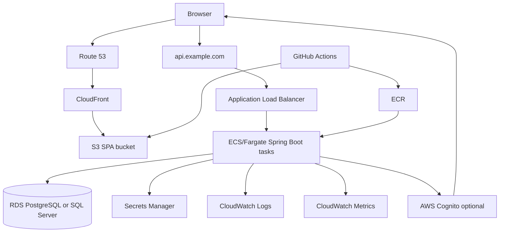
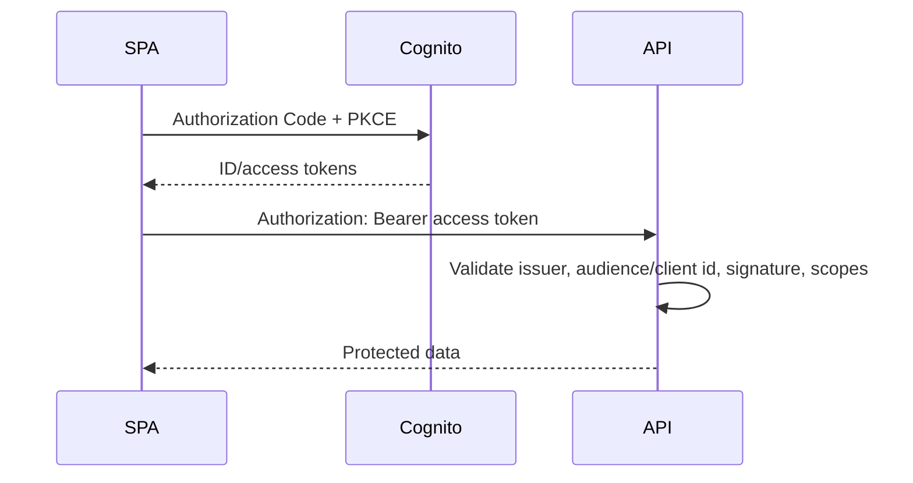

# 06 - AWS Fullstack Deployment Blueprint

This guide describes a production-style AWS deployment for a Spring Boot API with a React or Angular SPA and PostgreSQL or SQL Server. It is intentionally practical and interview-oriented.

## Target architecture



## Component responsibilities

| Component | Responsibility |
|---|---|
| Route 53 | DNS for app and API domains |
| ACM | TLS certificates for CloudFront and ALB |
| S3 | Static SPA asset storage |
| CloudFront | CDN, HTTPS, caching, SPA route fallback, security headers |
| ALB | HTTPS termination, routing, health checks |
| ECS/Fargate | Runs Spring Boot container without managing EC2 hosts |
| ECR | Stores Docker images |
| RDS | Managed PostgreSQL or SQL Server database |
| Secrets Manager | Database credentials, JWT secrets, external API keys |
| CloudWatch | Logs, metrics, alarms |
| IAM | Least-privilege permissions |
| Cognito | Optional managed user pool and OAuth/OIDC |
| GitHub Actions | CI/CD build, test, image push, deploy |

## Deployment option A: ECS/Fargate

Use ECS/Fargate when:

- You want container-native deployment.
- You expect multiple services later.
- You need good control over task CPU/memory, environment, health checks, and IAM roles.
- Your team is comfortable with VPC, ALB, ECR, and task definitions.

### ECS/Fargate flow

1. Build Spring Boot JAR.
2. Build Docker image.
3. Push image to ECR.
4. Render ECS task definition with new image.
5. Deploy ECS service.
6. ALB shifts traffic to healthy tasks.

### ECS service settings

- Desired count: at least 2 for production.
- Deployment minimum healthy percent: 100.
- Deployment maximum percent: 200.
- Health check grace period: enough for Spring startup and migrations.
- Assign public IP: usually no for private subnets; ALB is public.
- Security group: allow inbound only from ALB security group.

## Deployment option B: Elastic Beanstalk

Use Elastic Beanstalk when:

- You want a simpler managed platform.
- You are deploying one API service.
- You do not need deep container orchestration control.
- The interview or project values speed over infrastructure depth.

Trade-off:

| ECS/Fargate | Elastic Beanstalk |
|---|---|
| More explicit and flexible | Faster to set up |
| Better for multi-service container future | Easier for a single app |
| More IAM/VPC/task-definition details | More platform-managed magic |
| Stronger senior system design signal | Strong practical deployment option |

Interview line:

> For a senior production design, I usually choose ECS/Fargate for explicit container operations. For a small team or take-home demo, Elastic Beanstalk can be a reasonable simpler first deployment.

## SPA deployment with S3 + CloudFront

### S3 bucket

- Block public access.
- Do not use S3 static website hosting for production HTTPS if CloudFront is in front.
- Allow CloudFront access through Origin Access Control.

### CloudFront

Settings:

- Origin: S3 bucket.
- Viewer protocol policy: redirect HTTP to HTTPS.
- Compress objects: enabled.
- Default root object: `index.html`.
- Custom error response:
  - `403` -> `/index.html` with `200`
  - `404` -> `/index.html` with `200`

Caching:

- Hashed assets: long TTL.
- `index.html`: short TTL or invalidated on deploy.

Security headers:

- `Strict-Transport-Security`
- `X-Content-Type-Options: nosniff`
- `X-Frame-Options` or CSP `frame-ancestors`
- `Referrer-Policy`
- `Content-Security-Policy`

## API deployment with ALB + ECS/Fargate

### ALB

- Listener: `443` with ACM certificate.
- Optional listener: `80` redirect to `443`.
- Target group: ECS service on container port `8080`.
- Health check path: `/actuator/health/readiness`.
- Health check matcher: `200`.

### Spring Boot settings

```yaml
server:
  port: 8080
  shutdown: graceful

spring:
  lifecycle:
    timeout-per-shutdown-phase: 30s

management:
  endpoint:
    health:
      probes:
        enabled: true
  endpoints:
    web:
      exposure:
        include: health,info,metrics
```

### CORS

Production API should allow only SPA origin:

```yaml
app:
  cors:
    allowed-origins:
      - https://app.example.com
```

If using cookie auth, configure:

- `SameSite`
- `Secure`
- CSRF protection
- credentials in CORS

## RDS

### PostgreSQL

Good defaults:

- Multi-AZ for production.
- Private subnets.
- Not publicly accessible.
- Automated backups enabled.
- Performance Insights enabled if budget allows.
- Parameter group reviewed.

### SQL Server

Additional considerations:

- Licensing/edition.
- Storage and IOPS.
- Backup windows.
- Collation.
- Connection encryption.

### RDS security group

Inbound:

- Allow database port only from ECS task security group.

Do not expose RDS directly to the internet.

## Secrets Manager

Store:

- database password
- JWT signing secret if self-issued JWT
- external API keys
- OAuth client secret if confidential client

ECS task definition references secrets:

```json
{
  "name": "SPRING_DATASOURCE_PASSWORD",
  "valueFrom": "arn:aws:secretsmanager:us-east-1:123456789012:secret:catalog/db-password"
}
```

Do not put secrets in:

- Docker image
- GitHub repository
- frontend environment variables
- task definition plaintext env vars

## IAM

### GitHub Actions OIDC role

Prefer GitHub OIDC over long-lived AWS access keys.

The deploy role can:

- push images to ECR
- update ECS service/task definition
- sync SPA files to S3
- create CloudFront invalidations

It should not have broad administrator permissions.

### ECS task execution role

Allows ECS agent to:

- pull image from ECR
- write logs to CloudWatch
- read secret values referenced by task definition

### ECS task role

Permissions used by the application code:

- read specific Secrets Manager secrets if not injected at startup
- access S3 buckets if API handles file uploads
- publish to SNS/SQS if used

Keep execution role and application task role separate.

## Cognito optional

Cognito can replace custom login/password code.

Flow:



Spring config:

```yaml
spring:
  security:
    oauth2:
      resourceserver:
        jwt:
          issuer-uri: https://cognito-idp.us-east-1.amazonaws.com/us-east-1_Example
```

Also validate:

- expected audience/client ID
- groups/scopes mapping
- token use where relevant

Trade-offs:

| Cognito benefit | Cognito cost |
|---|---|
| Managed user pools, MFA, hosted UI | Service-specific learning curve |
| Federation support | Custom UX can be more complex |
| Less custom password security | Token claims/groups need careful mapping |

## CloudWatch

### Logs

Use structured JSON logs:

```json
{
  "timestamp": "2026-07-18T08:00:00Z",
  "level": "INFO",
  "service": "catalog-api",
  "traceId": "a31b...",
  "method": "GET",
  "path": "/api/v1/products",
  "status": 200,
  "durationMs": 42
}
```

Log groups:

- `/ecs/catalog-api`
- retention: 14-30 days for dev, longer by compliance needs

### Metrics and alarms

Monitor:

- ALB 5xx count
- ALB target response time
- ECS CPU/memory
- ECS task restarts
- RDS CPU, storage, connections
- RDS read/write latency
- application error rate
- login failures

Alarms:

- 5xx above threshold
- target health count below desired
- RDS free storage low
- ECS memory high

## CI/CD with GitHub Actions

See [`examples/aws/github-actions-deploy.yml`](examples/aws/github-actions-deploy.yml).

Pipeline stages:

1. Checkout.
2. Set up Java and Node.
3. Build and test API.
4. Build and test SPA.
5. Build Docker image.
6. Authenticate to AWS using OIDC.
7. Push image to ECR.
8. Render and deploy ECS task definition.
9. Sync SPA assets to S3.
10. Invalidate CloudFront.

Production additions:

- approval environment
- migration job before API deploy
- smoke tests after deploy
- rollback strategy
- artifact retention
- vulnerability scan

## Database migrations in deployment

Options:

### Run Flyway on API startup

Pros:

- Simple.
- Common for small apps.

Cons:

- Multiple app instances race, though Flyway locking helps.
- App startup can be delayed.
- Risky for complex migrations.

### Run migrations as CI/CD step or one-off ECS task

Pros:

- More controlled.
- Separate failure surface.
- Easier approval and logs.

Cons:

- More pipeline complexity.

Recommendation:

- Learning/demo: startup Flyway is fine.
- Production: controlled migration step for non-trivial systems.

## Blue/green and rollback

ECS supports rolling deployments by default. For stricter control:

- use CodeDeploy blue/green with ECS
- run smoke tests against green target group
- shift traffic gradually
- rollback on alarms

Rollback caveat: database migrations may not be reversible. Prefer forward fixes and expand/contract migrations.

## Security checklist

- [ ] HTTPS everywhere.
- [ ] RDS private, not publicly accessible.
- [ ] API tasks in private subnets when possible.
- [ ] ALB security group is the only inbound source to ECS tasks.
- [ ] Secrets in Secrets Manager, not env files in git.
- [ ] GitHub uses OIDC, not long-lived AWS keys.
- [ ] IAM policies are least privilege.
- [ ] CORS allows only known origins.
- [ ] Security headers configured for SPA.
- [ ] CloudFront origin access control protects S3.
- [ ] Actuator does not expose sensitive endpoints.

## Cost-aware development setup

For personal projects:

- Use one small RDS instance or pause/delete when not needed.
- Use Fargate desired count 1 for demos, 2 for production-like.
- Set CloudWatch log retention.
- Avoid NAT Gateway if budget is tight; NAT can dominate cost.
- Consider Elastic Beanstalk or App Runner for simpler demos.
- Tear down unused load balancers and databases.

## Interview deployment answer

Use this:

> I would deploy the SPA to S3 behind CloudFront with route fallback and security headers. The Spring Boot API would run as a Docker container on ECS/Fargate behind an ALB with readiness health checks. RDS hosts PostgreSQL or SQL Server in private subnets. Secrets Manager provides database credentials and JWT or OAuth secrets. CloudWatch collects structured logs and metrics. GitHub Actions builds/tests the API and SPA, pushes the image to ECR, deploys ECS, syncs static assets to S3, and invalidates CloudFront. IAM uses OIDC and least privilege. For auth, I would either validate Cognito JWTs or issue app JWTs for a learning project, with a BFF/cookie option for stronger browser token containment.

## Deployment checklist

- [ ] Domain and TLS certificates configured.
- [ ] SPA deploys to private S3 bucket through CloudFront.
- [ ] API deploys through ALB to ECS/Fargate or Elastic Beanstalk.
- [ ] RDS is private with backups.
- [ ] Secrets are externalized.
- [ ] CORS and security headers are environment-specific.
- [ ] Health checks distinguish liveness/readiness.
- [ ] Logs include correlation IDs.
- [ ] CI/CD uses GitHub OIDC.
- [ ] Migration strategy is documented.
- [ ] Rollback/forward-fix story is clear.
