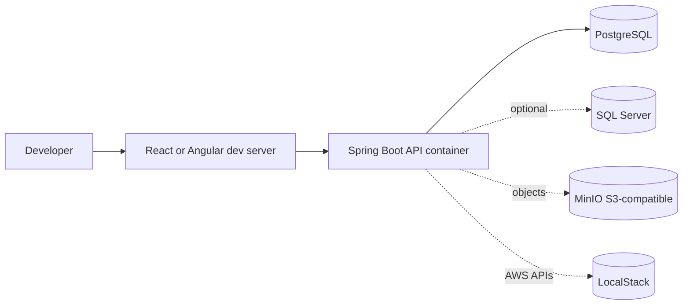

# 07 - Docker Local Development

This guide explains how to run a Spring Boot + React/Angular + PostgreSQL/SQL Server stack locally with Docker Compose. The goal is not to turn your laptop into AWS; the goal is reproducible dependencies, realistic integration tests, and fast onboarding.

## Local topology



## Services

| Service | Purpose | Default port |
|---|---|---|
| `api` | Spring Boot API | `8080` |
| `postgres` | Main relational database | `5432` |
| `mssql` | Optional SQL Server profile testing | `1433` |
| `localstack` | Optional AWS service emulator | `4566` |
| `minio` | Optional S3-compatible object storage | `9000`, `9001` |

See [`examples/docker/docker-compose.yml`](examples/docker/docker-compose.yml).

## Why use Docker for dependencies?

Benefits:

- Same database version for every developer.
- Easy cleanup with volumes.
- Local integration tests can run against real Postgres/SQL Server behavior.
- API can boot with the same environment-variable style used in cloud deployments.
- Optional services like LocalStack and MinIO let you practice AWS/object-storage workflows without cloud cost.

What Docker Compose does not solve:

- production scaling
- IAM design
- real AWS networking
- managed database operations
- secrets rotation
- CDN behavior

## API Dockerfile

See [`examples/docker/api.Dockerfile`](examples/docker/api.Dockerfile).

Use a multi-stage build:

1. Build with Maven and JDK.
2. Run with slim JRE.
3. Use non-root user when practical.
4. Expose port `8080`.
5. Configure memory and profiles through env vars.

## Compose environment variables

Typical API environment:

```yaml
environment:
  SPRING_PROFILES_ACTIVE: docker,postgres
  SPRING_DATASOURCE_URL: jdbc:postgresql://postgres:5432/catalog
  SPRING_DATASOURCE_USERNAME: catalog
  SPRING_DATASOURCE_PASSWORD: catalog
  APP_CORS_ALLOWED_ORIGINS: http://localhost:5173,http://localhost:4200
```

Rules:

- Use service names (`postgres`, `mssql`) inside the Docker network.
- Use localhost only from the host machine.
- Do not commit real secrets.
- Use `.env` for local overrides, but keep `.env` ignored.

## PostgreSQL service

```yaml
postgres:
  image: postgres:16
  environment:
    POSTGRES_DB: catalog
    POSTGRES_USER: catalog
    POSTGRES_PASSWORD: catalog
  ports:
    - "5432:5432"
  volumes:
    - postgres-data:/var/lib/postgresql/data
  healthcheck:
    test: ["CMD-SHELL", "pg_isready -U catalog -d catalog"]
    interval: 10s
    timeout: 5s
    retries: 5
```

## SQL Server optional service

```yaml
mssql:
  image: mcr.microsoft.com/mssql/server:2022-latest
  environment:
    ACCEPT_EULA: "Y"
    MSSQL_SA_PASSWORD: "StrongPassword!123"
  ports:
    - "1433:1433"
```

Notes:

- SQL Server containers require a strong SA password.
- They can need more memory than PostgreSQL.
- Startup can be slower.
- For CI, prefer Testcontainers unless you need full Compose.

## LocalStack

Use LocalStack when your API needs to call AWS-like services locally:

- S3
- SQS
- SNS
- Secrets Manager

Example env:

```yaml
AWS_ACCESS_KEY_ID: test
AWS_SECRET_ACCESS_KEY: test
AWS_REGION: us-east-1
AWS_ENDPOINT_URL: http://localstack:4566
```

In Spring, configure AWS SDK endpoint override only for local profile. Do not accidentally use LocalStack endpoint in production.

## MinIO

MinIO is useful when you want S3-compatible object storage:

- product images
- imports/exports
- generated reports

Local console:

```text
http://localhost:9001
```

Use it to practice:

- bucket creation
- presigned upload/download URLs
- object metadata
- local file cleanup

## Running the stack

```bash
cd 18-java-fullstack/examples/docker
docker compose up --build
```

Useful commands:

```bash
docker compose ps
docker compose logs -f api
docker compose logs -f postgres
docker compose down
docker compose down -v
```

`down -v` deletes volumes and database state. Use it when migrations or seed data are broken and you want a clean slate.

## Running frontend outside Docker

For development, often run the SPA directly on the host:

React:

```bash
npm run dev
```

Angular:

```bash
ng serve
```

The API and database can stay in Compose. This keeps hot reload fast and avoids containerizing every frontend tool during learning.

## Running API outside Docker

Run database in Compose, API on host:

```bash
docker compose up postgres
SPRING_PROFILES_ACTIVE=postgres ./mvnw spring-boot:run
```

Set datasource URL to localhost:

```yaml
spring:
  datasource:
    url: jdbc:postgresql://localhost:5432/catalog
```

Remember:

- Host-to-container uses `localhost:5432`.
- Container-to-container uses `postgres:5432`.

## Health checks

Compose `depends_on` with health conditions helps, but the app should still retry database connections or fail clearly.

Spring health:

```text
GET http://localhost:8080/actuator/health
GET http://localhost:8080/actuator/health/readiness
```

If the API starts before the database is ready:

- check Compose health checks
- check datasource URL
- check credentials
- check Flyway errors

## Seeding data

Options:

1. Flyway seed migration for stable reference data.
2. Spring `CommandLineRunner` in `dev` profile only.
3. SQL scripts mounted into database initialization directory.
4. API calls from a seed script.

Recommendation:

- Use Flyway for reference data like categories.
- Use dev-only seed runner for demo users/products.
- Do not seed production passwords or demo accounts accidentally.

## Docker and profiles

Profiles:

```text
local
docker
postgres
mssql
aws-local
```

Example:

```bash
SPRING_PROFILES_ACTIVE=docker,postgres,aws-local
```

Keep profile responsibilities clear:

- `docker`: container networking defaults
- `postgres`: database dialect and Flyway location
- `mssql`: SQL Server dialect and Flyway location
- `aws-local`: endpoint overrides for LocalStack/MinIO

## Debugging common local issues

### API cannot connect to database

Check:

- Are you running API in container or host?
- Is datasource host `postgres` or `localhost` appropriate?
- Are username/password/database correct?
- Did database health check pass?
- Did Flyway fail before JPA initialized?

### CORS fails

Check:

- Browser origin: `http://localhost:5173` or `http://localhost:4200`.
- Spring allowed origins include exact scheme/host/port.
- Preflight `OPTIONS` returns allowed methods and headers.
- Authorization header is allowed.

### SQL Server exits immediately

Check:

- `ACCEPT_EULA=Y`
- password complexity
- host memory
- container logs

### Flyway checksum mismatch

Cause:

- Someone edited an applied migration.

Fix:

- In disposable local DB: `docker compose down -v`.
- In shared/prod DB: create a new migration or follow Flyway repair only with team process.

### Port already in use

Check:

```bash
docker compose ps
```

Change host mapping:

```yaml
ports:
  - "5433:5432"
```

## Compose vs Testcontainers

| Tool | Best for |
|---|---|
| Docker Compose | Running the full local app manually |
| Testcontainers | Automated integration tests with disposable dependencies |

Use both:

- Compose for developer workflow.
- Testcontainers for CI and repeatable tests.

## Local dev checklist

- [ ] `docker compose up --build` starts dependencies.
- [ ] API health endpoint works.
- [ ] Flyway migrations apply from clean database.
- [ ] React/Angular dev server can call API.
- [ ] CORS allows only local dev origins.
- [ ] Volumes are named and documented.
- [ ] `down -v` cleanup is documented.
- [ ] Optional SQL Server profile can boot.
- [ ] LocalStack/MinIO are clearly optional.
- [ ] No real secrets are committed.
