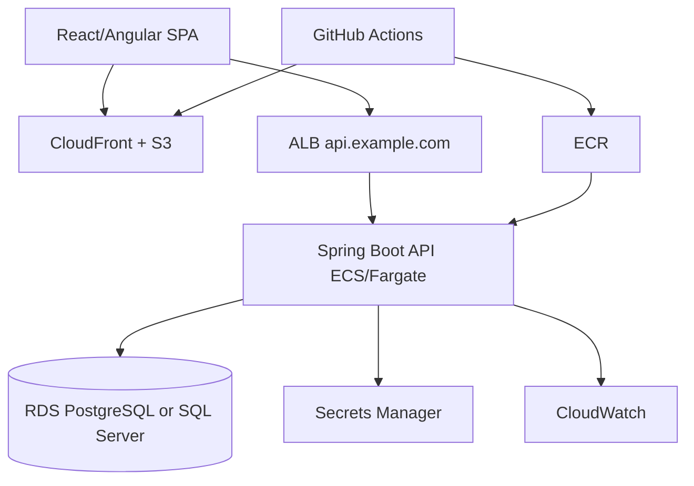

# 09 - Interview and System Design Prep

This guide prepares you to discuss Java fullstack systems in implementation interviews, take-home reviews, and system design rounds.

## How to answer fullstack interview questions

Use this pattern:

```text
Clarify requirements -> propose architecture -> explain data/API/auth -> discuss trade-offs -> cover failure modes -> mention tests/operations
```

Avoid jumping straight to framework trivia. Senior answers connect implementation details to user and production requirements.

## 60-second architecture answer

> I would build a Spring Boot API and a React or Angular SPA. The SPA is hosted as static assets on S3 behind CloudFront and calls the API over HTTPS. The API exposes versioned REST endpoints with DTOs, Bean Validation, Problem Details, pagination, and Spring Security. Business use cases live in services with transaction boundaries; repositories persist through JPA to RDS PostgreSQL or SQL Server with Flyway migrations. Auth can be app-issued JWTs for a learning project or Cognito/OIDC for production. Deployment uses ALB, ECS/Fargate or Elastic Beanstalk, Secrets Manager, CloudWatch, least-privilege IAM, and GitHub Actions. I would test service rules, controller behavior, repository queries, migrations, and key frontend flows.

## System design prompt: Product catalog

### Requirements

Functional:

- Users register/login.
- Users create and manage their own products.
- Product list supports pagination, filtering, sorting, and search.
- Admins can view aggregate metrics.

Non-functional:

- Secure user isolation.
- Low latency for product list.
- Reliable deployments.
- Basic auditability.
- AWS deployment.

### High-level design



### API endpoints

```text
POST /api/v1/auth/register
POST /api/v1/auth/login
GET  /api/v1/auth/me

GET    /api/v1/products?page=0&size=20&sort=createdAt,desc&status=ACTIVE&query=shoe
GET    /api/v1/products/{id}
POST   /api/v1/products
PUT    /api/v1/products/{id}
DELETE /api/v1/products/{id}
```

### Data model

Tables:

- `app_users`
- `categories`
- `products`
- `product_audit_events`

Indexes:

- unique email
- unique `(owner_id, sku)`
- `(owner_id, status, created_at desc)`
- `(owner_id, category_id, status, name)`

### Auth and authorization

- JWT contains subject/user ID, email, roles.
- API derives owner ID from JWT, not request body.
- Product queries include `owner_id`.
- Admin endpoints require role.
- For cross-user resources, return `404` when hiding existence is desired.

### Failure modes

| Failure | Mitigation |
|---|---|
| Duplicate SKU race | Database unique constraint + `409 Conflict` |
| Slow product list | Composite index, projections, capped page size |
| Token expired | Client clears auth and redirects to login |
| CORS failure | Exact allowed origins and preflight tests |
| Bad migration | CI migration test, backup, expand/contract |
| API task crash | ECS restarts, ALB health checks, CloudWatch alarms |

## Spring Boot questions

### Explain the Spring request lifecycle.

Good answer:

> A request reaches the servlet container, then passes through the Spring Security filter chain and other filters such as correlation ID or CORS. If authorized, it reaches `DispatcherServlet`, which maps it to a controller method. Spring deserializes the body into a DTO, applies validation, calls the service layer, then serializes the response. Exceptions are handled by `@ControllerAdvice`, and logs/metrics are emitted around the request.

### Where do transactions belong?

At the service/use-case boundary:

```java
@Transactional
public ProductResponse createProduct(ProductCreateRequest request, AuthenticatedUser user) {
    // validate business rule
    // load dependencies
    // persist product
    // return DTO
}
```

Why:

- one business operation maps to one transaction
- controllers remain HTTP-only
- repositories remain persistence-only

### What is the N+1 problem?

When code loads one parent query and then one query per child row due to lazy loading.

Fixes:

- fetch join for specific query
- entity graph
- DTO projection
- batch size
- redesign endpoint response

Do not solve every lazy relationship with eager loading; that often creates worse queries.

### Why disable Open Session in View?

`spring.jpa.open-in-view=false` prevents lazy loading during response serialization. It forces the service/repository layer to fetch the data the endpoint needs explicitly, making queries more predictable.

### How do you handle validation?

Layered validation:

- frontend for UX
- Bean Validation for request shape
- service/domain for business rules
- database constraints for race-safe integrity

### How do you return errors?

Use Problem Details:

- `400` validation with field errors
- `404` not found
- `409` conflict
- `401` unauthenticated
- `403` forbidden
- include trace ID for support

## Spring Security questions

### Authentication vs authorization

- Authentication: who are you?
- Authorization: what can you do?

JWT validation authenticates the principal. Roles, scopes, and ownership checks authorize actions.

### Stateless JWT vs session

| Stateless JWT | Session/cookie |
|---|---|
| API does not store session | Server stores/validates session |
| Works well for APIs/mobile | Strong browser token containment with HTTP-only cookies |
| Revocation is harder | Revocation is easier |
| Token theft risk if stored in JS | CSRF must be handled |

### How do you validate JWTs?

Check:

- signature
- issuer
- audience
- expiration
- not-before
- algorithm
- scopes/roles
- key rotation if using JWKS

### How do you prevent IDOR?

Never load by ID alone for user-owned resources. Use:

```java
findByIdAndOwnerId(productId, currentUser.id())
```

or domain authorization checks after loading if admin/ownership rules are more complex.

## React questions

### How do protected routes work?

They check auth state and redirect anonymous users to login. They are UX only. API security remains mandatory.

### How do you handle server state?

Use a query layer such as TanStack Query for caching, deduping, loading/error states, and invalidation after mutations.

### How do you handle validation errors from Spring?

Parse Problem Details and map `errors` to form fields. Render global errors for non-field domain errors.

### How do you avoid prop drilling for auth?

Use `AuthContext` or a state store. Keep token access inside an API client abstraction.

## Angular questions

### Why use interceptors?

They centralize HTTP cross-cutting concerns: auth headers, correlation IDs, error handling, and logging hooks.

### Guards vs backend security?

Guards are client UX; backend security is enforcement. Guards can be bypassed by direct HTTP calls.

### Signals vs RxJS?

Signals are good for local synchronous UI state. RxJS is still strong for HTTP, cancellation, debouncing, streams, and async composition.

### How do reactive forms handle server errors?

Use `control.setErrors({ server: message })` based on Problem Details `errors`.

## SQL and data questions

### How do you design indexes?

Start with access patterns:

```text
where owner_id = ? and status = ?
order by created_at desc
```

Index:

```text
(owner_id, status, created_at desc)
```

Do not index every column. Each index speeds some reads but slows writes and consumes storage.

### PostgreSQL vs SQL Server?

Discuss:

- organization expertise
- licensing
- AWS managed support
- JSON/search features
- operational tooling
- integration needs

### Why Flyway?

Versioned, reviewable, repeatable database changes. Avoid uncontrolled `ddl-auto=update` in shared environments.

### How handle migration rollback?

Prefer forward fixes. For risky changes, use expand/contract and backups. Rollback application code is not enough if schema changes are destructive.

## AWS questions

### Why S3 + CloudFront for SPA?

Static assets are cheap, scalable, cacheable, and do not need an application server. CloudFront provides CDN, TLS, route fallback, and security headers.

### ECS/Fargate vs Elastic Beanstalk?

ECS/Fargate gives explicit container orchestration and is better for multi-service growth. Elastic Beanstalk is simpler for one service and can be a good demo/deployment starting point.

### Where do secrets live?

Secrets Manager or SSM Parameter Store, not Git, Docker images, or frontend env files.

### How do you restrict database access?

RDS in private subnets, security group allowing inbound only from API task/security group, no public accessibility, TLS where appropriate.

### How do you deploy safely?

Build/test, run migrations in controlled step, deploy new task definition, use health checks, run smoke tests, monitor alarms, and have rollback/forward-fix plan.

## Debugging scenarios

### Scenario 1: React login succeeds, product list returns 401

Check:

1. Authorization header present?
2. Token expired?
3. API validates correct issuer/audience?
4. CORS allows `Authorization` header?
5. Spring Security matcher accidentally requires role not present?
6. Clock skew between issuer and API?

### Scenario 2: Angular form shows generic error instead of field errors

Check:

1. Does Spring return Problem Details?
2. Is `errors` map present?
3. Does field name match Angular form control name?
4. Is interceptor replacing error body?
5. Is the response content type JSON?

### Scenario 3: Product list slow in production

Check:

1. Query plan.
2. Missing composite index.
3. Page size too high.
4. `%term%` search causing scan.
5. N+1 relationships.
6. Returning too many columns.
7. RDS CPU/storage/connection pressure.

### Scenario 4: ECS deployment never becomes healthy

Check:

1. Container logs.
2. Health check path.
3. Security group ALB -> task.
4. App listening on correct port.
5. Database connectivity.
6. Secrets injected correctly.
7. Startup time vs health check grace period.
8. Flyway migration failure.

### Scenario 5: CORS preflight fails

Check:

1. Exact origin, including scheme and port.
2. `OPTIONS` allowed.
3. `Authorization` and `Content-Type` allowed headers.
4. Credentials setting matches wildcard rules.
5. API gateway/ALB not stripping headers.

## Take-home project review checklist

Reviewers often look for:

- clean README
- reproducible local run
- clear architecture
- DTOs and validation
- auth and ownership checks
- database migrations
- tests on risky behavior
- meaningful error handling
- no committed secrets
- sensible trade-offs and limitations

## STAR stories to prepare

Prepare concise stories for:

1. Debugged production API failure.
2. Improved slow database query.
3. Designed auth/authorization boundary.
4. Migrated schema safely.
5. Built frontend form with server validation.
6. Deployed a service to cloud.
7. Handled conflicting requirements.
8. Improved observability.

## Whiteboard templates

### API design template

```text
Resource:
Endpoints:
Request DTO:
Response DTO:
Validation:
Auth rule:
Data access:
Indexes:
Error cases:
Tests:
```

### System design template

```text
Users and requirements:
Traffic/data assumptions:
High-level diagram:
API contracts:
Data model:
Auth:
Frontend state:
Deployment:
Observability:
Failure modes:
Trade-offs:
```

## Practice prompts

1. Design a product catalog for 10,000 small businesses.
2. Design a notes app with tags, sharing, and offline support.
3. Design an admin dashboard for inventory updates.
4. Design image uploads for product photos.
5. Design a CSV import pipeline with progress updates.
6. Design search for products across name, SKU, and description.
7. Design multi-tenant isolation for enterprise customers.
8. Design deployment and rollback for a Spring Boot API.
9. Design auth using Cognito and Spring Security.
10. Debug a CORS + JWT failure in a SPA.

## Final interview checklist

- [ ] Can draw the architecture from memory.
- [ ] Can explain the request lifecycle.
- [ ] Can compare JWT, cookies, Cognito, and BFF.
- [ ] Can design REST endpoints and Problem Details.
- [ ] Can explain transaction boundaries.
- [ ] Can prevent IDOR.
- [ ] Can design indexes from access patterns.
- [ ] Can describe Flyway migration safety.
- [ ] Can connect React/Angular forms to Spring validation.
- [ ] Can explain AWS deployment and operations.
