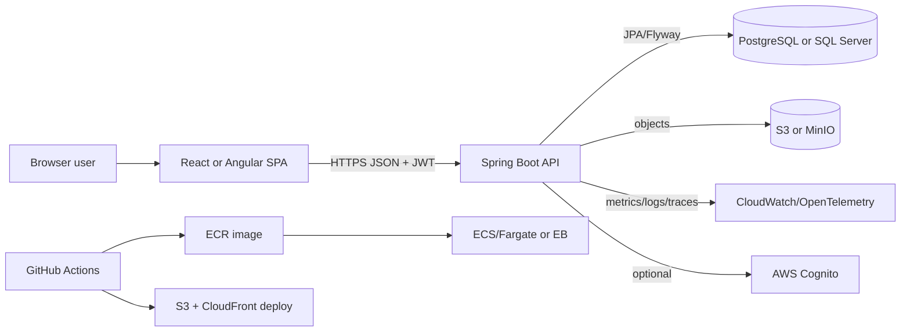

# 18-java-fullstack: Java Fullstack Prep with Spring Boot, React, Angular, SQL, Docker, and AWS

This section is a practical, interview-oriented track for building and explaining a modern Java fullstack application:

- **Backend:** Java 21, Spring Boot 3, Spring Web, Spring Security, Bean Validation, Spring Data JPA, Flyway.
- **Frontend:** React with Vite + TypeScript and Angular standalone applications.
- **Data:** PostgreSQL and Microsoft SQL Server schema design, migrations, indexing, and profile switching.
- **Local development:** Docker Compose with API, database services, optional object storage and AWS emulation.
- **Cloud:** AWS S3 + CloudFront for SPA hosting, ECS/Fargate or Elastic Beanstalk for API hosting, RDS, Secrets Manager, CloudWatch, IAM, and GitHub Actions.

Use it as:

1. A **study path** for Java fullstack interviews.
2. A **project blueprint** for a portfolio app.
3. A **system-design rehearsal kit** for SPA + API + relational database + AWS conversations.

## Target outcome

By the end, you should be able to whiteboard, build, debug, and explain:

- A Spring Boot REST API with validation, authentication, authorization, pagination, Problem Details, logging, migrations, and tests.
- A React or Angular SPA that authenticates with the API, handles route protection, calls endpoints through typed clients, renders validation errors, and reads environment config safely.
- A relational schema for a product catalog or notes system that works on PostgreSQL and SQL Server.
- A local Docker topology that is close enough to production to catch integration issues early.
- An AWS deployment using least-privilege IAM, managed database, secrets, logs, health checks, and CI/CD.

## Files

| Guide | Focus |
|---|---|
| [01 Architecture](01-architecture.md) | Layered and clean architecture, optional BFF, SPA + API topology, diagrams |
| [02 Spring API Design](02-spring-api-design.md) | REST conventions, versioning, Problem Details, pagination, authentication flow |
| [03 React with Spring](03-react-with-spring.md) | Vite React TypeScript client, JWT auth, interceptors, protected routes, streaming, env config |
| [04 Angular with Spring](04-angular-with-spring.md) | Angular standalone client, interceptors, guards, environments, reactive forms and validation errors |
| [05 MSSQL and PostgreSQL](05-mssql-postgresql.md) | Schema design, Flyway samples, indexing, migration strategy, profile switching |
| [06 AWS Fullstack Deploy](06-aws-fullstack-deploy.md) | S3 + CloudFront, ECS/Fargate or Elastic Beanstalk, RDS, Secrets Manager, CloudWatch, Cognito, IAM, CI/CD |
| [07 Docker Local Dev](07-docker-local-dev.md) | Docker Compose with API, PostgreSQL, optional SQL Server, LocalStack, MinIO |
| [08 End-to-End Tutorial](08-end-to-end-tutorial.md) | Build "Product Catalog + Auth" with Spring + React or Angular + PostgreSQL + AWS outline |
| [09 Interview and System Design](09-interview-and-system-design.md) | Interview prompts, trade-offs, debugging stories, system design scripts |
| [10 Cheatsheet](10-cheatsheet.md) | Fast recall for Spring, REST, security, SQL, Docker, AWS |
| [Project ideas](project-ideas.md) | Portfolio projects from beginner to senior-level scenarios |

## Examples

| Example | What it demonstrates |
|---|---|
| [`examples/docker/docker-compose.yml`](examples/docker/docker-compose.yml) | Local topology for API, PostgreSQL, optional SQL Server, LocalStack, and MinIO |
| [`examples/docker/api.Dockerfile`](examples/docker/api.Dockerfile) | Multi-stage Spring Boot Docker build |
| [`examples/react-client/AuthContext.tsx`](examples/react-client/AuthContext.tsx) | React auth provider with JWT storage, user state, and login/logout flow |
| [`examples/react-client/apiClient.ts`](examples/react-client/apiClient.ts) | Fetch-based API client with auth header, Problem Details parsing, and retry notes |
| [`examples/angular-client/auth.interceptor.ts`](examples/angular-client/auth.interceptor.ts) | Angular functional interceptor for bearer tokens and 401 handling |
| [`examples/angular-client/auth.guard.ts`](examples/angular-client/auth.guard.ts) | Angular route guard for protected pages |
| [`examples/flyway/V1__products_postgres.sql`](examples/flyway/V1__products_postgres.sql) | PostgreSQL product catalog schema |
| [`examples/flyway/V1__products_mssql.sql`](examples/flyway/V1__products_mssql.sql) | SQL Server product catalog schema |
| [`examples/aws/github-actions-deploy.yml`](examples/aws/github-actions-deploy.yml) | GitHub Actions pipeline for build, image push, ECS deploy, and SPA sync |
| [`examples/aws/task-definition.ecs.json`](examples/aws/task-definition.ecs.json) | ECS task definition template with logs and secrets |
| [`examples/spring/ProductService.java`](examples/spring/ProductService.java) | Spring service with transactions, validation boundaries, pagination, and domain errors |
| [`examples/spring/AuthController.java`](examples/spring/AuthController.java) | Authentication controller with login/register shape and cookie/header discussion |

## Architecture at a glance



For interviews, explain the request path in plain language:

1. The browser loads static files from CloudFront.
2. The SPA sends API calls over HTTPS to an API domain.
3. Spring Security validates the token or session.
4. Controllers accept DTOs and return response DTOs.
5. Services enforce business rules and transactions.
6. Repositories persist through JPA, while Flyway owns schema evolution.
7. Logs, metrics, health checks, and traces make the system operable.

## Recommended study path

### Pass 1: Build the vertical slice

1. Read [01 Architecture](01-architecture.md).
2. Create a Spring Boot product catalog API with:
   - `GET /api/v1/products`
   - `GET /api/v1/products/{id}`
   - `POST /api/v1/products`
   - `PUT /api/v1/products/{id}`
   - `DELETE /api/v1/products/{id}`
3. Add PostgreSQL and Flyway.
4. Add validation and Problem Details.
5. Add a React or Angular client.

### Pass 2: Harden for interviews

1. Add auth with Spring Security.
2. Add pagination, sorting, filtering, and indexes.
3. Add tests for service rules, controllers, auth, and migrations.
4. Add Docker Compose.
5. Write a README that explains trade-offs.

### Pass 3: Deploy and operate

1. Containerize the API.
2. Push an image to ECR.
3. Deploy to ECS/Fargate or Elastic Beanstalk.
4. Host the SPA on S3 + CloudFront.
5. Use RDS, Secrets Manager, CloudWatch, IAM roles, and GitHub Actions.
6. Prepare a failure-mode story: expired token, bad migration, slow query, broken CORS, failed deployment.

## Interview framing

When asked to describe a Java fullstack system, use this structure:

```text
Requirements -> API contract -> auth model -> data model -> frontend state -> deployment topology -> operations -> risks
```

Example answer:

> I would build a Spring Boot API behind HTTPS and a React or Angular SPA hosted on S3/CloudFront. The API exposes versioned REST endpoints with DTOs, Bean Validation, Problem Details, pagination, and Spring Security. PostgreSQL or SQL Server is managed by RDS, with Flyway migrations and indexes based on access patterns. The SPA stores short-lived access tokens carefully, protects routes, and maps validation errors onto forms. Deployment uses GitHub Actions, ECR, ECS/Fargate, Secrets Manager, CloudWatch logs, health checks, and least-privilege IAM. I would start with a single API service and split only when domain or scaling boundaries justify it.

## What to memorize vs what to understand

Memorize:

- Common HTTP status codes and REST conventions.
- Spring Security filter chain basics.
- Transaction boundary rules.
- JPA lazy loading pitfalls.
- Flyway naming and migration discipline.
- Basic AWS service responsibilities.

Understand deeply:

- Why DTOs protect API contracts from persistence details.
- Why validation belongs at the boundary and invariants belong in the domain/service layer.
- Why migrations must be compatible with rolling deploys.
- Why SPA auth is mostly a browser security problem, not only a token problem.
- Why indexes should follow access patterns.
- Why "serverless vs containers" is a trade-off, not a default ideology.

## Completion checklist

- [ ] Can draw the SPA + Spring + database + AWS diagram from memory.
- [ ] Can explain controller/service/repository responsibilities.
- [ ] Can implement Problem Details for validation and domain errors.
- [ ] Can secure endpoints with JWT claims and roles.
- [ ] Can build both PostgreSQL and SQL Server Flyway migrations.
- [ ] Can configure React or Angular environments without committing secrets.
- [ ] Can run the app with Docker Compose.
- [ ] Can explain an ECS/Fargate deployment and a simpler Elastic Beanstalk alternative.
- [ ] Can answer "what would you improve next?" with concrete production hardening steps.
